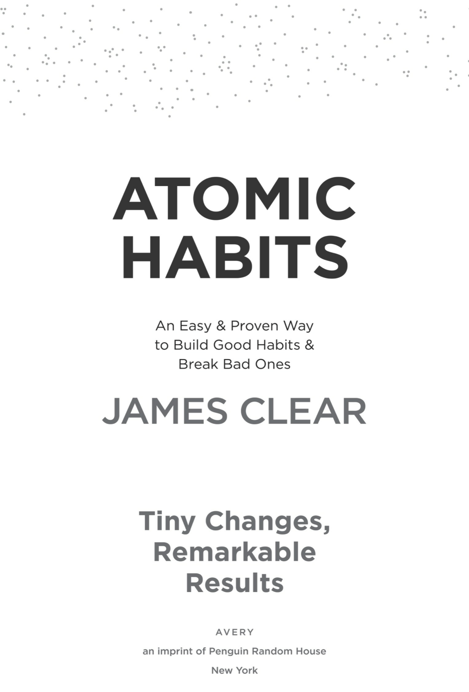
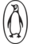

1 

&#123;/*  Start of picture text  */&#125;
An Easy & Proven Way to Build Good Habits & Break Bad Ones JAMES CLEAR Tiny Changes, Remarkable Results an imprint of oneuin Random House New York &#123;/*  End of picture text  */&#125;

2 

###### AN IMPRINT OF PENGUIN RANDOM HOUSE LLC 375 Hudson Street 

New York, New York 10014 

Copyright © 2018 by James Clear 

Penguin supports copyright. Copyright fuels creativity, encourages diverse voices, promotes free speech, and creates a vibrant culture. Thank you for buying an authorized edition of this book and for complying with copyright laws by not reproducing, scanning, or distributing any part of it in any form without permission. You are supporting writers and allowing Penguin to continue to publish books for every reader. 

###### Ebook ISBN 9780735211308 

While the author has made every effort to provide accurate Internet addresses at the time of publication, neither the publisher nor the author assumes any responsibility for errors, or for changes that occur after publication. Further, the publisher does not have any control over and does not assume any responsibility for author or third-party websites or their content. 

Version_1 

3 

###### **a·tom·ic** 

###### əˈ tämik 

1. an extremely small amount of a thing; the single irreducible unit of a larger system. 

2. the source of immense energy or power. 

###### **hab·it** 

###### ˈ hab ə t 

1. a routine or practice performed regularly; an automatic response to a specific situation. 

4