###### Introduction 

###### My Story 

**O** N THE FINAL day of my sophomore year of high school, I was hit in the face with a baseball bat. As my classmate took a full swing, the bat slipped out of his hands and came flying toward me before striking me directly between the eyes. I have no memory of the moment of impact. 

The bat smashed into my face with such force that it crushed my nose into a distorted U-shape. The collision sent the soft tissue of my brain slamming into the inside of my skull. Immediately, a wave of swelling surged throughout my head. In a fraction of a second, I had a broken nose, multiple skull fractures, and two shattered eye sockets. 

When I opened my eyes, I saw people staring at me and running over to help. I looked down and noticed spots of red on my clothes. One of my classmates took the shirt off his back and handed it to me. I used it to plug the stream of blood rushing from my broken nose. Shocked and confused, I was unaware of how seriously I had been injured. 

My teacher looped his arm around my shoulder and we began the long walk to the nurse’s office: across the field, down the hill, and back into school. Random hands touched my sides, holding me upright. We took our time and walked slowly. Nobody realized that every minute mattered. 

When we arrived at the nurse’s office, she asked me a series of questions. 

“What year is it?” “1998,” I answered. It was actually 2002. “Who is the president of the United States?” “Bill Clinton,” I said. The correct answer was George W. Bush. “What is your mom’s name?” 

7 

“Uh. Um.” I stalled. Ten seconds passed. 

“Patti,” I said casually, ignoring the fact that it had taken me ten seconds to remember my own mother’s name. 

That is the last question I remember. My body was unable to handle the rapid swelling in my brain and I lost consciousness before the ambulance arrived. Minutes later, I was carried out of school and taken to the local hospital. 

Shortly after arriving, my body began shutting down. I struggled with basic functions like swallowing and breathing. I had my first seizure of the day. Then I stopped breathing entirely. As the doctors hurried to supply me with oxygen, they also decided the local hospital was unequipped to handle the situation and ordered a helicopter to fly me to a larger hospital in Cincinnati. 

I was rolled out of the emergency room doors and toward the helipad across the street. The stretcher rattled on a bumpy sidewalk as one nurse pushed me along while another pumped each breath into me by hand. My mother, who had arrived at the hospital a few moments before, climbed into the helicopter beside me. I remained unconscious and unable to breathe on my own as she held my hand during the flight. 

While my mother rode with me in the helicopter, my father went home to check on my brother and sister and break the news to them. He choked back tears as he explained to my sister that he would miss her eighth-grade graduation ceremony that night. After passing my siblings off to family and friends, he drove to Cincinnati to meet my mother. 

When my mom and I landed on the roof of the hospital, a team of nearly twenty doctors and nurses sprinted onto the helipad and wheeled me into the trauma unit. By this time, the swelling in my brain had become so severe that I was having repeated posttraumatic seizures. My broken bones needed to be fixed, but I was in no condition to undergo surgery. After yet another seizure—my third of the day—I was put into a medically induced coma and placed on a ventilator. 

My parents were no strangers to this hospital. Ten years earlier, they had entered the same building on the ground floor after my sister was diagnosed with leukemia at age three. I was five at the time. My brother was just six months old. After two and a half years of chemotherapy treatments, spinal taps, and bone marrow biopsies, my little sister finally walked out of the hospital happy, 

8 healthy, and cancer free. And now, after ten years of normal life, my parents found themselves back in the same place with a different child. 

While I slipped into a coma, the hospital sent a priest and a social worker to comfort my parents. It was the same priest who had met with them a decade earlier on the evening they found out my sister had cancer. 

As day faded into night, a series of machines kept me alive. My parents slept restlessly on a hospital mattress—one moment they would collapse from fatigue, the next they would be wide awake with worry. My mother would tell me later, “It was one of the worst nights I’ve ever had.” 

###### **MY RECOVERY** 

Mercifully, by the next morning my breathing had rebounded to the point where the doctors felt comfortable releasing me from the coma. When I finally regained consciousness, I discovered that I had lost my ability to smell. As a test, a nurse asked me to blow my nose and sniff an apple juice box. My sense of smell returned, but— to everyone’s surprise—the act of blowing my nose forced air through the fractures in my eye socket and pushed my left eye outward. My eyeball bulged out of the socket, held precariously in place by my eyelid and the optic nerve attaching my eye to my brain. 

The ophthalmologist said my eye would gradually slide back into place as the air seeped out, but it was hard to tell how long this would take. I was scheduled for surgery one week later, which would allow me some additional time to heal. I looked like I had been on the wrong end of a boxing match, but I was cleared to leave the hospital. I returned home with a broken nose, half a dozen facial fractures, and a bulging left eye. 

The following months were hard. It felt like everything in my life was on pause. I had double vision for weeks; I literally couldn’t see straight. It took more than a month, but my eyeball did eventually return to its normal location. Between the seizures and my vision problems, it was eight months before I could drive a car again. At physical therapy, I practiced basic motor patterns like walking in a straight line. I was determined not to let my injury get me down, but 

9 

there were more than a few moments when I felt depressed and overwhelmed. 

I became painfully aware of how far I had to go when I returned to the baseball field one year later. Baseball had always been a major part of my life. My dad had played minor league baseball for the St. Louis Cardinals, and I had a dream of playing professionally, too. After months of rehabilitation, what I wanted more than anything was to get back on the field. 

But my return to baseball was not smooth. When the season rolled around, I was the only junior to be cut from the varsity baseball team. I was sent down to play with the sophomores on junior varsity. I had been playing since age four, and for someone who had spent so much time and effort on the sport, getting cut was humiliating. I vividly remember the day it happened. I sat in my car and cried as I flipped through the radio, desperately searching for a song that would make me feel better. 

After a year of self-doubt, I managed to make the varsity team as a senior, but I rarely made it on the field. In total, I played eleven innings of high school varsity baseball, barely more than a single game. 

Despite my lackluster high school career, I still believed I could become a great player. And I knew that if things were going to improve, I was the one responsible for making it happen. The turning point came two years after my injury, when I began college at Denison University. It was a new beginning, and it was the place where I would discover the surprising power of small habits for the first time. 

###### **HOW I LEARNED ABOUT HABITS** 

Attending Denison was one of the best decisions of my life. I earned a spot on the baseball team and, although I was at the bottom of the roster as a freshman, I was thrilled. Despite the chaos of my high school years, I had managed to become a college athlete. 

I wasn’t going to be starting on the baseball team anytime soon, so I focused on getting my life in order. While my peers stayed up late and played video games, I built good sleep habits and went to bed early each night. In the messy world of a college dorm, I made a point to keep my room neat and tidy. These improvements were 

10 

minor, but they gave me a sense of control over my life. I started to feel confident again. And this growing belief in myself rippled into the classroom as I improved my study habits and managed to earn straight A’s during my first year. 

A habit is a routine or behavior that is performed regularly—and, in many cases, automatically. As each semester passed, I accumulated small but consistent habits that ultimately led to results that were unimaginable to me when I started. For example, for the first time in my life, I made it a habit to lift weights multiple times per week, and in the years that followed, my six-foot-fourinch frame bulked up from a featherweight 170 to a lean 200 pounds. 

When my sophomore season arrived, I earned a starting role on the pitching staff. By my junior year, I was voted team captain and at the end of the season, I was selected for the all-conference team. But it was not until my senior season that my sleep habits, study habits, and strength-training habits really began to pay off. 

Six years after I had been hit in the face with a baseball bat, flown to the hospital, and placed into a coma, I was selected as the top male athlete at Denison University and named to the ESPN Academic All-America Team—an honor given to just thirty-three players across the country. By the time I graduated, I was listed in the school record books in eight different categories. That same year, I was awarded the university’s highest academic honor, the President’s Medal. 

I hope you’ll forgive me if this sounds boastful. To be honest, there was nothing legendary or historic about my athletic career. I never ended up playing professionally. However, looking back on those years, I believe I accomplished something just as rare: I fulfilled my potential. And I believe the concepts in this book can help you fulfill your potential as well. 

We all face challenges in life. This injury was one of mine, and the experience taught me a critical lesson: changes that seem small and unimportant at first will compound into remarkable results if you’re willing to stick with them for years. We all deal with setbacks but in the long run, the quality of our lives often depends on the quality of our habits. With the same habits, you’ll end up with the same results. But with better habits, anything is possible. 

Maybe there are people who can achieve incredible success overnight. I don’t know any of them, and I’m certainly not one of 

11 

them. There wasn’t one defining moment on my journey from medically induced coma to Academic All-American; there were many. It was a gradual evolution, a long series of small wins and tiny breakthroughs. The only way I made progress—the only choice I had—was to start small. And I employed this same strategy a few years later when I started my own business and began working on this book. 

###### **HOW AND WHY I WROTE THIS BOOK** 

In November 2012, I began publishing articles at jamesclear.com. For years, I had been keeping notes about my personal experiments with habits and I was finally ready to share some of them publicly. I began by publishing a new article every Monday and Thursday. Within a few months, this simple writing habit led to my first one thousand email subscribers, and by the end of 2013 that number had grown to more than thirty thousand people. 

In 2014, my email list expanded to over one hundred thousand subscribers, which made it one of the fastest-growing newsletters on the internet. I had felt like an impostor when I began writing two years earlier, but now I was becoming known as an expert on habits —a new label that excited me but also felt uncomfortable. I had never considered myself a master of the topic, but rather someone who was experimenting alongside my readers. 

In 2015, I reached two hundred thousand email subscribers and signed a book deal with Penguin Random House to begin writing the book you are reading now. As my audience grew, so did my business opportunities. I was increasingly asked to speak at top companies about the science of habit formation, behavior change, and continuous improvement. I found myself delivering keynote speeches at conferences in the United States and Europe. 

In 2016, my articles began to appear regularly in major publications like _Time_ , _Entrepreneur_ , and _Forbes_ . Incredibly, my writing was read by over eight million people that year. Coaches in the NFL, NBA, and MLB began reading my work and sharing it with their teams. 

At the start of 2017, I launched the Habits Academy, which became the premier training platform for organizations and individuals interested in building better habits in life and work.* 

12 

Fortune 500 companies and growing start-ups began to enroll their leaders and train their staff. In total, over ten thousand leaders, managers, coaches, and teachers have graduated from the Habits Academy, and my work with them has taught me an incredible amount about what it takes to make habits work in the real world. As I put the finishing touches on this book in 2018, 

jamesclear.com is receiving millions of visitors per month and nearly five hundred thousand people subscribe to my weekly email newsletter—a number that is so far beyond my expectations when I began that I’m not even sure what to think of it. 

###### **HOW THIS BOOK WILL BENEFIT YOU** 

The entrepreneur and investor Naval Ravikant has said, “To write a great book, you must first become the book.” I originally learned about the ideas mentioned here because I had to live them. I had to rely on small habits to rebound from my injury, to get stronger in the gym, to perform at a high level on the field, to become a writer, to build a successful business, and simply to develop into a responsible adult. Small habits helped me fulfill my potential, and since you picked up this book, I’m guessing you’d like to fulfill yours as well. 

In the pages that follow, I will share a step-by-step plan for building better habits—not for days or weeks, but for a lifetime. While science supports everything I’ve written, this book is not an academic research paper; it’s an operating manual. You’ll find wisdom and practical advice front and center as I explain the science of how to create and change your habits in a way that is easy to understand and apply. 

The fields I draw on—biology, neuroscience, philosophy, psychology, and more—have been around for many years. What I offer you is a synthesis of the best ideas smart people figured out a long time ago as well as the most compelling discoveries scientists have made recently. My contribution, I hope, is to find the ideas that matter most and connect them in a way that is highly actionable. Anything wise in these pages you should credit to the many experts who preceded me. Anything foolish, assume it is my error. 

13 

The backbone of this book is my four-step model of habits—cue, craving, response, and reward—and the four laws of behavior change that evolve out of these steps. Readers with a psychology background may recognize some of these terms from operant conditioning, which was first proposed as “stimulus, response, reward” by B. F. Skinner in the 1930s and has been popularized more recently as “cue, routine, reward” in _The Power of Habit_ by Charles Duhigg. 

Behavioral scientists like Skinner realized that if you offered the right reward or punishment, you could get people to act in a certain way. But while Skinner’s model did an excellent job of explaining how external stimuli influenced our habits, it lacked a good explanation for how our thoughts, feelings, and beliefs impact our behavior. Internal states—our moods and emotions—matter, too. In recent decades, scientists have begun to determine the connection between our thoughts, feelings, and behavior. This research will also be covered in these pages. 

In total, the framework I offer is an integrated model of the cognitive and behavioral sciences. I believe it is one of the first models of human behavior to accurately account for both the influence of external stimuli and internal emotions on our habits. While some of the language may be familiar, I am confident that the details—and the applications of the Four Laws of Behavior Change— will offer a new way to think about your habits. 

Human behavior is always changing: situation to situation, moment to moment, second to second. But this book is about what _doesn’t_ change. It’s about the fundamentals of human behavior. The lasting principles you can rely on year after year. The ideas you can build a business around, build a family around, build a life around. 

There is no one right way to create better habits, but this book describes the best way I know—an approach that will be effective regardless of where you start or what you’re trying to change. The strategies I cover will be relevant to anyone looking for a step-bystep system for improvement, whether your goals center on health, money, productivity, relationships, or all of the above. As long as human behavior is involved, this book will be your guide. 

14 

# **THE FUNDAMENTALS** 

Why Tiny Changes Make a Big Difference 

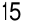

&#123;/*  Start of picture text  */&#125;
15 &#123;/*  End of picture text  */&#125;

1 

###### The Surprising Power of Atomic Habits 

**T** HE FATE OF British Cycling changed one day in 2003. The organization, which was the governing body for professional cycling in Great Britain, had recently hired Dave Brailsford as its new performance director. At the time, professional cyclists in Great Britain had endured nearly one hundred years of mediocrity. Since 1908, British riders had won just a single gold medal at the Olympic Games, and they had fared even worse in cycling’s biggest race, the Tour de France. In 110 years, no British cyclist had ever won the event. 

In fact, the performance of British riders had been so underwhelming that one of the top bike manufacturers in Europe refused to sell bikes to the team because they were afraid that it would hurt sales if other professionals saw the Brits using their gear. 

Brailsford had been hired to put British Cycling on a new trajectory. What made him different from previous coaches was his relentless commitment to a strategy that he referred to as “the aggregation of marginal gains,” which was the philosophy of searching for a tiny margin of improvement in everything you do. Brailsford said, “The whole principle came from the idea that if you broke down everything you could think of that goes into riding a bike, and then improve it by 1 percent, you will get a significant increase when you put them all together.” 

Brailsford and his coaches began by making small adjustments you might expect from a professional cycling team. They redesigned the bike seats to make them more comfortable and rubbed alcohol 

16 

on the tires for a better grip. They asked riders to wear electrically heated overshorts to maintain ideal muscle temperature while riding and used biofeedback sensors to monitor how each athlete responded to a particular workout. The team tested various fabrics in a wind tunnel and had their outdoor riders switch to indoor racing suits, which proved to be lighter and more aerodynamic. 

But they didn’t stop there. Brailsford and his team continued to find 1 percent improvements in overlooked and unexpected areas. They tested different types of massage gels to see which one led to the fastest muscle recovery. They hired a surgeon to teach each rider the best way to wash their hands to reduce the chances of catching a cold. They determined the type of pillow and mattress that led to the best night’s sleep for each rider. They even painted the inside of the team truck white, which helped them spot little bits of dust that would normally slip by unnoticed but could degrade the performance of the finely tuned bikes. 

As these and hundreds of other small improvements accumulated, the results came faster than anyone could have imagined. 

Just five years after Brailsford took over, the British Cycling team dominated the road and track cycling events at the 2008 Olympic Games in Beijing, where they won an astounding 60 percent of the gold medals available. Four years later, when the Olympic Games came to London, the Brits raised the bar as they set nine Olympic records and seven world records. 

That same year, Bradley Wiggins became the first British cyclist to win the Tour de France. The next year, his teammate Chris Froome won the race, and he would go on to win again in 2015, 2016, and 2017, giving the British team five Tour de France victories in six years. 

During the ten-year span from 2007 to 2017, British cyclists won 178 world championships and sixty-six Olympic or Paralympic gold medals and captured five Tour de France victories in what is widely regarded as the most successful run in cycling history.* 

How does this happen? How does a team of previously ordinary athletes transform into world champions with tiny changes that, at first glance, would seem to make a modest difference at best? Why do small improvements accumulate into such remarkable results, and how can you replicate this approach in your own life? 

17 

###### **WHY SMALL HABITS MAKE A BIG DIFFERENCE** 

It is so easy to overestimate the importance of one defining moment and underestimate the value of making small improvements on a daily basis. Too often, we convince ourselves that massive success requires massive action. Whether it is losing weight, building a business, writing a book, winning a championship, or achieving any other goal, we put pressure on ourselves to make some earthshattering improvement that everyone will talk about. 

Meanwhile, improving by 1 percent isn’t particularly notable— sometimes it isn’t even _noticeable_ —but it can be far more meaningful, especially in the long run. The difference a tiny improvement can make over time is astounding. Here’s how the math works out: if you can get 1 percent better each day for one year, you’ll end up thirty-seven times better by the time you’re done. Conversely, if you get 1 percent worse each day for one year, you’ll decline nearly down to zero. What starts as a small win or a minor setback accumulates into something much more. 

###### **1% BETTER EVERY DAY** 

1% worse every day for one year. 0.99365 = 00.03 

1% better every day for one year. 1.01365 = 37.78 

18 

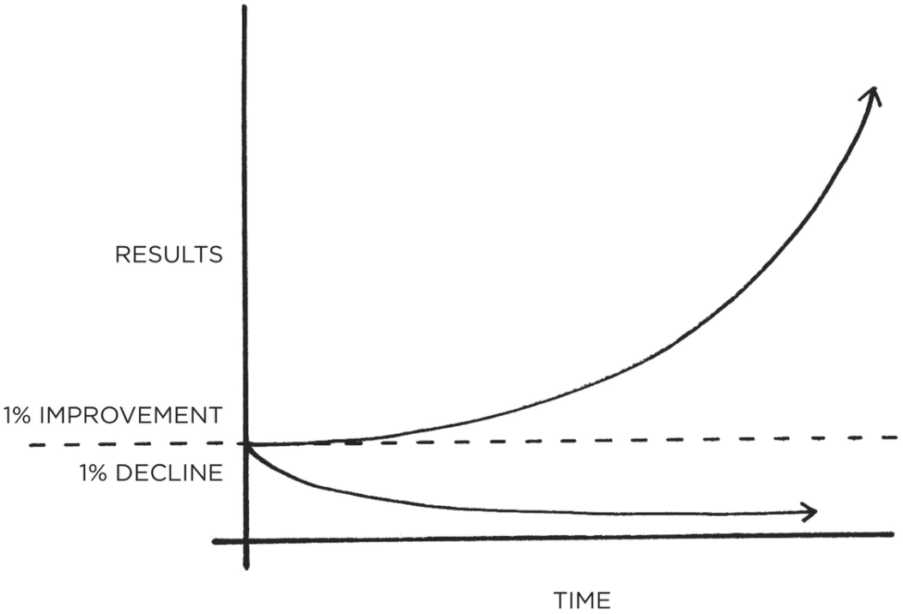

&#123;/*  Start of picture text  */&#125;
RESULTS 1% IMPROVEMENT 1% DECLINE TIME &#123;/*  End of picture text  */&#125;

FIGURE 1: The effects of small habits compound over time. For example, if you can get just 1 percent better each day, you’ll end up with results that are nearly 37 times better after one year. 

Habits are the compound interest of self-improvement. The same way that money multiplies through compound interest, the effects of your habits multiply as you repeat them. They seem to make little difference on any given day and yet the impact they deliver over the months and years can be enormous. It is only when looking back two, five, or perhaps ten years later that the value of good habits and the cost of bad ones becomes strikingly apparent. 

This can be a difficult concept to appreciate in daily life. We often dismiss small changes because they don’t seem to matter very much in the moment. If you save a little money now, you’re still not a millionaire. If you go to the gym three days in a row, you’re still out of shape. If you study Mandarin for an hour tonight, you still haven’t learned the language. We make a few changes, but the results never seem to come quickly and so we slide back into our previous routines. 

19 

Unfortunately, the slow pace of transformation also makes it easy to let a bad habit slide. If you eat an unhealthy meal today, the scale doesn’t move much. If you work late tonight and ignore your family, they will forgive you. If you procrastinate and put your project off until tomorrow, there will usually be time to finish it later. A single decision is easy to dismiss. 

But when we repeat 1 percent errors, day after day, by replicating poor decisions, duplicating tiny mistakes, and rationalizing little excuses, our small choices compound into toxic results. It’s the accumulation of many missteps—a 1 percent decline here and there —that eventually leads to a problem. 

The impact created by a change in your habits is similar to the effect of shifting the route of an airplane by just a few degrees. Imagine you are flying from Los Angeles to New York City. If a pilot leaving from LAX adjusts the heading just 3.5 degrees south, you will land in Washington, D.C., instead of New York. Such a small change is barely noticeable at takeoff—the nose of the airplane moves just a few feet—but when magnified across the entire United States, you end up hundreds of miles apart.* 

Similarly, a slight change in your daily habits can guide your life to a very different destination. Making a choice that is 1 percent better or 1 percent worse seems insignificant in the moment, but over the span of moments that make up a lifetime these choices determine the difference between who you are and who you could be. Success is the product of daily habits—not once-in-a-lifetime transformations. 

That said, it doesn’t matter how successful or unsuccessful you are right now. What matters is whether your habits are putting you on the path toward success. You should be far more concerned with your current trajectory than with your current results. If you’re a millionaire but you spend more than you earn each month, then you’re on a bad trajectory. If your spending habits don’t change, it’s not going to end well. Conversely, if you’re broke, but you save a little bit every month, then you’re on the path toward financial freedom—even if you’re moving slower than you’d like. 

Your outcomes are a lagging measure of your habits. Your net worth is a lagging measure of your financial habits. Your weight is a lagging measure of your eating habits. Your knowledge is a lagging measure of your learning habits. Your clutter is a lagging measure of your cleaning habits. You get what you repeat. 

20 

If you want to predict where you’ll end up in life, all you have to do is follow the curve of tiny gains or tiny losses, and see how your daily choices will compound ten or twenty years down the line. Are you spending less than you earn each month? Are you making it into the gym each week? Are you reading books and learning something new each day? Tiny battles like these are the ones that will define your future self. 

Time magnifies the margin between success and failure. It will multiply whatever you feed it. Good habits make time your ally. Bad habits make time your enemy. 

Habits are a double-edged sword. Bad habits can cut you down just as easily as good habits can build you up, which is why understanding the details is crucial. You need to know how habits work and how to design them to your liking, so you can avoid the dangerous half of the blade. 

###### **YOUR HABITS CAN COMPOUND FOR YOU OR AGAINST YOU** 

###### **Positive Compounding** 

**Productivity compounds.** Accomplishing one extra task is a small feat on any given day, but it counts for a lot over an entire career. The effect of automating an old task or mastering a new skill can be even greater. The more tasks you can handle without thinking, the more your brain is free to focus on other areas. 

**Knowledge compounds.** Learning one new idea won’t make you a genius, but a commitment to lifelong learning can be transformative. Furthermore, each book you read not only teaches you something new but also opens up different ways of thinking about old ideas. As Warren Buffett says, “That’s how knowledge works. It builds up, like compound interest.” 

**Relationships compound.** People reflect your behavior back to you. The more you help others, the more others want to help you. Being a little bit nicer in each interaction can result in a network of broad and strong connections over time. 

###### **Negative Compounding** 

**Stress compounds.** The frustration of a traffic jam. The weight of parenting responsibilities. The worry of making ends meet. The strain of slightly high blood pressure. By themselves, these common causes of stress are manageable. But when they persist for years, little stresses compound into serious health issues. 

**Negative thoughts compound.** The more you think of yourself as worthless, stupid, or ugly, the more you condition yourself to interpret life that way. You 

21 

get trapped in a thought loop. The same is true for how you think about others. Once you fall into the habit of seeing people as angry, unjust, or selfish, you see those kind of people everywhere. 

**Outrage compounds.** Riots, protests, and mass movements are rarely the result of a single event. Instead, a long series of microaggressions and daily aggravations slowly multiply until one event tips the scales and outrage spreads like wildfire. 

###### **WHAT PROGRESS IS REALLY LIKE** 

Imagine that you have an ice cube sitting on the table in front of you. The room is cold and you can see your breath. It is currently twenty-five degrees. Ever so slowly, the room begins to heat up. Twenty-six degrees. 

Twenty-seven. 

Twenty-eight. 

The ice cube is still sitting on the table in front of you. Twenty-nine degrees. Thirty. 

Thirty-one. 

Still, nothing has happened. 

Then, thirty-two degrees. The ice begins to melt. A one-degree shift, seemingly no different from the temperature increases before it, has unlocked a huge change. 

Breakthrough moments are often the result of many previous actions, which build up the potential required to unleash a major change. This pattern shows up everywhere. Cancer spends 80 percent of its life undetectable, then takes over the body in months. Bamboo can barely be seen for the first five years as it builds extensive root systems underground before exploding ninety feet into the air within six weeks. 

Similarly, habits often appear to make no difference until you cross a critical threshold and unlock a new level of performance. In the early and middle stages of any quest, there is often a Valley of Disappointment. You expect to make progress in a linear fashion and it’s frustrating how ineffective changes can seem during the first days, weeks, and even months. It doesn’t feel like you are going anywhere. It’s a hallmark of any compounding process: the most powerful outcomes are delayed. 

22 

This is one of the core reasons why it is so hard to build habits that last. People make a few small changes, fail to see a tangible result, and decide to stop. You think, “I’ve been running every day for a month, so why can’t I see any change in my body?” Once this kind of thinking takes over, it’s easy to let good habits fall by the wayside. But in order to make a meaningful difference, habits need to persist long enough to break through this plateau—what I call the _Plateau of Latent Potential_ . 

If you find yourself struggling to build a good habit or break a bad one, it is not because you have lost your ability to improve. It is often because you have not yet crossed the Plateau of Latent Potential. Complaining about not achieving success despite working hard is like complaining about an ice cube not melting when you heated it from twenty-five to thirty-one degrees. Your work was not wasted; it is just being stored. All the action happens at thirty-two degrees. 

When you finally break through the Plateau of Latent Potential, people will call it an overnight success. The outside world only sees the most dramatic event rather than all that preceded it. But you know that it’s the work you did long ago—when it seemed that you weren’t making any progress—that makes the jump today possible. 

It is the human equivalent of geological pressure. Two tectonic plates can grind against one another for millions of years, the tension slowly building all the while. Then, one day, they rub each other once again, in the same fashion they have for ages, but this time the tension is too great. An earthquake erupts. Change can take years—before it happens all at once. 

Mastery requires patience. The San Antonio Spurs, one of the most successful teams in NBA history, have a quote from social reformer Jacob Riis hanging in their locker room: “When nothing seems to help, I go and look at a stonecutter hammering away at his rock, perhaps a hundred times without as much as a crack showing in it. Yet at the hundred and first blow it will split in two, and I know it was not that last blow that did it—but all that had gone before.” 

###### **THE PLATEAU OF LATENT POTENTIAL** 

23 

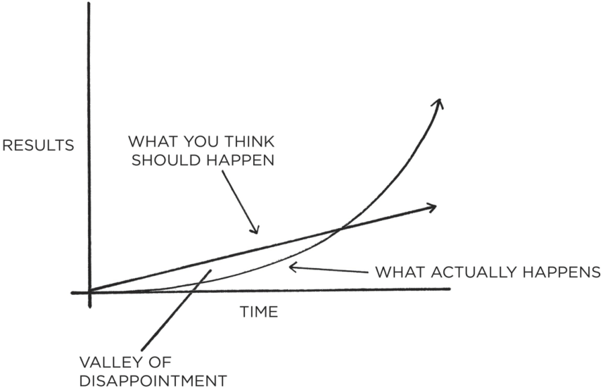

&#123;/*  Start of picture text  */&#125;
RESULTS WHAT YOU THINK SHOULD HAPPEN &lt;—\ WHAT ACTUALLY HAPPENS TIME VALLEY OF DISAPPOINTMENT &#123;/*  End of picture text  */&#125;

FIGURE 2: We often expect progress to be linear. At the very least, we hope it will come quickly. In reality, the results of our efforts are often delayed. It is not until months or years later that we realize the true value of the previous work we have done. This can result in a “valley of disappointment” where people feel discouraged after putting in weeks or months of hard work without experiencing any results. However, this work was not wasted. It was simply being stored. It is not until much later that the full value of previous efforts is revealed. 

All big things come from small beginnings. The seed of every habit is a single, tiny decision. But as that decision is repeated, a habit sprouts and grows stronger. Roots entrench themselves and branches grow. The task of breaking a bad habit is like uprooting a powerful oak within us. And the task of building a good habit is like cultivating a delicate flower one day at a time. 

But what determines whether we stick with a habit long enough to survive the Plateau of Latent Potential and break through to the other side? What is it that causes some people to slide into unwanted habits and enables others to enjoy the compounding effects of good ones? 

###### **FORGET ABOUT GOALS, FOCUS ON SYSTEMS INSTEAD** 

24 

Prevailing wisdom claims that the best way to achieve what we want in life—getting into better shape, building a successful business, relaxing more and worrying less, spending more time with friends and family—is to set specific, actionable goals. 

For many years, this was how I approached my habits, too. Each one was a goal to be reached. I set goals for the grades I wanted to get in school, for the weights I wanted to lift in the gym, for the profits I wanted to earn in business. I succeeded at a few, but I failed at a lot of them. Eventually, I began to realize that my results had very little to do with the goals I set and nearly everything to do with the systems I followed. 

What’s the difference between systems and goals? It’s a distinction I first learned from Scott Adams, the cartoonist behind the _Dilbert_ comic. Goals are about the results you want to achieve. Systems are about the processes that lead to those results. 

- If you’re a coach, your goal might be to win a championship. Your system is the way you recruit players, manage your assistant coaches, and conduct practice. 

- If you’re an entrepreneur, your goal might be to build a milliondollar business. Your system is how you test product ideas, hire employees, and run marketing campaigns. 

- If you’re a musician, your goal might be to play a new piece. Your system is how often you practice, how you break down and tackle difficult measures, and your method for receiving feedback from your instructor. 

Now for the interesting question: If you completely ignored your goals and focused only on your system, would you still succeed? For example, if you were a basketball coach and you ignored your goal to win a championship and focused only on what your team does at practice each day, would you still get results? 

I think you would. 

The goal in any sport is to finish with the best score, but it would be ridiculous to spend the whole game staring at the scoreboard. The only way to actually win is to get better each day. In the words of three-time Super Bowl winner Bill Walsh, “The score takes care of itself.” The same is true for other areas of life. If you want better 

25 

results, then forget about setting goals. Focus on your system instead. 

What do I mean by this? Are goals completely useless? Of course not. Goals are good for setting a direction, but systems are best for making progress. A handful of problems arise when you spend too much time thinking about your goals and not enough time designing your systems. 

###### Problem #1: Winners and losers have the same goals. 

Goal setting suffers from a serious case of survivorship bias. We concentrate on the people who end up winning—the survivors—and mistakenly assume that ambitious goals led to their success while overlooking all of the people who had the same objective but didn’t succeed. 

Every Olympian wants to win a gold medal. Every candidate wants to get the job. And if successful and unsuccessful people share the same goals, then the goal cannot be what differentiates the winners from the losers. It wasn’t the _goal_ of winning the Tour de France that propelled the British cyclists to the top of the sport. Presumably, they had wanted to win the race every year before—just like every other professional team. The goal had always been there. It was only when they implemented a _system_ of continuous small improvements that they achieved a different outcome. 

###### Problem #2: Achieving a goal is only a momentary change. 

Imagine you have a messy room and you set a goal to clean it. If you summon the energy to tidy up, then you will have a clean room—for now. But if you maintain the same sloppy, pack-rat habits that led to a messy room in the first place, soon you’ll be looking at a new pile of clutter and hoping for another burst of motivation. You’re left chasing the same outcome because you never changed the system behind it. You treated a symptom without addressing the cause. 

Achieving a goal only changes your life _for the moment_ . That’s the counterintuitive thing about improvement. We think we need to change our results, but the results are not the problem. What we really need to change are the systems that cause those results. When you solve problems at the results level, you only solve them 

26 

temporarily. In order to improve for good, you need to solve problems at the systems level. Fix the inputs and the outputs will fix themselves. 

###### Problem #3: Goals restrict your happiness. 

The implicit assumption behind any goal is this: “Once I reach my goal, then I’ll be happy.” The problem with a goals-first mentality is that you’re continually putting happiness off until the next milestone. I’ve slipped into this trap so many times I’ve lost count. For years, happiness was always something for my future self to enjoy. I promised myself that once I gained twenty pounds of muscle or after my business was featured in the _New York Times_ , then I could finally relax. 

Furthermore, goals create an “either-or” conflict: either you achieve your goal and are successful or you fail and you are a disappointment. You mentally box yourself into a narrow version of happiness. This is misguided. It is unlikely that your actual path through life will match the exact journey you had in mind when you set out. It makes no sense to restrict your satisfaction to one scenario when there are many paths to success. 

A systems-first mentality provides the antidote. When you fall in love with the process rather than the product, you don’t have to wait to give yourself permission to be happy. You can be satisfied anytime your system is running. And a system can be successful in many different forms, not just the one you first envision. 

###### Problem #4: Goals are at odds with long-term progress. 

Finally, a goal-oriented mind-set can create a “yo-yo” effect. Many runners work hard for months, but as soon as they cross the finish line, they stop training. The race is no longer there to motivate them. When all of your hard work is focused on a particular goal, what is left to push you forward after you achieve it? This is why many people find themselves reverting to their old habits after accomplishing a goal. 

The purpose of setting goals is to win the game. The purpose of building systems is to continue playing the game. True long-term thinking is goal-less thinking. It’s not about any single 

27 

accomplishment. It is about the cycle of endless refinement and continuous improvement. Ultimately, it is your commitment to the _process_ that will determine your _progress_ . 

###### **A SYSTEM OF ATOMIC HABITS** 

If you’re having trouble changing your habits, the problem isn’t you. The problem is your system. Bad habits repeat themselves again and again not because you don’t want to change, but because you have the wrong system for change. 

You do not rise to the level of your goals. You fall to the level of your systems. 

Focusing on the overall system, rather than a single goal, is one of the core themes of this book. It is also one of the deeper meanings behind the word _atomic_ . By now, you’ve probably realized that an atomic habit refers to a tiny change, a marginal gain, a 1 percent improvement. But atomic habits are not just any old habits, however small. They are little habits that are part of a larger system. Just as atoms are the building blocks of molecules, atomic habits are the building blocks of remarkable results. 

Habits are like the atoms of our lives. Each one is a fundamental unit that contributes to your overall improvement. At first, these tiny routines seem insignificant, but soon they build on each other and fuel bigger wins that multiply to a degree that far outweighs the cost of their initial investment. They are both small and mighty. This is the meaning of the phrase _atomic habits_ —a regular practice or routine that is not only small and easy to do, but also the source of incredible power; a component of the system of compound growth. 

###### Chapter Summary 

- Habits are the compound interest of self-improvement. Getting 1 percent better every day counts for a lot in the long-run. Habits are a double-edged sword. They can work for you or against you, which is why understanding the details is essential. Small changes often appear to make no difference until you cross a critical threshold. The most powerful outcomes of any 

28 

- compounding process are delayed. You need to be patient. An atomic habit is a little habit that is part of a larger system. Just as atoms are the building blocks of molecules, atomic habits are the building blocks of remarkable results. If you want better results, then forget about setting goals. Focus on your system instead. 

- You do not rise to the level of your goals. You fall to the level of your systems. 

29 

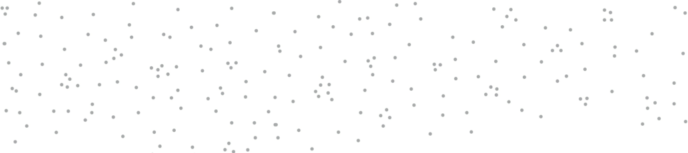

2 

###### How Your Habits Shape Your Identity (and Vice Versa) 

**W** HY IS IT so easy to repeat bad habits and so hard to form good ones? Few things can have a more powerful impact on your life than improving your daily habits. And yet it is likely that this time next year you’ll be doing the same thing rather than something better. 

It often feels difficult to keep good habits going for more than a few days, even with sincere effort and the occasional burst of motivation. Habits like exercise, meditation, journaling, and cooking are reasonable for a day or two and then become a hassle. 

However, once your habits are established, they seem to stick around forever—especially the unwanted ones. Despite our best intentions, unhealthy habits like eating junk food, watching too much television, procrastinating, and smoking can feel impossible to break. 

Changing our habits is challenging for two reasons: (1) we try to change the wrong thing and (2) we try to change our habits in the wrong way. In this chapter, I’ll address the first point. In the chapters that follow, I’ll answer the second. 

Our first mistake is that we try to change the wrong thing. To understand what I mean, consider that there are three levels at which change can occur. You can imagine them like the layers of an onion. 

###### **THREE LAYERS OF BEHAVIOR CHANGE** 

30 

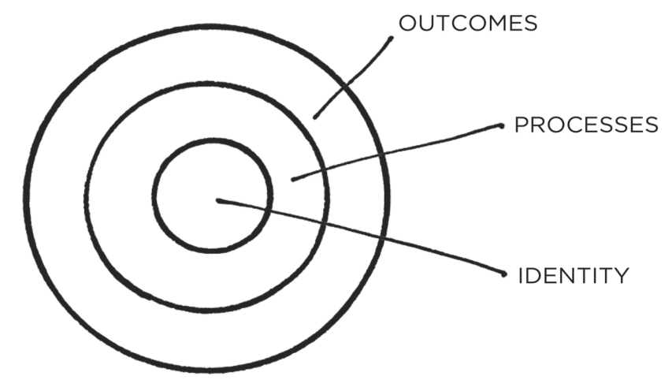

&#123;/*  Start of picture text  */&#125;
OUTCOMES PROCESSES IDENTITY &#123;/*  End of picture text  */&#125;

FIGURE 3: There are three layers of behavior change: a change in your outcomes, a change in your processes, or a change in your identity. 

**The first layer is changing your outcomes.** This level is concerned with changing your results: losing weight, publishing a book, winning a championship. Most of the goals you set are associated with this level of change. 

**The second layer is changing your process.** This level is concerned with changing your habits and systems: implementing a new routine at the gym, decluttering your desk for better workflow, developing a meditation practice. Most of the habits you build are associated with this level. 

**The third and deepest layer is changing your identity.** This level is concerned with changing your beliefs: your worldview, your self-image, your judgments about yourself and others. Most of the beliefs, assumptions, and biases you hold are associated with this level. 

Outcomes are about what you get. Processes are about what you do. Identity is about what you believe. When it comes to building habits that last—when it comes to building a system of 1 percent improvements—the problem is not that one level is “better” or “worse” than another. All levels of change are useful in their own way. The problem is the _direction_ of change. 

Many people begin the process of changing their habits by focusing on _what_ they want to achieve. This leads us to outcome- 

31 

based habits. The alternative is to build identity-based habits. With this approach, we start by focusing on _who_ we wish to become. 

###### **OUTCOME-BASED HABITS** 

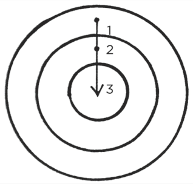

###### **IDENTITY-BASED HABITS** 

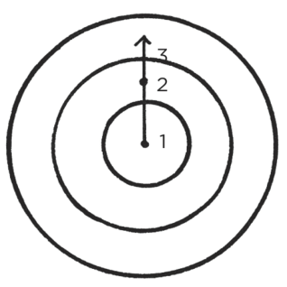

FIGURE 4: With outcome-based habits, the focus is on what you want to achieve. With identity-based habits, the focus is on who you wish to become. 

Imagine two people resisting a cigarette. When offered a smoke, the first person says, “No thanks. I’m trying to quit.” It sounds like a reasonable response, but this person still believes they are a smoker who is trying to be something else. They are hoping their behavior will change while carrying around the same beliefs. 

The second person declines by saying, “No thanks. I’m not a smoker.” It’s a small difference, but this statement signals a shift in identity. Smoking was part of their former life, not their current one. They no longer identify as someone who smokes. 

32 

Most people don’t even consider identity change when they set out to improve. They just think, “I want to be skinny (outcome) and if I stick to this diet, then I’ll be skinny (process).” They set goals and determine the actions they should take to achieve those goals without considering the beliefs that drive their actions. They never shift the way they look at themselves, and they don’t realize that their old identity can sabotage their new plans for change. 

Behind every system of actions are a system of beliefs. The system of a democracy is founded on beliefs like freedom, majority rule, and social equality. The system of a dictatorship has a very different set of beliefs like absolute authority and strict obedience. You can imagine many ways to try to get more people to vote in a democracy, but such behavior change would never get off the ground in a dictatorship. That’s not the identity of the system. Voting is a behavior that is impossible under a certain set of beliefs. A similar pattern exists whether we are discussing individuals, organizations, or societies. There are a set of beliefs and assumptions that shape the system, an identity behind the habits. 

Behavior that is incongruent with the self will not last. You may want more money, but if your identity is someone who consumes rather than creates, then you’ll continue to be pulled toward spending rather than earning. You may want better health, but if you continue to prioritize comfort over accomplishment, you’ll be drawn to relaxing rather than training. It’s hard to change your habits if you never change the underlying beliefs that led to your past behavior. You have a new goal and a new plan, but you haven’t changed _who_ you are. 

The story of Brian Clark, an entrepreneur from Boulder, Colorado, provides a good example. “For as long as I can remember, I’ve chewed my fingernails,” Clark told me. “It started as a nervous habit when I was young, and then morphed into an undesirable grooming ritual. One day, I resolved to stop chewing my nails until they grew out a bit. Through mindful willpower alone, I managed to do it.” 

Then, Clark did something surprising. 

“I asked my wife to schedule my first-ever manicure,” he said. “My thought was that if I started paying to maintain my nails, I wouldn’t chew them. And it worked, but not for the monetary reason. What happened was the manicure made my fingers look really nice for the first time. The manicurist even said that—other 

33 

than the chewing—I had really healthy, attractive nails. Suddenly, I was proud of my fingernails. And even though that’s something I had never aspired to, it made all the difference. I’ve never chewed my nails since; not even a single close call. And it’s because I now take pride in properly caring for them.” 

The ultimate form of intrinsic motivation is when a habit becomes part of your identity. It’s one thing to say I’m the type of person who _wants_ this. It’s something very different to say I’m the type of person who _is_ this. 

The more pride you have in a particular aspect of your identity, the more motivated you will be to maintain the habits associated with it. If you’re proud of how your hair looks, you’ll develop all sorts of habits to care for and maintain it. If you’re proud of the size of your biceps, you’ll make sure you never skip an upper-body workout. If you’re proud of the scarves you knit, you’ll be more likely to spend hours knitting each week. Once your pride gets involved, you’ll fight tooth and nail to maintain your habits. 

True behavior change is identity change. You might start a habit because of motivation, but the only reason you’ll stick with one is that it becomes part of your identity. Anyone can convince themselves to visit the gym or eat healthy once or twice, but if you don’t shift the belief behind the behavior, then it is hard to stick with long-term changes. Improvements are only temporary until they become part of who you are. 

- The goal is not to read a book, the goal is to _become_ a reader. The goal is not to run a marathon, the goal is to _become_ a runner. 

- The goal is not to learn an instrument, the goal is to _become_ a musician. 

Your behaviors are usually a reflection of your identity. What you do is an indication of the type of person you believe that you are— either consciously or nonconsciously.* Research has shown that once a person believes in a particular aspect of their identity, they are more likely to act in alignment with that belief. For example, people who identified as “being a voter” were more likely to vote than those who simply claimed “voting” was an action they wanted to perform. Similarly, the person who incorporates exercise into 

34 

their identity doesn’t have to convince themselves to train. Doing the right thing is easy. After all, when your behavior and your identity are fully aligned, you are no longer pursuing behavior change. You are simply acting like the type of person you already believe yourself to be. 

Like all aspects of habit formation, this, too, is a double-edged sword. When working for you, identity change can be a powerful force for self-improvement. When working against you, though, identity change can be a curse. Once you have adopted an identity, it can be easy to let your allegiance to it impact your ability to change. Many people walk through life in a cognitive slumber, blindly following the norms attached to their identity. 

“I’m terrible with directions.” 

- “I’m not a morning person.” 

“I’m bad at remembering people’s names.” 

- “I’m always late.” 

“I’m not good with technology.” 

“I’m horrible at math.” 

. . . and a thousand other variations. 

When you have repeated a story to yourself for years, it is easy to slide into these mental grooves and accept them as a fact. In time, you begin to resist certain actions because “that’s not who I am.” There is internal pressure to maintain your self-image and behave in a way that is consistent with your beliefs. You find whatever way you can to avoid contradicting yourself. 

The more deeply a thought or action is tied to your identity, the more difficult it is to change it. It can feel comfortable to believe what your culture believes (group identity) or to do what upholds your self-image (personal identity), even if it’s wrong. The biggest barrier to positive change at any level—individual, team, society—is identity conflict. Good habits can make rational sense, but if they conflict with your identity, you will fail to put them into action. 

On any given day, you may struggle with your habits because you’re too busy or too tired or too overwhelmed or hundreds of other reasons. Over the long run, however, the real reason you fail to stick with habits is that your self-image gets in the way. This is why you can’t get too attached to one version of your identity. 

35 

Progress requires unlearning. Becoming the best version of yourself requires you to continuously edit your beliefs, and to upgrade and expand your identity. 

This brings us to an important question: If your beliefs and worldview play such an important role in your behavior, where do they come from in the first place? How, exactly, is your identity formed? And how can you emphasize new aspects of your identity that serve you and gradually erase the pieces that hinder you? 

###### **THE TWO-STEP PROCESS TO CHANGING YOUR IDENTITY** 

Your identity emerges out of your habits. You are not born with preset beliefs. Every belief, including those about yourself, is learned and conditioned through experience.* 

More precisely, your habits are how you _embody_ your identity. When you make your bed each day, you embody the identity of an organized person. When you write each day, you embody the identity of a creative person. When you train each day, you embody the identity of an athletic person. 

The more you repeat a behavior, the more you reinforce the identity associated with that behavior. In fact, the word _identity_ was originally derived from the Latin words _essentitas_ , which means _being,_ and _identidem_ , which means _repeatedly_ . Your identity is literally your “repeated beingness.” 

Whatever your identity is right now, you only believe it because you have proof of it. If you go to church every Sunday for twenty years, you have evidence that you are religious. If you study biology for one hour every night, you have evidence that you are studious. If you go to the gym even when it’s snowing, you have evidence that you are committed to fitness. The more evidence you have for a belief, the more strongly you will believe it. 

For most of my early life, I didn’t consider myself a writer. If you were to ask any of my high school teachers or college professors, they would tell you I was an average writer at best: certainly not a standout. When I began my writing career, I published a new article every Monday and Thursday for the first few years. As the evidence grew, so did my identity as a writer. I didn’t start out as a writer. I _became_ one through my habits. 

36 

Of course, your habits are not the _only_ actions that influence your identity, but by virtue of their frequency they are usually the most important ones. Each experience in life modifies your selfimage, but it’s unlikely you would consider yourself a soccer player because you kicked a ball once or an artist because you scribbled a picture. As you repeat these actions, however, the evidence accumulates and your self-image begins to change. The effect of one-off experiences tends to fade away while the effect of habits gets reinforced with time, which means your habits contribute most of the evidence that shapes your identity. In this way, the process of building habits is actually the process of becoming yourself. 

This is a gradual evolution. We do not change by snapping our fingers and deciding to be someone entirely new. We change bit by bit, day by day, habit by habit. We are continually undergoing microevolutions of the self. 

Each habit is like a suggestion: “Hey, maybe _this_ is who I am.” If you finish a book, then perhaps you are the type of person who likes reading. If you go to the gym, then perhaps you are the type of person who likes exercise. If you practice playing the guitar, perhaps you are the type of person who likes music. 

Every action you take is a vote for the type of person you wish to become. No single instance will transform your beliefs, but as the votes build up, so does the evidence of your new identity. This is one reason why meaningful change does not require radical change. Small habits can make a meaningful difference by providing evidence of a new identity. And if a change is meaningful, it actually is big. That’s the paradox of making small improvements. 

Putting this all together, you can see that habits are the path to changing your identity. The most practical way to change _who_ you are is to change _what_ you do. 

Each time you write a page, you are a writer. Each time you practice the violin, you are a musician. Each time you start a workout, you are an athlete. Each time you encourage your employees, you are a leader. 

Each habit not only gets results but also teaches you something far more important: to trust yourself. You start to believe you can actually accomplish these things. When the votes mount up and the 

37 

evidence begins to change, the story you tell yourself begins to change as well. 

Of course, it works the opposite way, too. Every time you choose to perform a bad habit, it’s a vote for that identity. The good news is that you don’t need to be perfect. In any election, there are going to be votes for both sides. You don’t need a unanimous vote to win an election; you just need a majority. It doesn’t matter if you cast a few votes for a bad behavior or an unproductive habit. Your goal is simply to win the majority of the time. 

New identities require new evidence. If you keep casting the same votes you’ve always cast, you’re going to get the same results you’ve always had. If nothing changes, nothing is going to change. It is a simple two-step process: 

1. Decide the type of person you want to be. 

2. Prove it to yourself with small wins. 

First, decide who you want to be. This holds at any level—as an individual, as a team, as a community, as a nation. What do you want to stand for? What are your principles and values? Who do you wish to become? 

These are big questions, and many people aren’t sure where to begin—but they do know what kind of results they want: to get sixpack abs or to feel less anxious or to double their salary. That’s fine. Start there and work backward from the results you want to the type of person who could get those results. Ask yourself, “Who is the type of person that could get the outcome I want?” Who is the type of person that could lose forty pounds? Who is the type of person that could learn a new language? Who is the type of person that could run a successful start-up? 

For example, “Who is the type of person who could write a book?” It’s probably someone who is consistent and reliable. Now your focus shifts from writing a book (outcome-based) to being the type of person who is consistent and reliable (identity-based). This process can lead to beliefs like: 

- “I’m the kind of teacher who stands up for her students.” “I’m the kind of doctor who gives each patient the time and empathy they need.” 

38 

“I’m the kind of manager who advocates for her employees.” 

Once you have a handle on the type of person you want to be, you can begin taking small steps to reinforce your desired identity. I have a friend who lost over 100 pounds by asking herself, “What would a healthy person do?” All day long, she would use this question as a guide. Would a healthy person walk or take a cab? Would a healthy person order a burrito or a salad? She figured if she acted like a healthy person long enough, eventually she would become that person. She was right. 

The concept of identity-based habits is our first introduction to another key theme in this book: feedback loops. Your habits shape your identity, and your identity shapes your habits. It’s a two-way street. The formation of all habits is a feedback loop (a concept we will explore in depth in the next chapter), but it’s important to let your values, principles, and identity drive the loop rather than your results. The focus should always be on becoming that type of person, not getting a particular outcome. 

###### **THE REAL REASON HABITS MATTER** 

Identity change is the North Star of habit change. The remainder of this book will provide you with step-by-step instructions on how to build better habits in yourself, your family, your team, your company, and anywhere else you wish. But the true question is: “Are you becoming the type of person you want to become?” The first step is not _what_ or _how_ , but _who_ . You need to know who you want to be. Otherwise, your quest for change is like a boat without a rudder. And that’s why we are starting here. 

You have the power to change your beliefs about yourself. Your identity is not set in stone. You have a choice in every moment. You can choose the identity you want to reinforce today with the habits you choose today. And this brings us to the deeper purpose of this book and the real reason habits matter. 

Building better habits isn’t about littering your day with life hacks. It’s not about flossing one tooth each night or taking a cold shower each morning or wearing the same outfit each day. It’s not about achieving external measures of success like earning more money, losing weight, or reducing stress. Habits can help you 

39 

achieve all of these things, but fundamentally they are not about _having_ something. They are about _becoming_ someone. Ultimately, your habits matter because they help you become the type of person you wish to be. They are the channel through which you develop your deepest beliefs about yourself. Quite literally, you become your habits. 

###### Chapter Summary 

- There are three levels of change: outcome change, process change, and identity change. 

- The most effective way to change your habits is to focus not on what you want to achieve, but on who you wish to become. Your identity emerges out of your habits. Every action is a vote for the type of person you wish to become. 

- Becoming the best version of yourself requires you to continuously edit your beliefs, and to upgrade and expand your identity. 

- The real reason habits matter is not because they can get you better results (although they can do that), but because they can change your beliefs about yourself. 

40 

3 

###### How to Build Better Habits in 4 Simple Steps 

**I** N 1898, A psychologist named Edward Thorndike conducted an experiment that would lay the foundation for our understanding of how habits form and the rules that guide our behavior. Thorndike was interested in studying the behavior of animals, and he started by working with cats. 

He would place each cat inside a device known as a puzzle box. The box was designed so that the cat could escape through a door “by some simple act, such as pulling at a loop of cord, pressing a lever, or stepping on a platform.” For example, one box contained a lever that, when pressed, would open a door on the side of the box. Once the door had been opened, the cat could dart out and run over to a bowl of food. 

Most cats wanted to escape as soon as they were placed inside the box. They would poke their nose into the corners, stick their paws through openings, and claw at loose objects. After a few minutes of exploration, the cats would happen to press the magical lever, the door would open, and they would escape. 

Thorndike tracked the behavior of each cat across many trials. In the beginning, the animals moved around the box at random. But as soon as the lever had been pressed and the door opened, the process of learning began. Gradually, each cat learned to associate the action of pressing the lever with the reward of escaping the box and getting to the food. 

After twenty to thirty trials, this behavior became so automatic and habitual that the cat could escape within a few seconds. For 

41 

example, Thorndike noted, “Cat 12 took the following times to perform the act. 160 seconds, 30 seconds, 90 seconds, 60, 15, 28, 20, 30, 22, 11, 15, 20, 12, 10, 14, 10, 8, 8, 5, 10, 8, 6, 6, 7.” 

During the first three trials, the cat escaped in an average of 1.5 minutes. During the last three trials, it escaped in an average of 6.3 seconds. With practice, each cat made fewer errors and their actions became quicker and more automatic. Rather than repeat the same mistakes, the cat began to cut straight to the solution. 

From his studies, Thorndike described the learning process by stating, “behaviors followed by satisfying consequences tend to be repeated and those that produce unpleasant consequences are less likely to be repeated.” His work provides the perfect starting point for discussing how habits form in our own lives. It also provides answers to some fundamental questions like: What are habits? And why does the brain bother building them at all? 

###### **WHY YOUR BRAIN BUILDS HABITS** 

A habit is a behavior that has been repeated enough times to become automatic. The process of habit formation begins with trial and error. Whenever you encounter a new situation in life, your brain has to make a decision. _How do I respond to this?_ The first time you come across a problem, you’re not sure how to solve it. Like Thorndike’s cat, you’re just trying things out to see what works. 

Neurological activity in the brain is high during this period. You are carefully analyzing the situation and making conscious decisions about how to act. You’re taking in tons of new information and trying to make sense of it all. The brain is busy learning the most effective course of action. 

Occasionally, like a cat pressing on a lever, you stumble across a solution. You’re feeling anxious, and you discover that going for a run calms you down. You’re mentally exhausted from a long day of work, and you learn that playing video games relaxes you. You’re exploring, exploring, exploring, and then—BAM—a reward. 

After you stumble upon an unexpected reward, you alter your strategy for next time. Your brain immediately begins to catalog the events that preceded the reward. _Wait a minute—that felt good. What did I do right before that?_ 

42 

This is the feedback loop behind all human behavior: try, fail, learn, try differently. With practice, the useless movements fade away and the useful actions get reinforced. That’s a habit forming. Whenever you face a problem repeatedly, your brain begins to automate the process of solving it. Your habits are just a series of automatic solutions that solve the problems and stresses you face regularly. As behavioral scientist Jason Hreha writes, “Habits are, simply, reliable solutions to recurring problems in our environment.” 

As habits are created, the level of activity in the brain _decreases_ . You learn to lock in on the cues that predict success and tune out everything else. When a similar situation arises in the future, you know exactly what to look for. There is no longer a need to analyze every angle of a situation. Your brain skips the process of trial and error and creates a mental rule: if this, then that. These cognitive scripts can be followed automatically whenever the situation is appropriate. Now, whenever you feel stressed, you get the itch to run. As soon as you walk in the door from work, you grab the video game controller. A choice that once required effort is now automatic. A habit has been created. 

Habits are mental shortcuts learned from experience. In a sense, a habit is just a memory of the steps you previously followed to solve a problem in the past. Whenever the conditions are right, you can draw on this memory and automatically apply the same solution. The primary reason the brain remembers the past is to better predict what will work in the future. 

Habit formation is incredibly useful because the conscious mind is the bottleneck of the brain. It can only pay attention to one problem at a time. As a result, your brain is always working to preserve your conscious attention for whatever task is most essential. Whenever possible, the conscious mind likes to pawn off tasks to the nonconscious mind to do automatically. This is precisely what happens when a habit is formed. Habits reduce cognitive load and free up mental capacity, so you can allocate your attention to other tasks. 

Despite their efficiency, some people still wonder about the benefits of habits. The argument goes like this: “Will habits make my life dull? I don’t want to pigeonhole myself into a lifestyle I don’t enjoy. Doesn’t so much routine take away the vibrancy and spontaneity of life?” Hardly. Such questions set up a false 

43 

dichotomy. They make you think that you have to choose between building habits and attaining freedom. In reality, the two complement each other. 

Habits do not restrict freedom. They create it. In fact, the people who don’t have their habits handled are often the ones with the _least_ amount of freedom. Without good financial habits, you will always be struggling for the next dollar. Without good health habits, you will always seem to be short on energy. Without good learning habits, you will always feel like you’re behind the curve. If you’re always being forced to make decisions about simple tasks—when should I work out, where do I go to write, when do I pay the bills— then you have less time for freedom. It’s only by making the fundamentals of life easier that you can create the mental space needed for free thinking and creativity. 

Conversely, when you have your habits dialed in and the basics of life are handled and done, your mind is free to focus on new challenges and master the next set of problems. Building habits in the present allows you to do more of what you want in the future. 

###### **THE SCIENCE OF HOW HABITS WORK** 

The process of building a habit can be divided into four simple steps: cue, craving, response, and reward.* Breaking it down into these fundamental parts can help us understand what a habit is, how it works, and how to improve it. 

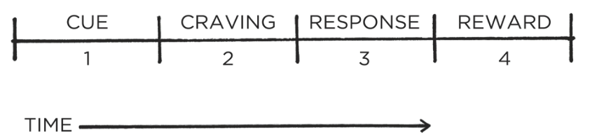

&#123;/*  Start of picture text  */&#125;
CUE1 | CRAVING2 | RESPONSE3 | REWARD4 TIME —_—_—___————————t> &#123;/*  End of picture text  */&#125;

FIGURE 5: All habits proceed through four stages in the same order: cue, craving, response, and reward. 

This four-step pattern is the backbone of every habit, and your brain runs through these steps in the same order each time. First, there is the cue. The cue triggers your brain to initiate a behavior. It is a bit of information that predicts a reward. Our 

44 

prehistoric ancestors were paying attention to cues that signaled the location of primary rewards like food, water, and sex. Today, we spend most of our time learning cues that predict secondary rewards like money and fame, power and status, praise and approval, love and friendship, or a sense of personal satisfaction. (Of course, these pursuits also indirectly improve our odds of survival and reproduction, which is the deeper motive behind everything we do.) 

Your mind is continuously analyzing your internal and external environment for hints of where rewards are located. Because the cue is the first indication that we’re close to a reward, it naturally leads to a craving. 

Cravings are the second step, and they are the motivational force behind every habit. Without some level of motivation or desire— without craving a change—we have no reason to act. What you crave is not the habit itself but the change in state it delivers. You do not crave smoking a cigarette, you crave the feeling of relief it provides. You are not motivated by brushing your teeth but rather by the feeling of a clean mouth. You do not want to turn on the television, you want to be entertained. Every craving is linked to a desire to change your internal state. This is an important point that we will discuss in detail later. 

Cravings differ from person to person. In theory, any piece of information could trigger a craving, but in practice, people are not motivated by the same cues. For a gambler, the sound of slot machines can be a potent trigger that sparks an intense wave of desire. For someone who rarely gambles, the jingles and chimes of the casino are just background noise. Cues are meaningless until they are interpreted. The thoughts, feelings, and emotions of the observer are what transform a cue into a craving. 

The third step is the response. The response is the actual habit you perform, which can take the form of a thought or an action. Whether a response occurs depends on how motivated you are and how much friction is associated with the behavior. If a particular action requires more physical or mental effort than you are willing to expend, then you won’t do it. Your response also depends on your ability. It sounds simple, but a habit can occur only if you are capable of doing it. If you want to dunk a basketball but can’t jump high enough to reach the hoop, well, you’re out of luck. 

45 

Finally, the response delivers a reward. Rewards are the end goal of every habit. The cue is about noticing the reward. The craving is about wanting the reward. The response is about obtaining the reward. We chase rewards because they serve two purposes: (1) they satisfy us and (2) they teach us. 

The first purpose of rewards is to _satisfy your craving_ . Yes, rewards provide benefits on their own. Food and water deliver the energy you need to survive. Getting a promotion brings more money and respect. Getting in shape improves your health and your dating prospects. But the more immediate benefit is that rewards satisfy your craving to eat or to gain status or to win approval. At least for a moment, rewards deliver contentment and relief from craving. 

Second, rewards teach us which actions are worth remembering in the future. Your brain is a reward detector. As you go about your life, your sensory nervous system is continuously monitoring which actions satisfy your desires and deliver pleasure. Feelings of pleasure and disappointment are part of the feedback mechanism that helps your brain distinguish useful actions from useless ones. Rewards close the feedback loop and complete the habit cycle. 

If a behavior is insufficient in any of the four stages, it will not become a habit. Eliminate the cue and your habit will never start. Reduce the craving and you won’t experience enough motivation to act. Make the behavior difficult and you won’t be able to do it. And if the reward fails to satisfy your desire, then you’ll have no reason to do it again in the future. Without the first three steps, a behavior will not occur. Without all four, a behavior will not be repeated. 

###### **THE HABIT LOOP** 

46 

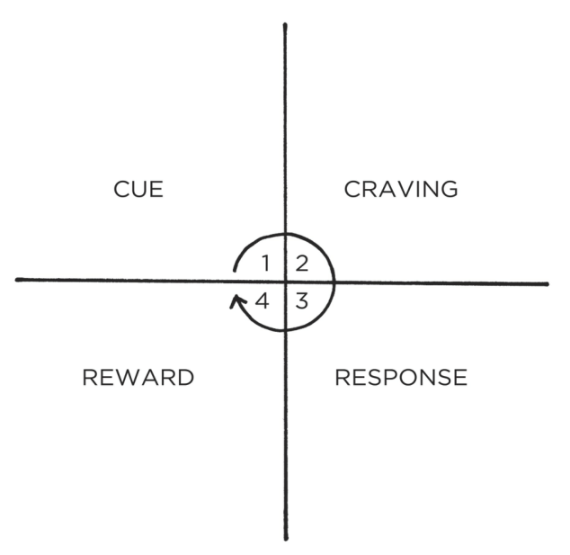

&#123;/*  Start of picture text  */&#125;
CUE CRAVING 1 4 REWARD RESPONSE &#123;/*  End of picture text  */&#125;

FIGURE 6: The four stages of habit are best described as a feedback loop. They form an endless cycle that is running every moment you are alive. This “habit loop” is continually scanning the environment, predicting what will happen next, trying out different responses, and learning from the results.* 

In summary, the cue triggers a craving, which motivates a response, which provides a reward, which satisfies the craving and, ultimately, becomes associated with the cue. Together, these four steps form a neurological feedback loop—cue, craving, response, reward; cue, craving, response, reward—that ultimately allows you to create automatic habits. This cycle is known as the habit loop. 

This four-step process is not something that happens occasionally, but rather it is an endless feedback loop that is running and active during every moment you are alive—even now. The brain is continually scanning the environment, predicting what will happen next, trying out different responses, and learning from the results. The entire process is completed in a split second, and we use it again and again without realizing everything that has been packed into the previous moment. 

We can split these four steps into two phases: the problem phase and the solution phase. The problem phase includes the cue and the craving, and it is when you realize that something needs to change. 

47 

The solution phase includes the response and the reward, and it is when you take action and achieve the change you desire. 

###### **Problem phase** 

**1. Cue** 

**2. Craving** 

###### **Solution phase** 

**3. Response** 

**4. Reward** 

All behavior is driven by the desire to solve a problem. Sometimes the problem is that you notice something good and you want to obtain it. Sometimes the problem is that you are experiencing pain and you want to relieve it. Either way, the purpose of every habit is to solve the problems you face. 

In the table on the following page, you can see a few examples of what this looks like in real life. 

Imagine walking into a dark room and flipping on the light switch. You have performed this simple habit so many times that it occurs without thinking. You proceed through all four stages in the fraction of a second. The urge to act strikes you without thinking. 

###### **Problem phase** 

**1. Cue:** Your phone buzzes with a new text message. **2. Craving:** You want to learn the contents of the message. 

###### **Solution phase** 

**3. Response:** You grab your phone and read the text. **4. Reward:** You satisfy your craving to read the message. Grabbing your phone becomes associated with your phone buzzing. **Problem phase** 

**1. Cue:** You are answering emails. **2. Craving:** You begin to feel stressed and overwhelmed by work. You want to feel in control. 

###### **Solution phase** 

**3. Response:** You bite your nails. 

48 

**4. Reward:** You satisfy your craving to reduce stress. Biting your nails becomes associated with answering email. 

###### **Problem phase** 

**1. Cue:** You wake up. 

**2. Craving:** You want to feel alert. 

###### **Solution phase** 

**3. Response:** You drink a cup of coffee. 

**4. Reward:** You satisfy your craving to feel alert. Drinking coffee becomes associated with waking up. 

###### **Problem phase** 

**1. Cue:** You smell a doughnut shop as you walk down the street near your office. 

**2. Craving:** You begin to crave a doughnut. 

###### **Solution phase** 

**3. Response:** You buy a doughnut and eat it. 

**4. Reward:** You satisfy your craving to eat a doughnut. Buying a doughnut becomes associated with walking down the street near your office. 

###### **Problem phase** 

**1. Cue:** You hit a stumbling block on a project at work. 

**2. Craving:** You feel stuck and want to relieve your frustration. 

###### **Solution phase** 

**3. Response:** You pull out your phone and check social media. 

**4. Reward:** You satisfy your craving to feel relieved. Checking social media becomes associated with feeling stalled at work. 

###### **Problem phase** 

**1. Cue:** You walk into a dark room. 

**2. Craving:** You want to be able to see. 

###### **Solution phase** 

**3. Response:** You flip the light switch. **4. Reward:** You satisfy your craving to see. Turning on the light switch becomes associated with being in a dark room. 

49 

By the time we become adults, we rarely notice the habits that are running our lives. Most of us never give a second thought to the fact that we tie the same shoe first each morning, or unplug the toaster after each use, or always change into comfortable clothes after getting home from work. After decades of mental programming, we automatically slip into these patterns of thinking and acting. 

###### **THE FOUR LAWS OF BEHAVIOR CHANGE** 

In the following chapters, we will see time and again how the four stages of cue, craving, response, and reward influence nearly everything we do each day. But before we do that, we need to transform these four steps into a practical framework that we can use to design good habits and eliminate bad ones. 

I refer to this framework as the _Four Laws of Behavior Change_ , and it provides a simple set of rules for creating good habits and breaking bad ones. You can think of each law as a lever that influences human behavior. When the levers are in the right positions, creating good habits is effortless. When they are in the wrong positions, it is nearly impossible. 

**How to Create a Good Habit** 

**The 1st law (Cue):** Make it obvious. **The 2nd law (Craving):** Make it attractive. **The 3rd law (Response):** Make it easy. **The 4th law (Reward):** Make it satisfying. 

We can invert these laws to learn how to break a bad habit. 

**How to Break a Bad Habit Inversion of the 1st law (Cue):** Make it invisible. **Inversion of the 2nd law (Craving):** Make it unattractive. **Inversion of the 3rd law (Response):** Make it difficult. **Inversion of the 4th law (Reward):** Make it unsatisfying. 

It would be irresponsible for me to claim that these four laws are an exhaustive framework for changing _any_ human behavior, but I 

50 

think they’re close. As you will soon see, the Four Laws of Behavior Change apply to nearly every field, from sports to politics, art to medicine, comedy to management. These laws can be used no matter what challenge you are facing. There is no need for completely different strategies for each habit. Whenever you want to change your behavior, you can simply ask yourself: 

1. How can I make it obvious? 

2. How can I make it attractive? 

3. How can I make it easy? 

4. How can I make it satisfying? 

If you have ever wondered, “Why don’t I do what I say I’m going to do? Why don’t I lose the weight or stop smoking or save for retirement or start that side business? Why do I say something is important but never seem to make time for it?” The answers to those questions can be found somewhere in these four laws. The key to creating good habits and breaking bad ones is to understand these fundamental laws and how to alter them to your specifications. Every goal is doomed to fail if it goes against the grain of human nature. 

Your habits are shaped by the systems in your life. In the chapters that follow, we will discuss these laws one by one and show how you can use them to create a system in which good habits emerge naturally and bad habits wither away. 

###### Chapter Summary 

- A habit is a behavior that has been repeated enough times to become automatic. 

- The ultimate purpose of habits is to solve the problems of life with as little energy and effort as possible. 

- Any habit can be broken down into a feedback loop that involves four steps: cue, craving, response, and reward. The Four Laws of Behavior Change are a simple set of rules we can use to build better habits. They are (1) make it obvious, (2) make it attractive, (3) make it easy, and (4) make it satisfying. 

51 

## **THE 1ST LAW** 

### Make It Obvious 

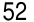

&#123;/*  Start of picture text  */&#125;
52 &#123;/*  End of picture text  */&#125;

&#123;/*  Start of picture text  */&#125;
4 &#123;/*  End of picture text  */&#125;

###### The Man Who Didn’t Look Right 

THE PSYCHOLOGIST GARY Klein once told me a story about a woman who attended a family gathering. She had spent years working as a paramedic and, upon arriving at the event, took one look at her father-in-law and got very concerned. 

“I don’t like the way you look,” she said. 

Her father-in-law, who was feeling perfectly fine, jokingly replied, “Well, I don’t like your looks, either.” 

“No,” she insisted. “You need to go to the hospital now.” 

A few hours later, the man was undergoing lifesaving surgery after an examination had revealed that he had a blockage to a major artery and was at immediate risk of a heart attack. Without his daughter-in-law’s intuition, he could have died. 

What did the paramedic see? How did she predict his impending heart attack? 

When major arteries are obstructed, the body focuses on sending blood to critical organs and away from peripheral locations near the surface of the skin. The result is a change in the pattern of distribution of blood in the face. After many years of working with people with heart failure, the woman had unknowingly developed the ability to recognize this pattern on sight. She couldn’t explain what it was that she noticed in her father-in-law’s face, but she knew something was wrong. 

Similar stories exist in other fields. For example, military analysts can identify which blip on a radar screen is an enemy missile and which one is a plane from their own fleet even though they are traveling at the same speed, flying at the same altitude, and 

53 

look identical on radar in nearly every respect. During the Gulf War, Lieutenant Commander Michael Riley saved an entire battleship when he ordered a missile shot down—despite the fact that it looked exactly like the battleship’s own planes on radar. He made the right call, but even his superior officers couldn’t explain how he did it. 

Museum curators have been known to discern the difference between an authentic piece of art and an expertly produced counterfeit even though they can’t tell you precisely which details tipped them off. Experienced radiologists can look at a brain scan and predict the area where a stroke will develop before any obvious signs are visible to the untrained eye. I’ve even heard of hairdressers noticing whether a client is pregnant based only on the feel of her hair. 

The human brain is a prediction machine. It is continuously taking in your surroundings and analyzing the information it comes across. Whenever you experience something repeatedly—like a paramedic seeing the face of a heart attack patient or a military analyst seeing a missile on a radar screen—your brain begins noticing what is important, sorting through the details and highlighting the relevant cues, and cataloging that information for future use. 

With enough practice, you can pick up on the cues that predict certain outcomes without consciously thinking about it. Automatically, your brain encodes the lessons learned through experience. We can’t always explain what it is we are learning, but learning is happening all along the way, and your ability to notice the relevant cues in a given situation is the foundation for every habit you have. 

We underestimate how much our brains and bodies can do without thinking. You do not tell your hair to grow, your heart to pump, your lungs to breathe, or your stomach to digest. And yet your body handles all this and more on autopilot. You are much more than your conscious self. 

Consider hunger. How do you know when you’re hungry? You don’t necessarily have to see a cookie on the counter to realize that it is time to eat. Appetite and hunger are governed nonconsciously. Your body has a variety of feedback loops that gradually alert you when it is time to eat again and that track what is going on around you and within you. Cravings can arise thanks to hormones and 

54 

chemicals circulating through your body. Suddenly, you’re hungry even though you’re not quite sure what tipped you off. 

This is one of the most surprising insights about our habits: you don’t need to be aware of the cue for a habit to begin. You can notice an opportunity and take action without dedicating conscious attention to it. This is what makes habits useful. 

It’s also what makes them dangerous. As habits form, your actions come under the direction of your automatic and nonconscious mind. You fall into old patterns before you realize what’s happening. Unless someone points it out, you may not notice that you cover your mouth with your hand whenever you laugh, that you apologize before asking a question, or that you have a habit of finishing other people’s sentences. And the more you repeat these patterns, the less likely you become to question what you’re doing and why you’re doing it. 

I once heard of a retail clerk who was instructed to cut up empty gift cards after customers had used up the balance on the card. One day, the clerk cashed out a few customers in a row who purchased with gift cards. When the next person walked up, the clerk swiped the customer’s actual credit card, picked up the scissors, and then cut it in half—entirely on autopilot—before looking up at the stunned customer and realizing what had just happened. 

Another woman I came across in my research was a former preschool teacher who had switched to a corporate job. Even though she was now working with adults, her old habits would kick in and she kept asking coworkers if they had washed their hands after going to the bathroom. I also found the story of a man who had spent years working as a lifeguard and would occasionally yell “Walk!” whenever he saw a child running. 

Over time, the cues that spark our habits become so common that they are essentially invisible: the treats on the kitchen counter, the remote control next to the couch, the phone in our pocket. Our responses to these cues are so deeply encoded that it may feel like the urge to act comes from nowhere. For this reason, we must begin the process of behavior change with awareness. 

Before we can effectively build new habits, we need to get a handle on our current ones. This can be more challenging than it sounds because once a habit is firmly rooted in your life, it is mostly nonconscious and automatic. If a habit remains mindless, you can’t expect to improve it. As the psychologist Carl Jung said, “Until you 

55 

make the unconscious conscious, it will direct your life and you will call it fate.” 

###### **THE HABITS SCORECARD** 

The Japanese railway system is regarded as one of the best in the world. If you ever find yourself riding a train in Tokyo, you’ll notice that the conductors have a peculiar habit. 

As each operator runs the train, they proceed through a ritual of pointing at different objects and calling out commands. When the train approaches a signal, the operator will point at it and say, “Signal is green.” As the train pulls into and out of each station, the operator will point at the speedometer and call out the exact speed. When it’s time to leave, the operator will point at the timetable and state the time. Out on the platform, other employees are performing similar actions. Before each train departs, staff members will point along the edge of the platform and declare, “All clear!” Every detail is identified, pointed at, and named aloud.* 

This process, known as _Pointing-and-Calling_ , is a safety system designed to reduce mistakes. It seems silly, but it works incredibly well. Pointing-and-Calling reduces errors by up to 85 percent and cuts accidents by 30 percent. The MTA subway system in New York City adopted a modified version that is “point-only,” and “within two years of implementation, incidents of incorrectly berthed subways fell 57 percent.” 

Pointing-and-Calling is so effective because it raises the level of awareness from a nonconscious habit to a more conscious level. Because the train operators must use their eyes, hands, mouth, and ears, they are more likely to notice problems before something goes wrong. 

My wife does something similar. Whenever we are preparing to walk out the door for a trip, she verbally calls out the most essential items in her packing list. “I’ve got my keys. I’ve got my wallet. I’ve got my glasses. I’ve got my husband.” 

The more automatic a behavior becomes, the less likely we are to consciously think about it. And when we’ve done something a thousand times before, we begin to overlook things. We assume that the next time will be just like the last. We’re so used to doing what we’ve always done that we don’t stop to question whether it’s the 

56 

right thing to do at all. Many of our failures in performance are largely attributable to a lack of self-awareness. 

One of our greatest challenges in changing habits is maintaining awareness of what we are actually doing. This helps explain why the consequences of bad habits can sneak up on us. We need a “pointand-call” system for our personal lives. That’s the origin of the Habits Scorecard, which is a simple exercise you can use to become more aware of your behavior. To create your own, make a list of your daily habits. 

Here’s a sample of where your list might start: 

- Wake up 

- Turn off alarm 

- Check my phone 

- Go to the bathroom 

- Weigh myself 

- Take a shower 

- Brush my teeth 

- Floss my teeth 

- Put on deodorant 

- Hang up towel to dry 

- Get dressed 

- Make a cup of tea 

. . . and so on. 

Once you have a full list, look at each behavior, and ask yourself, “Is this a good habit, a bad habit, or a neutral habit?” If it is a good habit, write “+” next to it. If it is a bad habit, write “–”. If it is a neutral habit, write “=”. 

For example, the list above might look like this: 

Wake up = 

- Turn off alarm = 

- Check my phone – 

- Go to the bathroom = 

- Weigh myself + 

- Take a shower + 

- Brush my teeth + 

- Floss my teeth + 

57 

Put on deodorant + Hang up towel to dry = Get dressed = 

Make a cup of tea + 

The marks you give to a particular habit will depend on your situation and your goals. For someone who is trying to lose weight, eating a bagel with peanut butter every morning might be a bad habit. For someone who is trying to bulk up and add muscle, the same behavior might be a good habit. It all depends on what you’re working toward.* 

Scoring your habits can be a bit more complex for another reason as well. The labels “good habit” and “bad habit” are slightly inaccurate. There are no good habits or bad habits. There are only effective habits. That is, effective at solving problems. All habits serve you in some way—even the bad ones—which is why you repeat them. For this exercise, categorize your habits by how they will benefit you in the long run. Generally speaking, good habits will have net positive outcomes. Bad habits have net negative outcomes. Smoking a cigarette may reduce stress right now (that’s how it’s serving you), but it’s not a healthy long-term behavior. 

If you’re still having trouble determining how to rate a particular habit, here is a question I like to use: “Does this behavior help me become the type of person I wish to be? Does this habit cast a vote for or against my desired identity?” Habits that reinforce your desired identity are usually good. Habits that conflict with your desired identity are usually bad. 

As you create your Habits Scorecard, there is no need to change anything at first. The goal is to simply notice what is actually going on. Observe your thoughts and actions without judgment or internal criticism. Don’t blame yourself for your faults. Don’t praise yourself for your successes. 

If you eat a chocolate bar every morning, acknowledge it, almost as if you were watching someone else. _Oh, how interesting that they would do such a thing._ If you binge-eat, simply notice that you are eating more calories than you should. If you waste time online, notice that you are spending your life in a way that you do not want to. 

The first step to changing bad habits is to be on the lookout for them. If you feel like you need extra help, then you can try Pointing- 

58 

and-Calling in your own life. Say out loud the action that you are thinking of taking and what the outcome will be. If you want to cut back on your junk food habit but notice yourself grabbing another cookie, say out loud, “I’m about to eat this cookie, but I don’t need it. Eating it will cause me to gain weight and hurt my health.” 

Hearing your bad habits spoken aloud makes the consequences seem more real. It adds weight to the action rather than letting yourself mindlessly slip into an old routine. This approach is useful even if you’re simply trying to remember a task on your to-do list. Just saying out loud, “Tomorrow, I need to go to the post office after lunch,” increases the odds that you’ll actually do it. You’re getting yourself to acknowledge the need for action—and that can make all the difference. 

The process of behavior change always starts with awareness. Strategies like Pointing-and-Calling and the Habits Scorecard are focused on getting you to recognize your habits and acknowledge the cues that trigger them, which makes it possible to respond in a way that benefits you. 

###### Chapter Summary 

- With enough practice, your brain will pick up on the cues that predict certain outcomes without consciously thinking about it. Once our habits become automatic, we stop paying attention to what we are doing. 

- The process of behavior change always starts with awareness. You need to be aware of your habits before you can change them. 

- Pointing-and-Calling raises your level of awareness from a nonconscious habit to a more conscious level by verbalizing your actions. 

- The Habits Scorecard is a simple exercise you can use to become more aware of your behavior. 

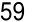

&#123;/*  Start of picture text  */&#125;
59 &#123;/*  End of picture text  */&#125;

###### 5 

###### The Best Way to Start a New Habit 

**I** N 2001, RESEARCHERS in Great Britain began working with 248 people to build better exercise habits over the course of two weeks. The subjects were divided into three groups. 

The first group was the control group. They were simply asked to track how often they exercised. 

The second group was the “motivation” group. They were asked not only to track their workouts but also to read some material on the benefits of exercise. The researchers also explained to the group how exercise could reduce the risk of coronary heart disease and improve heart health. 

Finally, there was the third group. These subjects received the same presentation as the second group, which ensured that they had equal levels of motivation. However, they were also asked to formulate a plan for when and where they would exercise over the following week. Specifically, each member of the third group completed the following sentence: “During the next week, I will partake in at least 20 minutes of vigorous exercise on [DAY] at [TIME] in [PLACE].” 

In the first and second groups, 35 to 38 percent of people exercised at least once per week. (Interestingly, the motivational presentation given to the second group seemed to have no meaningful impact on behavior.) But 91 percent of the third group exercised at least once per week—more than double the normal rate. The sentence they filled out is what researchers refer to as an _implementation intention_ , which is a plan you make beforehand 

60 

about when and where to act. That is, how you _intend_ to _implement_ a particular habit. 

The cues that can trigger a habit come in a wide range of forms— the feel of your phone buzzing in your pocket, the smell of chocolate chip cookies, the sound of ambulance sirens—but the two most common cues are time and location. Implementation intentions leverage both of these cues. 

Broadly speaking, the format for creating an implementation intention is: “When situation X arises, I will perform response Y.” 

Hundreds of studies have shown that implementation intentions are effective for sticking to our goals, whether it’s writing down the exact time and date of when you will get a flu shot or recording the time of your colonoscopy appointment. They increase the odds that people will stick with habits like recycling, studying, going to sleep early, and stopping smoking. 

Researchers have even found that voter turnout increases when people are forced to create implementation intentions by answering questions like: “What route are you taking to the polling station? At what time are you planning to go? What bus will get you there?” Other successful government programs have prompted citizens to make a clear plan to send taxes in on time or provided directions on when and where to pay late traffic bills. 

The punch line is clear: people who make a specific plan for when and where they will perform a new habit are more likely to follow through. Too many people try to change their habits without these basic details figured out. We tell ourselves, “I’m going to eat healthier” or “I’m going to write more,” but we never say when and where these habits are going to happen. We leave it up to chance and hope that we will “just remember to do it” or feel motivated at the right time. An implementation intention sweeps away foggy notions like “I want to work out more” or “I want to be more productive” or “I should vote” and transforms them into a concrete plan of action. 

Many people think they lack motivation when what they really lack is clarity. It is not always obvious when and where to take 

61 

action. Some people spend their entire lives waiting for the time to be right to make an improvement. 

Once an implementation intention has been set, you don’t have to wait for inspiration to strike. _Do I write a chapter today or not? Do I meditate this morning or at lunch?_ When the moment of action occurs, there is no need to make a decision. Simply follow your predetermined plan. 

The simple way to apply this strategy to your habits is to fill out this sentence: I will [BEHAVIOR] at [TIME] in [LOCATION]. 

- Meditation. I will meditate for one minute at 7 a.m. in my kitchen. 

- Studying. I will study Spanish for twenty minutes at 6 p.m. in my bedroom. 

- Exercise. I will exercise for one hour at 5 p.m. in my local gym. Marriage. I will make my partner a cup of tea at 8 a.m. in the kitchen. 

If you aren’t sure when to start your habit, try the first day of the week, month, or year. People are more likely to take action at those times because hope is usually higher. If we have hope, we have a reason to take action. A fresh start feels motivating. 

There is another benefit to implementation intentions. Being specific about what you want and how you will achieve it helps you say no to things that derail progress, distract your attention, and pull you off course. We often say yes to little requests because we are not clear enough about what we need to be doing instead. When your dreams are vague, it’s easy to rationalize little exceptions all day long and never get around to the specific things you need to do to succeed. 

Give your habits a time and a space to live in the world. The goal is to make the time and location so obvious that, with enough repetition, you get an urge to do the right thing at the right time, even if you can’t say why. As the writer Jason Zweig noted, “Obviously you’re never going to just work out without conscious thought. But like a dog salivating at a bell, maybe you start to get antsy around the time of day you normally work out.” 

62 

There are many ways to use implementation intentions in your life and work. My favorite approach is one I learned from Stanford professor BJ Fogg and it is a strategy I refer to as _habit stacking_ . 

###### **HABIT STACKING: A SIMPLE PLAN TO OVERHAUL YOUR HABITS** 

The French philosopher Denis Diderot lived nearly his entire life in poverty, but that all changed one day in 1765. 

Diderot’s daughter was about to be married and he could not afford to pay for the wedding. Despite his lack of wealth, Diderot was well known for his role as the co-founder and writer of _Encyclopédie_ , one of the most comprehensive encyclopedias of the time. When Catherine the Great, the Empress of Russia, heard of Diderot’s financial troubles, her heart went out to him. She was a book lover and greatly enjoyed his encyclopedia. She offered to buy Diderot’s personal library for £1,000—more than $150,000 today.* Suddenly, Diderot had money to spare. With his new wealth, he not only paid for the wedding but also acquired a scarlet robe for himself. 

Diderot’s scarlet robe was beautiful. So beautiful, in fact, that he immediately noticed how out of place it seemed when surrounded by his more common possessions. He wrote that there was “no more coordination, no more unity, no more beauty” between his elegant robe and the rest of his stuff. 

Diderot soon felt the urge to upgrade his possessions. He replaced his rug with one from Damascus. He decorated his home with expensive sculptures. He bought a mirror to place above the mantel, and a better kitchen table. He tossed aside his old straw chair for a leather one. Like falling dominoes, one purchase led to the next. 

Diderot’s behavior is not uncommon. In fact, the tendency for one purchase to lead to another one has a name: the Diderot Effect. The Diderot Effect states that obtaining a new possession often creates a spiral of consumption that leads to additional purchases. 

You can spot this pattern everywhere. You buy a dress and have to get new shoes and earrings to match. You buy a couch and suddenly question the layout of your entire living room. You buy a 

63 

toy for your child and soon find yourself purchasing all of the accessories that go with it. It’s a chain reaction of purchases. 

Many human behaviors follow this cycle. You often decide what to do next based on what you have just finished doing. Going to the bathroom leads to washing and drying your hands, which reminds you that you need to put the dirty towels in the laundry, so you add laundry detergent to the shopping list, and so on. No behavior happens in isolation. Each action becomes a cue that triggers the next behavior. 

Why is this important? 

When it comes to building new habits, you can use the connectedness of behavior to your advantage. One of the best ways to build a new habit is to identify a current habit you already do each day and then stack your new behavior on top. This is called _habit stacking_ . 

Habit stacking is a special form of an implementation intention. Rather than pairing your new habit with a particular time and location, you pair it with a current habit. This method, which was created by BJ Fogg as part of his Tiny Habits program, can be used to design an obvious cue for nearly any habit.* 

###### The habit stacking formula is: “After [CURRENT HABIT], I will [NEW HABIT].” 

For example: 

- Meditation. After I pour my cup of coffee each morning, I will meditate for one minute. 

- Exercise. After I take off my work shoes, I will immediately change into my workout clothes. 

- Gratitude. After I sit down to dinner, I will say one thing I’m grateful for that happened today. 

- Marriage. After I get into bed at night, I will give my partner a kiss. 

- Safety. After I put on my running shoes, I will text a friend or family member where I am running and how long it will take. 

The key is to tie your desired behavior into something you already do each day. Once you have mastered this basic structure, 

64 

you can begin to create larger stacks by chaining small habits together. This allows you to take advantage of the natural momentum that comes from one behavior leading into the next—a positive version of the Diderot Effect. 

###### **HABIT STACKING** 

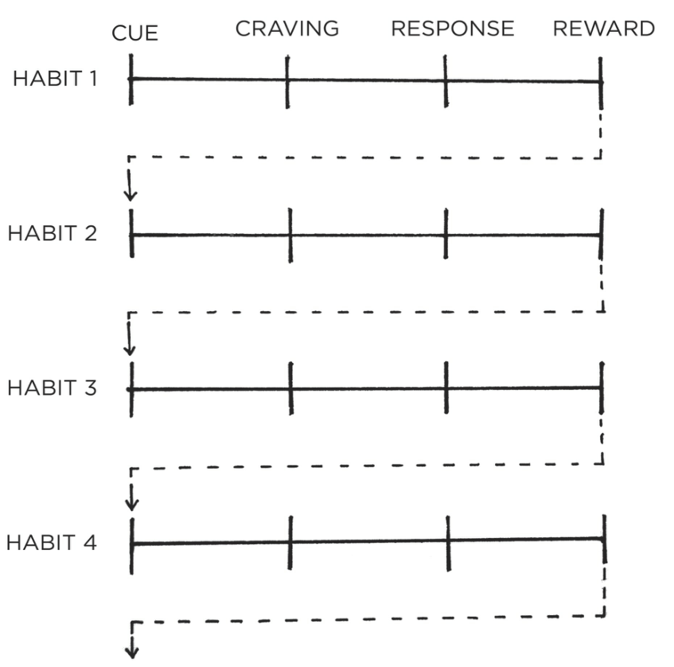

&#123;/*  Start of picture text  */&#125;
CUE CRAVING RESPONSE REWARD HABIT 1 f->——_+——__—_—_ aa HABIT 2 [|__| \ eeee | t - ee| HABIT 4 &#125;+—_&#125;+—__+—_4! 1 ------------d v &#123;/*  End of picture text  */&#125;

FIGURE 7: Habit stacking increases the likelihood that you’ll stick with a habit by stacking your new behavior on top of an old one. This process can be repeated to chain numerous habits together, each one acting as the cue for the next. 

Your morning routine habit stack might look like this: 

1. After I pour my morning cup of coffee, I will meditate for sixty seconds. 

65 

2. After I meditate for sixty seconds, I will write my to-do list for the day. 

3. After I write my to-do list for the day, I will immediately begin my first task. 

Or, consider this habit stack in the evening: 

1. After I finish eating dinner, I will put my plate directly into the dishwasher. 

2. After I put my dishes away, I will immediately wipe down the counter. 

3. After I wipe down the counter, I will set out my coffee mug for tomorrow morning. 

You can also insert new behaviors into the middle of your current routines. For example, you may already have a morning routine that looks like this: Wake up > Make my bed > Take a shower. Let’s say you want to develop the habit of reading more each night. You can expand your habit stack and try something like: Wake up > Make my bed > _Place a book on my pillow_ > Take a shower. Now, when you climb into bed each night, a book will be sitting there waiting for you to enjoy. 

Overall, habit stacking allows you to create a set of simple rules that guide your future behavior. It’s like you always have a game plan for which action should come next. Once you get comfortable with this approach, you can develop general habit stacks to guide you whenever the situation is appropriate: 

- Exercise. When I see a set of stairs, I will take them instead of using the elevator. 

- Social skills. When I walk into a party, I will introduce myself to someone I don’t know yet. 

- Finances. When I want to buy something over $100, I will wait twenty-four hours before purchasing. 

- Healthy eating. When I serve myself a meal, I will always put veggies on my plate first. 

- Minimalism. When I buy a new item, I will give something away. (“One in, one out.”) 

66 

Mood. When the phone rings, I will take one deep breath and smile before answering. 

- Forgetfulness. When I leave a public place, I will check the table and chairs to make sure I don’t leave anything behind. 

No matter how you use this strategy, the secret to creating a successful habit stack is selecting the right cue to kick things off. Unlike an implementation intention, which specifically states the time and location for a given behavior, habit stacking implicitly has the time and location built into it. When and where you choose to insert a habit into your daily routine can make a big difference. If you’re trying to add meditation into your morning routine but mornings are chaotic and your kids keep running into the room, then that may be the wrong place and time. Consider when you are most likely to be successful. Don’t ask yourself to do a habit when you’re likely to be occupied with something else. 

Your cue should also have the same frequency as your desired habit. If you want to do a habit every day, but you stack it on top of a habit that only happens on Mondays, that’s not a good choice. 

One way to find the right trigger for your habit stack is by brainstorming a list of your current habits. You can use your Habits Scorecard from the last chapter as a starting point. Alternatively, you can create a list with two columns. In the first column, write down the habits you do each day without fail.* 

For example: 

Get out of bed. 

- Take a shower. Brush your teeth. Get dressed. 

- Brew a cup of coffee. Eat breakfast. 

- Take the kids to school. 

- Start the work day. Eat lunch. 

- End the work day. 

- Change out of work clothes. Sit down for dinner. 

- Turn off the lights. 

67 

Get into bed. 

Your list can be much longer, but you get the idea. In the second column, write down all of the things that happen to you each day without fail. For example: 

The sun rises. 

You get a text message. The song you are listening to ends. The sun sets. 

Armed with these two lists, you can begin searching for the best place to layer your new habit into your lifestyle. 

Habit stacking works best when the cue is highly specific and immediately actionable. Many people select cues that are too vague. I made this mistake myself. When I wanted to start a push-up habit, my habit stack was “When I take a break for lunch, I will do ten push-ups.” At first glance, this sounded reasonable. But soon, I realized the trigger was unclear. Would I do my push-ups before I ate lunch? After I ate lunch? Where would I do them? After a few inconsistent days, I changed my habit stack to: “When I close my laptop for lunch, I will do ten push-ups next to my desk.” Ambiguity gone. 

Habits like “read more” or “eat better” are worthy causes, but these goals do not provide instruction on how and when to act. Be specific and clear: After I close the door. After I brush my teeth. After I sit down at the table. The specificity is important. The more tightly bound your new habit is to a specific cue, the better the odds are that you will notice when the time comes to act. 

The 1st Law of Behavior Change is to _make it obvious._ Strategies like implementation intentions and habit stacking are among the most practical ways to create obvious cues for your habits and design a clear plan for when and where to take action. 

###### Chapter Summary 

The 1st Law of Behavior Change is _make it obvious_ . The two most common cues are time and location. 

68 

- Creating an implementation intention is a strategy you can use to pair a new habit with a specific time and location. The implementation intention formula is: I will [BEHAVIOR] at [TIME] in [LOCATION]. 

- Habit stacking is a strategy you can use to pair a new habit with a current habit. 

- The habit stacking formula is: After [CURRENT HABIT], I will [NEW HABIT]. 

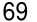

&#123;/*  Start of picture text  */&#125;
69 &#123;/*  End of picture text  */&#125;

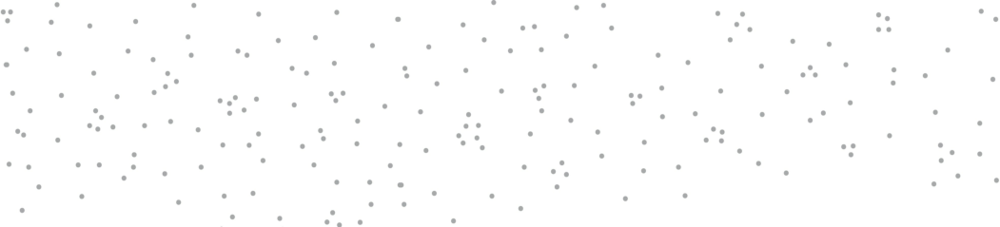

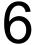

&#123;/*  Start of picture text  */&#125;
6 &#123;/*  End of picture text  */&#125;

###### Motivation Is Overrated; Environment Often Matters More 

ANNE THORNDIKE, A primary care physician at Massachusetts General Hospital in Boston, had a crazy idea. She believed she could improve the eating habits of thousands of hospital staff and visitors without changing their willpower or motivation in the slightest way. In fact, she didn’t plan on talking to them at all. 

Thorndike and her colleagues designed a six-month study to alter the “choice architecture” of the hospital cafeteria. They started by changing how drinks were arranged in the room. Originally, the refrigerators located next to the cash registers in the cafeteria were filled with only soda. The researchers added water as an option to each one. Additionally, they placed baskets of bottled water next to the food stations throughout the room. Soda was still in the primary refrigerators, but water was now available at _all_ drink locations. 

Over the next three months, the number of soda sales at the hospital dropped by 11.4 percent. Meanwhile, sales of bottled water increased by 25.8 percent. They made similar adjustments—and saw similar results—with the food in the cafeteria. Nobody had said a word to anyone eating there. 

**BEFORE** 

**AFTER** 

70 

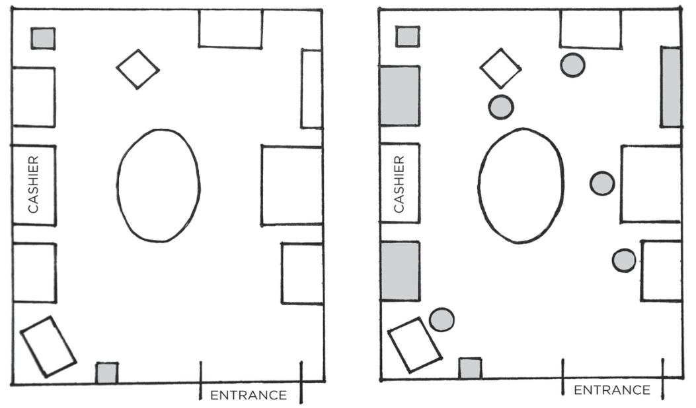

&#123;/*  Start of picture text  */&#125;
oO | | oO || 17° (| gs? O | | OOHOL © - To t ENTRANCE 1S = ENTRANCE &#123;/*  End of picture text  */&#125;

FIGURE 8: Here is a representation of what the cafeteria looked like before the environment design changes were made (left) and after (right). The shaded boxes indicate areas where bottled water was available in each instance. Because the amount of water in the environment was increased, behavior shifted naturally and without additional motivation. 

People often choose products not because of _what_ they are, but because of _where_ they are. If I walk into the kitchen and see a plate of cookies on the counter, I’ll pick up half a dozen and start eating, even if I hadn’t been thinking about them beforehand and didn’t necessarily feel hungry. If the communal table at the office is always filled with doughnuts and bagels, it’s going to be hard not to grab one every now and then. Your habits change depending on the room you are in and the cues in front of you. 

Environment is the invisible hand that shapes human behavior. Despite our unique personalities, certain behaviors tend to arise again and again under certain environmental conditions. In church, people tend to talk in whispers. On a dark street, people act wary and guarded. In this way, the most common form of change is not internal, but external: we are changed by the world around us. Every habit is context dependent. 

71 

In 1936, psychologist Kurt Lewin wrote a simple equation that makes a powerful statement: Behavior is a function of the Person in their Environment, or B = _f_ (P,E). 

It didn’t take long for Lewin’s Equation to be tested in business. In 1952, the economist Hawkins Stern described a phenomenon he called _Suggestion Impulse Buying_ , which “is triggered when a shopper sees a product for the first time and visualizes a need for it.” In other words, customers will occasionally buy products not because they _want_ them but because of how they are _presented_ to them. 

For example, items at eye level tend to be purchased more than those down near the floor. For this reason, you’ll find expensive brand names featured in easy-to-reach locations on store shelves because they drive the most profit, while cheaper alternatives are tucked away in harder-to-reach spots. The same goes for end caps, which are the units at the end of aisles. End caps are moneymaking machines for retailers because they are obvious locations that encounter a lot of foot traffic. For example, 45 percent of Coca-Cola sales come specifically from end-of-the-aisle racks. 

The more obviously available a product or service is, the more likely you are to try it. People drink Bud Light because it is in every bar and visit Starbucks because it is on every corner. We like to think that we are in control. If we choose water over soda, we assume it is because we wanted to do so. The truth, however, is that many of the actions we take each day are shaped not by purposeful drive and choice but by the most obvious option. 

Every living being has its own methods for sensing and understanding the world. Eagles have remarkable long-distance vision. Snakes can smell by “tasting the air” with their highly sensitive tongues. Sharks can detect small amounts of electricity and vibrations in the water caused by nearby fish. Even bacteria have chemoreceptors—tiny sensory cells that allow them to detect toxic chemicals in their environment. 

In humans, perception is directed by the sensory nervous system. We perceive the world through sight, sound, smell, touch, and taste. But we also have other ways of sensing stimuli. Some are conscious, but many are nonconscious. For instance, you can “notice” when the temperature drops before a storm, or when the pain in your gut rises during a stomachache, or when you fall off balance while walking on rocky ground. Receptors in your body pick up on a wide 

72 

range of internal stimuli, such as the amount of salt in your blood or the need to drink when thirsty. 

The most powerful of all human sensory abilities, however, is vision. The human body has about eleven million sensory receptors. Approximately ten million of those are dedicated to sight. Some experts estimate that half of the brain’s resources are used on vision. Given that we are more dependent on vision than on any other sense, it should come as no surprise that visual cues are the greatest catalyst of our behavior. For this reason, a small change in what you _see_ can lead to a big shift in what you _do_ . As a result, you can imagine how important it is to live and work in environments that are filled with productive cues and devoid of unproductive ones. 

Thankfully, there is good news in this respect. You don’t have to be the victim of your environment. You can also be the architect of it. 

###### **HOW TO DESIGN YOUR ENVIRONMENT FOR SUCCESS** 

During the energy crisis and oil embargo of the 1970s, Dutch researchers began to pay close attention to the country’s energy usage. In one suburb near Amsterdam, they found that some homeowners used 30 percent less energy than their neighbors— despite the homes being of similar size and getting electricity for the same price. 

It turned out the houses in this neighborhood were nearly identical except for one feature: the location of the electrical meter. Some had one in the basement. Others had the electrical meter upstairs in the main hallway. As you may guess, the homes with the meters located in the main hallway used less electricity. When their energy use was obvious and easy to track, people changed their behavior. 

Every habit is initiated by a cue, and we are more likely to notice cues that stand out. Unfortunately, the environments where we live and work often make it easy _not_ to do certain actions because there is no obvious cue to trigger the behavior. It’s easy _not_ to practice the guitar when it’s tucked away in the closet. It’s easy _not_ to read a book when the bookshelf is in the corner of the guest room. It’s easy _not_ to take your vitamins when they are out of sight in the pantry. 

73 

When the cues that spark a habit are subtle or hidden, they are easy to ignore. 

By comparison, creating obvious visual cues can draw your attention toward a desired habit. In the early 1990s, the cleaning staff at Schiphol Airport in Amsterdam installed a small sticker that looked like a fly near the center of each urinal. Apparently, when men stepped up to the urinals, they aimed for what they thought was a bug. The stickers improved their aim and significantly reduced “spillage” around the urinals. Further analysis determined that the stickers cut bathroom cleaning costs by 8 percent per year. 

I’ve experienced the power of obvious cues in my own life. I used to buy apples from the store, put them in the crisper in the bottom of the refrigerator, and forget all about them. By the time I remembered, the apples would have gone bad. I never saw them, so I never ate them. 

Eventually, I took my own advice and redesigned my environment. I bought a large display bowl and placed it in the middle of the kitchen counter. The next time I bought apples, that was where they went—out in the open where I could see them. Almost like magic, I began eating a few apples each day simply because they were obvious rather than out of sight. 

Here are a few ways you can redesign your environment and make the cues for your preferred habits more obvious: 

If you want to remember to take your medication each night, put your pill bottle directly next to the faucet on the bathroom counter. 

If you want to practice guitar more frequently, place your guitar stand in the middle of the living room. 

If you want to remember to send more thank-you notes, keep a stack of stationery on your desk. 

If you want to drink more water, fill up a few water bottles each morning and place them in common locations around the house. 

If you want to make a habit a big part of your life, make the cue a big part of your environment. The most persistent behaviors usually have multiple cues. Consider how many different ways a smoker 

74 could be prompted to pull out a cigarette: driving in the car, seeing a friend smoke, feeling stressed at work, and so on. 

The same strategy can be employed for good habits. By sprinkling triggers throughout your surroundings, you increase the odds that you’ll think about your habit throughout the day. Make sure the best choice is the most obvious one. Making a better decision is easy and natural when the cues for good habits are right in front of you. 

Environment design is powerful not only because it influences how we engage with the world but also because we rarely do it. Most people live in a world others have created for them. But you can alter the spaces where you live and work to increase your exposure to positive cues and reduce your exposure to negative ones. Environment design allows you to take back control and become the architect of your life. Be the designer of your world and not merely the consumer of it. 

###### **THE CONTEXT IS THE CUE** 

The cues that trigger a habit can start out very specific, but over time your habits become associated not with a single trigger but with the entire _context_ surrounding the behavior. 

For example, many people drink more in social situations than they would ever drink alone. The trigger is rarely a single cue, but rather the whole situation: watching your friends order drinks, hearing the music at the bar, seeing the beers on tap. 

We mentally assign our habits to the locations in which they occur: the home, the office, the gym. Each location develops a connection to certain habits and routines. You establish a particular relationship with the objects on your desk, the items on your kitchen counter, the things in your bedroom. 

Our behavior is not defined by the objects in the environment but by our relationship to them. In fact, this is a useful way to think about the influence of the environment on your behavior. Stop thinking about your environment as filled with objects. Start thinking about it as filled with relationships. Think in terms of how you interact with the spaces around you. For one person, her couch is the place where she reads for an hour each night. For someone else, the couch is where he watches television and eats a bowl of ice 

75 

cream after work. Different people can have different memories— and thus different habits—associated with the same place. 

The good news? You can train yourself to link a particular habit with a particular context. 

In one study, scientists instructed insomniacs to get into bed only when they were tired. If they couldn’t fall asleep, they were told to sit in a different room until they became sleepy. Over time, subjects began to associate the context of their bed with the action of sleeping, and it became easier to quickly fall asleep when they climbed in bed. Their brains learned that sleeping—not browsing on their phones, not watching television, not staring at the clock—was the only action that happened in that room. 

The power of context also reveals an important strategy: habits can be easier to change in a new environment. It helps to escape the subtle triggers and cues that nudge you toward your current habits. Go to a new place—a different coffee shop, a bench in the park, a corner of your room you seldom use—and create a new routine there. 

It is easier to associate a new habit with a new context than to build a new habit in the face of competing cues. It can be difficult to go to bed early if you watch television in your bedroom each night. It can be hard to study in the living room without getting distracted if that’s where you always play video games. But when you step outside your normal environment, you leave your behavioral biases behind. You aren’t battling old environmental cues, which allows new habits to form without interruption. 

Want to think more creatively? Move to a bigger room, a rooftop patio, or a building with expansive architecture. Take a break from the space where you do your daily work, which is also linked to your current thought patterns. 

Trying to eat healthier? It is likely that you shop on autopilot at your regular supermarket. Try a new grocery store. You may find it easier to avoid unhealthy food when your brain doesn’t automatically know where it is located in the store. 

When you can’t manage to get to an entirely new environment, redefine or rearrange your current one. Create a separate space for work, study, exercise, entertainment, and cooking. The mantra I find useful is “One space, one use.” 

When I started my career as an entrepreneur, I would often work from my couch or at the kitchen table. In the evenings, I found it 

76 

very difficult to stop working. There was no clear division between the end of work time and the beginning of personal time. Was the kitchen table my office or the space where I ate meals? Was the couch where I relaxed or where I sent emails? Everything happened in the same place. 

A few years later, I could finally afford to move to a home with a separate room for my office. Suddenly, work was something that happened “in here” and personal life was something that happened “out there.” It was easier for me to turn off the professional side of my brain when there was a clear dividing line between work life and home life. Each room had one primary use. The kitchen was for cooking. The office was for working. 

Whenever possible, avoid mixing the context of one habit with another. When you start mixing contexts, you’ll start mixing habits —and the easier ones will usually win out. This is one reason why the versatility of modern technology is both a strength and a weakness. You can use your phone for all sorts of tasks, which makes it a powerful device. But when you can use your phone to do nearly anything, it becomes hard to associate it with one task. You want to be productive, but you’re also conditioned to browse social media, check email, and play video games whenever you open your phone. It’s a mishmash of cues. 

You may be thinking, “You don’t understand. I live in New York City. My apartment is the size of a smartphone. I need each room to play multiple roles.” Fair enough. If your space is limited, divide your room into activity zones: a chair for reading, a desk for writing, a table for eating. You can do the same with your digital spaces. I know a writer who uses his computer only for writing, his tablet only for reading, and his phone only for social media and texting. Every habit should have a home. 

If you can manage to stick with this strategy, each context will become associated with a particular habit and mode of thought. Habits thrive under predictable circumstances like these. Focus comes automatically when you are sitting at your work desk. Relaxation is easier when you are in a space designed for that purpose. Sleep comes quickly when it is the only thing that happens in your bedroom. If you want behaviors that are stable and predictable, you need an environment that is stable and predictable. 

A stable environment where everything has a place and a purpose is an environment where habits can easily form. 

77 

###### Chapter Summary 

- Small changes in context can lead to large changes in behavior over time. 

- Every habit is initiated by a cue. We are more likely to notice cues that stand out. 

- Make the cues of good habits obvious in your environment. Gradually, your habits become associated not with a single trigger but with the entire context surrounding the behavior. The context becomes the cue. 

- It is easier to build new habits in a new environment because you are not fighting against old cues. 

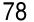

&#123;/*  Start of picture text  */&#125;
78 &#123;/*  End of picture text  */&#125;

7 

###### The Secret to Self-Control 

**I** N 1971, as the Vietnam War was heading into its sixteenth year, congressmen Robert Steele from Connecticut and Morgan Murphy from Illinois made a discovery that stunned the American public. While visiting the troops, they had learned that over 15 percent of U.S. soldiers stationed there were heroin addicts. Followup research revealed that 35 percent of service members in Vietnam had tried heroin and as many as 20 percent were addicted—the problem was even worse than they had initially thought. 

The discovery led to a flurry of activity in Washington, including the creation of the Special Action Office of Drug Abuse Prevention under President Nixon to promote prevention and rehabilitation and to track addicted service members when they returned home. 

Lee Robins was one of the researchers in charge. In a finding that completely upended the accepted beliefs about addiction, Robins found that when soldiers who had been heroin users returned home, only 5 percent of them became re-addicted within a year, and just 12 percent relapsed within three years. In other words, approximately nine out of ten soldiers who used heroin in Vietnam eliminated their addiction nearly overnight. 

This finding contradicted the prevailing view at the time, which considered heroin addiction to be a permanent and irreversible condition. Instead, Robins revealed that addictions could spontaneously dissolve if there was a radical change in the environment. In Vietnam, soldiers spent all day surrounded by cues triggering heroin use: it was easy to access, they were engulfed by the constant stress of war, they built friendships with fellow soldiers 

79 

who were also heroin users, and they were thousands of miles from home. Once a soldier returned to the United States, though, he found himself in an environment devoid of those triggers. When the context changed, so did the habit. 

Compare this situation to that of a typical drug user. Someone becomes addicted at home or with friends, goes to a clinic to get clean—which is devoid of all the environmental stimuli that prompt their habit—then returns to their old neighborhood with all of their previous cues that caused them to get addicted in the first place. It’s no wonder that usually you see numbers that are the exact opposite of those in the Vietnam study. Typically, 90 percent of heroin users become re-addicted once they return home from rehab. 

The Vietnam studies ran counter to many of our cultural beliefs about bad habits because it challenged the conventional association of unhealthy behavior as a moral weakness. If you’re overweight, a smoker, or an addict, you’ve been told your entire life that it is because you lack self-control—maybe even that you’re a bad person. The idea that a little bit of discipline would solve all our problems is deeply embedded in our culture. 

Recent research, however, shows something different. When scientists analyze people who appear to have tremendous selfcontrol, it turns out those individuals aren’t all that different from those who are struggling. Instead, “disciplined” people are better at structuring their lives in a way that _does not require_ heroic willpower and self-control. In other words, they spend less time in tempting situations. 

The people with the best self-control are typically the ones who need to use it the least. It’s easier to practice self-restraint when you don’t have to use it very often. So, yes, perseverance, grit, and willpower are essential to success, but the way to improve these qualities is not by wishing you were a more disciplined person, but by creating a more disciplined environment. 

This counterintuitive idea makes even more sense once you understand what happens when a habit is formed in the brain. A habit that has been encoded in the mind is ready to be used whenever the relevant situation arises. When Patty Olwell, a therapist from Austin, Texas, started smoking, she would often light up while riding horses with a friend. Eventually, she quit smoking and avoided it for years. She had also stopped riding. Decades later, she hopped on a horse again and found herself craving a cigarette 

80 

for the first time in forever. The cues were still internalized; she just hadn’t been exposed to them in a long time. 

Once a habit has been encoded, the urge to act follows whenever the environmental cues reappear. This is one reason behavior change techniques can backfire. Shaming obese people with weightloss presentations can make them feel stressed, and as a result many people return to their favorite coping strategy: overeating. Showing pictures of blackened lungs to smokers leads to higher levels of anxiety, which drives many people to reach for a cigarette. If you’re not careful about cues, you can cause the very behavior you want to stop. 

Bad habits are autocatalytic: the process feeds itself. They foster the feelings they try to numb. You feel bad, so you eat junk food. Because you eat junk food, you feel bad. Watching television makes you feel sluggish, so you watch more television because you don’t have the energy to do anything else. Worrying about your health makes you feel anxious, which causes you to smoke to ease your anxiety, which makes your health even worse and soon you’re feeling more anxious. It’s a downward spiral, a runaway train of bad habits. 

Researchers refer to this phenomenon as “cue-induced wanting”: an external trigger causes a compulsive craving to repeat a bad habit. Once you _notice_ something, you begin to _want_ it. This process is happening all the time—often without us realizing it. Scientists have found that showing addicts a picture of cocaine for just thirty-three milliseconds stimulates the reward pathway in the brain and sparks desire. This speed is too fast for the brain to consciously register—the addicts couldn’t even tell you what they had seen—but they craved the drug all the same. 

Here’s the punch line: You can break a habit, but you’re unlikely to forget it. Once the mental grooves of habit have been carved into your brain, they are nearly impossible to remove entirely—even if they go unused for quite a while. And that means that simply resisting temptation is an ineffective strategy. It is hard to maintain a Zen attitude in a life filled with interruptions. It takes too much energy. In the short-run, you can choose to overpower temptation. In the long-run, we become a product of the environment that we live in. To put it bluntly, I have never seen someone consistently stick to positive habits in a negative environment. 

81 

A more reliable approach is to cut bad habits off at the source. One of the most practical ways to eliminate a bad habit is to reduce exposure to the cue that causes it. 

- If you can’t seem to get any work done, leave your phone in another room for a few hours. 

- If you’re continually feeling like you’re not enough, stop following social media accounts that trigger jealousy and envy. If you’re wasting too much time watching television, move the TV out of the bedroom. 

- If you’re spending too much money on electronics, quit reading reviews of the latest tech gear. 

- If you’re playing too many video games, unplug the console and put it in a closet after each use. 

This practice is an inversion of the 1st Law of Behavior Change. Rather than _make it obvious_ , you can _make it invisible_ . I’m often surprised by how effective simple changes like these can be. Remove a single cue and the entire habit often fades away. 

Self-control is a short-term strategy, not a long-term one. You may be able to resist temptation once or twice, but it’s unlikely you can muster the willpower to override your desires every time. Instead of summoning a new dose of willpower whenever you want to do the right thing, your energy would be better spent optimizing your environment. This is the secret to self-control. Make the cues of your good habits obvious and the cues of your bad habits invisible. 

###### Chapter Summary 

- The inversion of the 1st Law of Behavior Change is _make it invisible_ . 

- Once a habit is formed, it is unlikely to be forgotten. People with high self-control tend to spend less time in tempting situations. It’s easier to avoid temptation than resist it. 

- One of the most practical ways to eliminate a bad habit is to reduce exposure to the cue that causes it. 

82 

Self-control is a short-term strategy, not a long-term one. 

###### **HOW TO CREATE A GOOD HABIT**