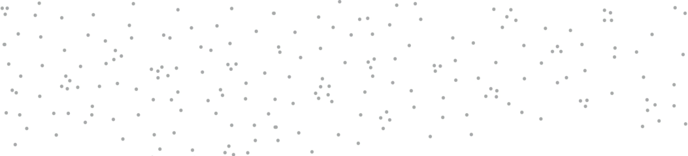
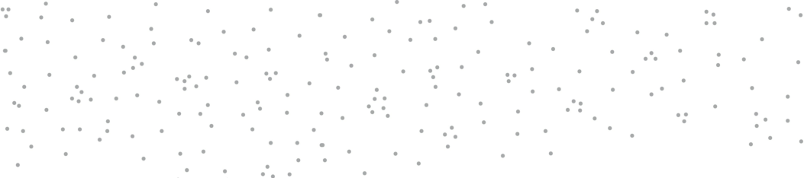
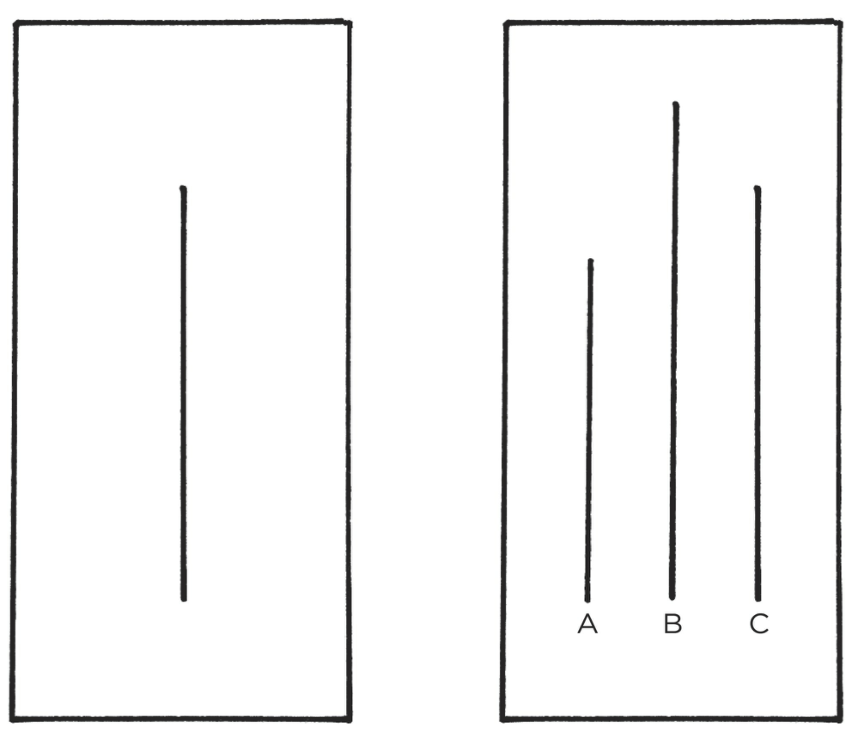
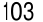

- **The 4th Law: Make It Satisfying** 

|**HOW TO BREAK A BAD HABIT**|
|---|
|**Inversion of the 1st Law: Make It Invisible**|
|**1.5:**Reduce exposure. Remove the cues of your bad habits from your environment.|
|**Inversion of the 2nd Law: Make It Unattractive**|
|**Inversion of the 3rd Law: Make It Difficult**|
|**Inversion of the 4th Law: Make It Unsatisfying**|

_You can download a printable version of this habits cheat sheet at:_ _atomichabits.com/cheatsheet_ 

83 

#### **THE 2ND LAW** 

Make It Attractive 

&#123;/*  Start of picture text  */&#125;
84 &#123;/*  End of picture text  */&#125;

8 

###### How to Make a Habit Irresistible 

**I** N THE 1940S, a Dutch scientist named Niko Tinbergen performed a series of experiments that transformed our understanding of what motivates us. Tinbergen—who eventually won a Nobel Prize for his work—was investigating herring gulls, the gray and white birds often seen flying along the seashores of North America. 

Adult herring gulls have a small red dot on their beak, and Tinbergen noticed that newly hatched chicks would peck this spot whenever they wanted food. To begin one experiment, he created a collection of fake cardboard beaks, just a head without a body. When the parents had flown away, he went over to the nest and offered these dummy beaks to the chicks. The beaks were obvious fakes, and he assumed the baby birds would reject them altogether. 

However, when the tiny gulls saw the red spot on the cardboard beak, they pecked away just as if it were attached to their own mother. They had a clear preference for those red spots—as if they had been genetically programmed at birth. Soon Tinbergen discovered that the bigger the red spot, the faster the chicks pecked. Eventually, he created a beak with three large red dots on it. When he placed it over the nest, the baby birds went crazy with delight. They pecked at the little red patches as if it was the greatest beak they had ever seen. 

Tinbergen and his colleagues discovered similar behavior in other animals. For example, the greylag goose is a ground-nesting bird. Occasionally, as the mother moves around on the nest, one of the eggs will roll out and settle on the grass nearby. Whenever this 

85 

happens, the goose will waddle over to the egg and use its beak and neck to pull it back into the nest. 

Tinbergen discovered that the goose will pull _any_ nearby round object, such as a billiard ball or a lightbulb, back into the nest. The bigger the object, the greater their response. One goose even made a tremendous effort to roll a volleyball back and sit on top. Like the baby gulls automatically pecking at red dots, the greylag goose was following an instinctive rule: _When I see a round object nearby, I must roll it back into the nest. The bigger the round object, the harder I should try to get it._ 

It’s like the brain of each animal is preloaded with certain rules for behavior, and when it comes across an exaggerated version of that rule, it lights up like a Christmas tree. Scientists refer to these exaggerated cues as _supernormal stimuli_ . A supernormal stimulus is a heightened version of reality—like a beak with three red dots or an egg the size of a volleyball—and it elicits a stronger response than usual. 

Humans are also prone to fall for exaggerated versions of reality. Junk food, for example, drives our reward systems into a frenzy. After spending hundreds of thousands of years hunting and foraging for food in the wild, the human brain has evolved to place a high value on salt, sugar, and fat. Such foods are often calorie-dense and they were quite rare when our ancient ancestors were roaming the savannah. When you don’t know where your next meal is coming from, eating as much as possible is an excellent strategy for survival. 

Today, however, we live in a calorie-rich environment. Food is abundant, but your brain continues to crave it like it is scarce. Placing a high value on salt, sugar, and fat is no longer advantageous to our health, but the craving persists because the brain’s reward centers have not changed for approximately fifty thousand years. The modern food industry relies on stretching our Paleolithic instincts beyond their evolutionary purpose. 

A primary goal of food science is to create products that are more attractive to consumers. Nearly every food in a bag, box, or jar has been enhanced in some way, if only with additional flavoring. Companies spend millions of dollars to discover the most satisfying level of crunch in a potato chip or the perfect amount of fizz in a soda. Entire departments are dedicated to optimizing how a product feels in your mouth—a quality known as _orosensation_ . French fries, 

86 for example, are a potent combination—golden brown and crunchy on the outside, light and smooth on the inside. 

Other processed foods enhance _dynamic contrast_ , which refers to items with a combination of sensations, like crunchy and creamy. Imagine the gooeyness of melted cheese on top of a crispy pizza crust, or the crunch of an Oreo cookie combined with its smooth center. With natural, unprocessed foods, you tend to experience the same sensations over and over— _how’s that seventeenth bite of kale taste?_ After a few minutes, your brain loses interest and you begin to feel full. But foods that are high in dynamic contrast keep the experience novel and interesting, encouraging you to eat more. 

Ultimately, such strategies enable food scientists to find the “bliss point” for each product—the precise combination of salt, sugar, and fat that excites your brain and keeps you coming back for more. The result, of course, is that you overeat because hyperpalatable foods are more attractive to the human brain. As Stephan Guyenet, a neuroscientist who specializes in eating behavior and obesity, says, “We’ve gotten too good at pushing our own buttons.” 

The modern food industry, and the overeating habits it has spawned, is just one example of the 2nd Law of Behavior Change: _Make it attractive._ The more attractive an opportunity is, the more likely it is to become habit-forming. 

Look around. Society is filled with highly engineered versions of reality that are more attractive than the world our ancestors evolved in. Stores feature mannequins with exaggerated hips and breasts to sell clothes. Social media delivers more “likes” and praise in a few minutes than we could ever get in the office or at home. Online porn splices together stimulating scenes at a rate that would be impossible to replicate in real life. Advertisements are created with a combination of ideal lighting, professional makeup, and Photoshopped edits—even the model doesn’t look like the person in the final image. These are the supernormal stimuli of our modern world. They exaggerate features that are naturally attractive to us, and our instincts go wild as a result, driving us into excessive shopping habits, social media habits, porn habits, eating habits, and many others. 

If history serves as a guide, the opportunities of the future will be more attractive than those of today. The trend is for rewards to become more concentrated and stimuli to become more enticing. Junk food is a more concentrated form of calories than natural 

87 

foods. Hard liquor is a more concentrated form of alcohol than beer. Video games are a more concentrated form of play than board games. Compared to nature, these pleasure-packed experiences are hard to resist. We have the brains of our ancestors but temptations they never had to face. 

If you want to increase the odds that a behavior will occur, then you need to make it attractive. Throughout our discussion of the 2nd Law, our goal is to learn how to make our habits irresistible. While it is not possible to transform every habit into a supernormal stimulus, we can make any habit more enticing. To do this, we must start by understanding what a craving is and how it works. 

We begin by examining a biological signature that all habits share—the dopamine spike. 

###### **THE DOPAMINE-DRIVEN FEEDBACK LOOP** 

Scientists can track the precise moment a craving occurs by measuring a neurotransmitter called dopamine.* The importance of dopamine became apparent in 1954 when the neuroscientists James Olds and Peter Milner ran an experiment that revealed the neurological processes behind craving and desire. By implanting electrodes in the brains of rats, the researchers blocked the release of dopamine. To the surprise of the scientists, the rats lost all will to live. They wouldn’t eat. They wouldn’t have sex. They didn’t crave anything. Within a few days, the animals died of thirst. 

In follow-up studies, other scientists also inhibited the dopamine-releasing parts of the brain, but this time, they squirted little droplets of sugar into the mouths of the dopamine-depleted rats. Their little rat faces lit up with pleasurable grins from the tasty substance. Even though dopamine was blocked, they _liked_ the sugar just as much as before; they just didn’t _want_ it anymore. The ability to experience pleasure remained, but without dopamine, desire died. And without desire, action stopped. 

When other researchers reversed this process and flooded the reward system of the brain with dopamine, animals performed habits at breakneck speed. In one study, mice received a powerful hit of dopamine each time they poked their nose in a box. Within minutes, the mice developed a craving so strong they began poking their nose into the box eight hundred times per hour. (Humans are 

88 

not so different: the average slot machine player will spin the wheel six hundred times per hour.) 

Habits are a dopamine-driven feedback loop. Every behavior that is highly habit-forming—taking drugs, eating junk food, playing video games, browsing social media—is associated with higher levels of dopamine. The same can be said for our most basic habitual behaviors like eating food, drinking water, having sex, and interacting socially. 

For years, scientists assumed dopamine was all about pleasure, but now we know it plays a central role in many neurological processes, including motivation, learning and memory, punishment and aversion, and voluntary movement. 

When it comes to habits, the key takeaway is this: dopamine is released not only when you _experience_ pleasure, but also when you _anticipate_ it. Gambling addicts have a dopamine spike right _before_ they place a bet, not after they win. Cocaine addicts get a surge of dopamine when they _see_ the powder, not after they take it. Whenever you predict that an opportunity will be rewarding, your levels of dopamine spike in anticipation. And whenever dopamine rises, so does your motivation to act. 

It is the anticipation of a reward—not the fulfillment of it—that gets us to take action. 

Interestingly, the reward system that is activated in the brain when you _receive_ a reward is the same system that is activated when you _anticipate_ a reward. This is one reason the anticipation of an experience can often feel better than the attainment of it. As a child, thinking about Christmas morning can be better than opening the gifts. As an adult, daydreaming about an upcoming vacation can be more enjoyable than actually being on vacation. Scientists refer to this as the difference between “wanting” and “liking.” 

###### **THE DOPAMINE SPIKE** 

89 

&#123;/*  Start of picture text  */&#125;
CUE1 | CRAVING2 IRESPONSE|3 REWARD4 | ° Ae : un ee : wl ey po ° wl lm / &#123;/*  End of picture text  */&#125;

FIGURE 9: Before a habit is learned (A), dopamine is released when the reward is experienced for the first time. The next time around (B), dopamine rises _before_ taking action, immediately after a cue is recognized. This spike leads to a feeling of desire and a craving to take action whenever the cue is spotted. Once a habit is learned, dopamine will not rise when a reward is experienced because you already expect the reward. However, if you see a cue and expect a reward, but do not get one, then dopamine will drop in disappointment (C). The sensitivity of the dopamine response can clearly be seen when a reward is provided late (D). First, the cue is identified and dopamine rises as a craving builds. Next, a response is taken but the reward does not come as 

90 

quickly as expected and dopamine begins to drop. Finally, when the reward comes a little later than you had hoped, dopamine spikes again. It is as if the brain is saying, “See! I knew I was right. Don’t forget to repeat this action next time.” 

Your brain has far more neural circuitry allocated for _wanting_ rewards than for _liking_ them. The wanting centers in the brain are large: the brain stem, the nucleus accumbens, the ventral tegmental area, the dorsal striatum, the amygdala, and portions of the prefrontal cortex. By comparison, the liking centers of the brain are much smaller. They are often referred to as “hedonic hot spots” and are distributed like tiny islands throughout the brain. For instance, researchers have found that 100 percent of the nucleus accumbens is activated during wanting. Meanwhile, only 10 percent of the structure is activated during liking. 

The fact that the brain allocates so much precious space to the regions responsible for craving and desire provides further evidence of the crucial role these processes play. Desire is the engine that drives behavior. Every action is taken because of the anticipation that precedes it. It is the craving that leads to the response. 

These insights reveal the importance of the 2nd Law of Behavior Change. We need to make our habits attractive because it is the expectation of a rewarding experience that motivates us to act in the first place. This is where a strategy known as temptation bundling comes into play. 

###### **HOW TO USE TEMPTATION BUNDLING TO MAKE YOUR HABITS MORE ATTRACTIVE** 

Ronan Byrne, an electrical engineering student in Dublin, Ireland, enjoyed watching Netflix, but he also knew that he should exercise more often than he did. Putting his engineering skills to use, Byrne hacked his stationary bike and connected it to his laptop and television. Then he wrote a computer program that would allow Netflix to run _only_ if he was cycling at a certain speed. If he slowed down for too long, whatever show he was watching would pause until he started pedaling again. He was, in the words of one fan, “eliminating obesity one Netflix binge at a time.” 

91 

He was also employing temptation bundling to make his exercise habit more attractive. Temptation bundling works by linking an action you want to do with an action you need to do. In Byrne’s case, he bundled watching Netflix (the thing he wanted to do) with riding his stationary bike (the thing he needed to do). 

Businesses are masters at temptation bundling. For instance, when the American Broadcasting Company, more commonly known as ABC, launched its Thursday-night television lineup for the 2014– 2015 season, they promoted temptation bundling on a massive scale. 

Every Thursday, the company would air three shows created by screenwriter Shonda Rhimes— _Grey’s Anatomy_ , _Scandal_ , and _How to Get Away with Murder_ . They branded it as “TGIT on ABC” (TGIT stands for Thank God It’s Thursday). In addition to promoting the shows, ABC encouraged viewers to make popcorn, drink red wine, and enjoy the evening. 

Andrew Kubitz, head of scheduling for ABC, described the idea behind the campaign: “We see Thursday night as a viewership opportunity, with either couples or women by themselves who want to sit down and escape and have fun and drink their red wine and have some popcorn.” The brilliance of this strategy is that ABC was associating the thing they _needed_ viewers to do (watch their shows) with activities their viewers already _wanted_ to do (relax, drink wine, and eat popcorn). 

Over time, people began to connect watching ABC with feeling relaxed and entertained. If you drink red wine and eat popcorn at 8 p.m. every Thursday, then eventually “8 p.m. on Thursday” _means_ relaxation and entertainment. The reward gets associated with the cue, and the habit of turning on the television becomes more attractive. 

You’re more likely to find a behavior attractive if you get to do one of your favorite things at the same time. Perhaps you want to hear about the latest celebrity gossip, but you need to get in shape. Using temptation bundling, you could only read the tabloids and watch reality shows at the gym. Maybe you want to get a pedicure, but you need to clean out your email inbox. Solution: only get a pedicure while processing overdue work emails. 

Temptation bundling is one way to apply a psychology theory known as Premack’s Principle. Named after the work of professor David Premack, the principle states that “more probable behaviors 

92 

will reinforce less probable behaviors.” In other words, even if you don’t really want to process overdue work emails, you’ll become conditioned to do it if it means you get to do something you really want to do along the way. 

You can even combine temptation bundling with the habit stacking strategy we discussed in Chapter 5 to create a set of rules to guide your behavior. 

The habit stacking + temptation bundling formula is: 

1. After [CURRENT HABIT], I will [HABIT I NEED]. 

2. After [HABIT I NEED], I will [HABIT I WANT]. 

If you want to read the news, but you need to express more gratitude: 

1. After I get my morning coffee, I will say one thing I’m grateful for that happened yesterday (need). 

2. After I say one thing I’m grateful for, I will read the news (want). 

If you want to watch sports, but you need to make sales calls: 

1. After I get back from my lunch break, I will call three potential clients (need). 

2. After I call three potential clients, I will check ESPN (want). 

If you want to check Facebook, but you need to exercise more: 

1. After I pull out my phone, I will do ten burpees (need). 2. After I do ten burpees, I will check Facebook (want). 

The hope is that eventually you’ll look forward to calling three clients or doing ten burpees because it means you get to read the latest sports news or check Facebook. Doing the thing you need to do means you get to do the thing you want to do. 

93 

We began this chapter by discussing supernormal stimuli, which are heightened versions of reality that increase our desire to take action. Temptation bundling is one way to create a heightened version of any habit by connecting it with something you already want. Engineering a truly irresistible habit is a hard task, but this simple strategy can be employed to make nearly any habit more attractive than it would be otherwise. 

###### Chapter Summary 

- The 2nd Law of Behavior Change is _make it attractive._ The more attractive an opportunity is, the more likely it is to become habit-forming. 

- Habits are a dopamine-driven feedback loop. When dopamine rises, so does our motivation to act. 

- It is the anticipation of a reward—not the fulfillment of it—that gets us to take action. The greater the anticipation, the greater the dopamine spike. 

- Temptation bundling is one way to make your habits more attractive. The strategy is to pair an action you _want_ to do with an action you _need_ to do. 

94 

9 

###### The Role of Family and Friends in Shaping Your Habits 

**I** N 1965, a Hungarian man named Laszlo Polgar wrote a series of strange letters to a woman named Klara. 

Laszlo was a firm believer in hard work. In fact, it was all he believed in: he completely rejected the idea of innate talent. He claimed that with deliberate practice and the development of good habits, a child could become a genius in any field. His mantra was “A genius is not born, but is educated and trained.” 

Laszlo believed in this idea so strongly that he wanted to test it with his own children—and he was writing to Klara because he “needed a wife willing to jump on board.” Klara was a teacher and, although she may not have been as adamant as Laszlo, she also believed that with proper instruction, anyone could advance their skills. 

Laszlo decided chess would be a suitable field for the experiment, and he laid out a plan to raise his children to become chess prodigies. The kids would be home-schooled, a rarity in Hungary at the time. The house would be filled with chess books and pictures of famous chess players. The children would play against each other constantly and compete in the best tournaments they could find. The family would keep a meticulous file system of the tournament history of every competitor the children faced. Their lives would be dedicated to chess. 

Laszlo successfully courted Klara, and within a few years, the Polgars were parents to three young girls: Susan, Sofia, and Judit. 

95 

Susan, the oldest, began playing chess when she was four years old. Within six months, she was defeating adults. Sofia, the middle child, did even better. By fourteen, she was a world champion, and a few years later, she became a grandmaster. Judit, the youngest, was the best of all. By age five, she could beat her father. At twelve, she was the youngest player ever listed among the top one hundred chess players in the world. At fifteen years and four months old, she became the youngest grandmaster of all time— younger than Bobby Fischer, the previous record holder. For twenty-seven years, she was the number-one-ranked female chess player in the world. 

The childhood of the Polgar sisters was atypical, to say the least. And yet, if you ask them about it, they claim their lifestyle was attractive, even enjoyable. In interviews, the sisters talk about their childhood as entertaining rather than grueling. They loved playing chess. They couldn’t get enough of it. Once, Laszlo reportedly found Sofia playing chess in the bathroom in the middle of the night. Encouraging her to go back to sleep, he said, “Sofia, leave the pieces alone!” To which she replied, “Daddy, _they_ won’t leave _me_ alone!” 

The Polgar sisters grew up in a culture that prioritized chess above all else—praised them for it, rewarded them for it. In their world, an obsession with chess was normal. And as we are about to see, whatever habits are normal in your culture are among the most attractive behaviors you’ll find. 

###### **THE SEDUCTIVE PULL OF SOCIAL NORMS** 

Humans are herd animals. We want to fit in, to bond with others, and to earn the respect and approval of our peers. Such inclinations are essential to our survival. For most of our evolutionary history, our ancestors lived in tribes. Becoming separated from the tribe—or worse, being cast out—was a death sentence. “The lone wolf dies, but the pack survives.”* 

Meanwhile, those who collaborated and bonded with others enjoyed increased safety, mating opportunities, and access to resources. As Charles Darwin noted, “In the long history of humankind, those who learned to collaborate and improvise most effectively have prevailed.” As a result, one of the deepest human 

96 desires is to belong. And this ancient preference exerts a powerful influence on our modern behavior. 

We don’t choose our earliest habits, we imitate them. We follow the script handed down by our friends and family, our church or school, our local community and society at large. Each of these cultures and groups comes with its own set of expectations and standards—when and whether to get married, how many children to have, which holidays to celebrate, how much money to spend on your child’s birthday party. In many ways, these social norms are the invisible rules that guide your behavior each day. You’re always keeping them in mind, even if they are at the not top of your mind. Often, you follow the habits of your culture without thinking, without questioning, and sometimes without remembering. As the French philosopher Michel de Montaigne wrote, “The customs and practices of life in society sweep us along.” 

Most of the time, going along with the group does not feel like a burden. Everyone wants to belong. If you grow up in a family that rewards you for your chess skills, playing chess will seem like a very attractive thing to do. If you work in a job where everyone wears expensive suits, then you’ll be inclined to splurge on one as well. If all of your friends are sharing an inside joke or using a new phrase, you’ll want to do it, too, so they know that you “get it.” Behaviors are attractive when they help us fit in. 

We imitate the habits of three groups in particular: 

1. The close. 

2. The many. 

3. The powerful. 

Each group offers an opportunity to leverage the 2nd Law of Behavior Change and make our habits more attractive. 

###### 1. Imitating the Close 

Proximity has a powerful effect on our behavior. This is true of the physical environment, as we discussed in Chapter 6, but it is also true of the social environment. 

We pick up habits from the people around us. We copy the way our parents handle arguments, the way our peers flirt with one 

97 

another, the way our coworkers get results. When your friends smoke pot, you give it a try, too. When your wife has a habit of double-checking that the door is locked before going to bed, you pick it up as well. 

I find that I often imitate the behavior of those around me without realizing it. In conversation, I’ll automatically assume the body posture of the other person. In college, I began to talk like my roommates. When traveling to other countries, I unconsciously imitate the local accent despite reminding myself to stop. 

As a general rule, the closer we are to someone, the more likely we are to imitate some of their habits. One groundbreaking study tracked twelve thousand people for thirty-two years and found that “a person’s chances of becoming obese increased by 57 percent if he or she had a friend who became obese.” It works the other way, too. Another study found that if one person in a relationship lost weight, the other partner would also slim down about one third of the time. Our friends and family provide a sort of invisible peer pressure that pulls us in their direction. 

Of course, peer pressure is bad only if you’re surrounded by bad influences. When astronaut Mike Massimino was a graduate student at MIT, he took a small robotics class. Of the ten people in the class, _four_ became astronauts. If your goal was to make it into space, then that room was about the best culture you could ask for. Similarly, one study found that the higher your best friend’s IQ at age eleven or twelve, the higher your IQ would be at age fifteen, even after controlling for natural levels of intelligence. We soak up the qualities and practices of those around us. 

One of the most effective things you can do to build better habits is to join a culture where your desired behavior is the normal behavior. New habits seem achievable when you see others doing them every day. If you are surrounded by fit people, you’re more likely to consider working out to be a common habit. If you’re surrounded by jazz lovers, you’re more likely to believe it’s reasonable to play jazz every day. Your culture sets your expectation for what is “normal.” Surround yourself with people who have the habits you want to have yourself. You’ll rise together. 

To make your habits even more attractive, you can take this strategy one step further. 

Join a culture where (1) your desired behavior is the normal behavior and (2) you already have something in common with the 

98 

group. Steve Kamb, an entrepreneur in New York City, runs a company called Nerd Fitness, which “helps nerds, misfits, and mutants lose weight, get strong, and get healthy.” His clients include video game lovers, movie fanatics, and average Joes who want to get in shape. Many people feel out of place the first time they go to the gym or try to change their diet, but if you are already similar to the other members of the group in some way—say, your mutual love of _Star Wars_ —change becomes more appealing because it feels like something people like you already do. 

Nothing sustains motivation better than belonging to the tribe. It transforms a personal quest into a shared one. Previously, you were on your own. Your identity was singular. _You are a reader. You are a musician. You are an athlete._ When you join a book club or a band or a cycling group, your identity becomes linked to those around you. Growth and change is no longer an individual pursuit. _We are readers. We are musicians. We are cyclists._ The shared identity begins to reinforce your personal identity. This is why remaining part of a group after achieving a goal is crucial to maintaining your habits. It’s friendship and community that embed a new identity and help behaviors last over the long run. 

###### 2. Imitating the Many 

In the 1950s, psychologist Solomon Asch conducted a series of experiments that are now taught to legions of undergrads each year. To begin each experiment, the subject entered the room with a group of strangers. Unbeknownst to them, the other participants were actors planted by the researcher and instructed to deliver scripted answers to certain questions. 

The group would be shown one card with a line on it and then a second card with a series of lines. Each person was asked to select the line on the second card that was similar in length to the line on the first card. It was a very simple task. Here is an example of two cards used in the experiment: 

###### **CONFORMING TO SOCIAL NORMS** 

99 

&#123;/*  Start of picture text  */&#125;
Wil &#123;/*  End of picture text  */&#125;

FIGURE 10: This is a representation of two cards used by Solomon Asch in his famous social conformity experiments. The length of the line on the first card (left) is obviously the same as line C, but when a group of actors claimed it was a different length the research subjects would often change their minds and go with the crowd rather than believe their own eyes. 

The experiment always began the same. First, there would be some easy trials where everyone agreed on the correct line. After a few rounds, the participants were shown a test that was just as obvious as the previous ones, except the actors in the room would select an intentionally _incorrect_ answer. For example, they would respond “A” to the comparison shown in Figure 10. Everyone would agree that the lines were the same even though they were clearly different. 

The subject, who was unaware of the ruse, would immediately become bewildered. Their eyes would open wide. They would laugh nervously to themselves. They would double-check the reactions of other participants. Their agitation would grow as one person after 

100 

another delivered the same incorrect response. Soon, the subject began to doubt their own eyes. Eventually, they delivered the answer they knew in their heart to be incorrect. 

Asch ran this experiment many times and in many different ways. What he discovered was that as the number of actors increased, so did the conformity of the subject. If it was just the subject and one actor, then there was no effect on the person’s choice. They just assumed they were in the room with a dummy. When two actors were in the room with the subject, there was still little impact. But as the number of people increased to three actors and four and all the way to eight, the subject became more likely to second-guess themselves. By the end of the experiment, nearly 75 percent of the subjects had agreed with the group answer even though it was obviously incorrect. 

Whenever we are unsure how to act, we look to the group to guide our behavior. We are constantly scanning our environment and wondering, “What is everyone else doing?” We check reviews on Amazon or Yelp or TripAdvisor because we want to imitate the “best” buying, eating, and travel habits. It’s usually a smart strategy. There is evidence in numbers. 

But there can be a downside. 

The normal behavior of the tribe often overpowers the desired behavior of the individual. For example, one study found that when a chimpanzee learns an effective way to crack nuts open as a member of one group and then switches to a new group that uses a less effective strategy, it will avoid using the superior nut cracking method just to blend in with the rest of the chimps. 

Humans are similar. There is tremendous internal pressure to comply with the norms of the group. The reward of being accepted is often greater than the reward of winning an argument, looking smart, or finding truth. Most days, we’d rather be wrong with the crowd than be right by ourselves. 

The human mind knows how to get along with others. It _wants_ to get along with others. This is our natural mode. You can override it —you can choose to ignore the group or to stop caring what other people think—but it takes work. Running against the grain of your culture requires extra effort. 

When changing your habits means challenging the tribe, change is unattractive. When changing your habits means fitting in with the tribe, change is very attractive. 

101 

###### 3. Imitating the Powerful 

Humans everywhere pursue power, prestige, and status. We want pins and medallions on our jackets. We want President or Partner in our titles. We want to be acknowledged, recognized, and praised. This tendency can seem vain, but overall, it’s a smart move. Historically, a person with greater power and status has access to more resources, worries less about survival, and proves to be a more attractive mate. 

We are drawn to behaviors that earn us respect, approval, admiration, and status. We want to be the one in the gym who can do muscle-ups or the musician who can play the hardest chord progressions or the parent with the most accomplished children because these things separate us from the crowd. Once we fit in, we start looking for ways to stand out. 

This is one reason we care so much about the habits of highly effective people. We try to copy the behavior of successful people because we desire success ourselves. Many of our daily habits are imitations of people we admire. You replicate the marketing strategies of the most successful firms in your industry. You make a recipe from your favorite baker. You borrow the storytelling strategies of your favorite writer. You mimic the communication style of your boss. We imitate people we envy. 

High-status people enjoy the approval, respect, and praise of others. And that means if a behavior can get us approval, respect, and praise, we find it attractive. 

We are also motivated to avoid behaviors that would lower our status. We trim our hedges and mow our lawn because we don’t want to be the slob of the neighborhood. When our mother comes to visit, we clean up the house because we don’t want to be judged. We are continually wondering “What will others think of me?” and altering our behavior based on the answer. 

The Polgar sisters—the chess prodigies mentioned at the beginning of this chapter—are evidence of the powerful and lasting impact social influences can have on our behavior. The sisters practiced chess for many hours each day and continued this remarkable effort for decades. But these habits and behaviors maintained their attractiveness, in part, because they were valued by their culture. From the praise of their parents to the achievement 

102 

of different status markers like becoming a grandmaster, they had many reasons to continue their effort. 

###### Chapter Summary 

- The culture we live in determines which behaviors are attractive to us. 

- We tend to adopt habits that are praised and approved of by our culture because we have a strong desire to fit in and belong to the tribe. 

- We tend to imitate the habits of three social groups: the close (family and friends), the many (the tribe), and the powerful (those with status and prestige). 

- One of the most effective things you can do to build better habits is to join a culture where (1) your desired behavior is the normal behavior and (2) you already have something in common with the group. 

- The normal behavior of the tribe often overpowers the desired behavior of the individual. Most days, we’d rather be wrong with the crowd than be right by ourselves. 

- If a behavior can get us approval, respect, and praise, we find it attractive. 

&#123;/*  Start of picture text  */&#125;
103 &#123;/*  End of picture text  */&#125;

###### 10 

###### How to Find and Fix the Causes of Your Bad Habits 

**I** N LATE 2012, I was sitting in an old apartment just a few blocks from Istanbul’s most famous street, Istiklal Caddesi. I was in the middle of a four-day trip to Turkey and my guide, Mike, was relaxing in a worn-out armchair a few feet away. 

Mike wasn’t really a guide. He was just a guy from Maine who had been living in Turkey for five years, but he offered to show me around while I was visiting the country and I took him up on it. On this particular night, I had been invited to dinner with him and a handful of his Turkish friends. 

There were seven of us, and I was the only one who hadn’t, at some point, smoked at least one pack of cigarettes per day. I asked one of the Turks how he got started. “Friends,” he said. “It always starts with your friends. One friend smokes, then you try it.” 

What was truly fascinating was that half of the people in the room had managed to _quit_ smoking. Mike had been smoke-free for a few years at that point, and he swore up and down that he broke the habit because of a book called _Allen Carr’s Easy Way to Stop Smoking_ . 

“It frees you from the mental burden of smoking,” he said. “It tells you: ‘Stop lying to yourself. You know you don’t actually want to smoke. You know you don’t really enjoy this.’ It helps you feel like you’re not the victim anymore. You start to realize that you don’t _need_ to smoke.” 

I had never tried a cigarette, but I took a look at the book afterward out of curiosity. The author employs an interesting 

104 

strategy to help smokers eliminate their cravings. He systematically reframes each cue associated with smoking and gives it a new meaning. 

He says things like: 

- You think you are quitting something, but you’re not quitting anything because cigarettes do nothing for you. You think smoking is something you need to do to be social, but it’s not. You can be social without smoking at all. 

- You think smoking is about relieving stress, but it’s not. Smoking does not relieve your nerves, it destroys them. 

Over and over, he repeats these phrases and others like them. “Get it clearly into your mind,” he says. “You are losing nothing and you are making marvelous positive gains not only in health, energy and money but also in confidence, self-respect, freedom and, most important of all, in the length and quality of your future life.” By the time you get to the end of the book, smoking seems like the most ridiculous thing in the world to do. And if you no longer expect smoking to bring you any benefits, you have no reason to smoke. It is an inversion of the 2nd Law of Behavior Change: _make it unattractive_ . Now, I know this idea might sound overly simplistic. Just change your mind and you can quit smoking. But stick with me for a minute. 

###### **WHERE CRAVINGS COME FROM** 

Every behavior has a surface level craving and a deeper, underlying motive. I often have a craving that goes something like this: “I want to eat tacos.” If you were to ask me why I want to eat tacos, I wouldn’t say, “Because I need food to survive.” But the truth is, somewhere deep down, I am motivated to eat tacos because I have to eat to survive. The underlying motive is to obtain food and water even if my specific craving is for a taco. Some of our underlying motives include:* 

Conserve energy 

105 

- Obtain food and water 

- Find love and reproduce 

- Connect and bond with others 

- Win social acceptance and approval 

- Reduce uncertainty 

- Achieve status and prestige 

A craving is just a specific manifestation of a deeper underlying motive. Your brain did not evolve with a desire to smoke cigarettes or to check Instagram or to play video games. At a deep level, you simply want to reduce uncertainty and relieve anxiety, to win social acceptance and approval, or to achieve status. 

Look at nearly any product that is habit-forming and you’ll see that it does not create a new motivation, but rather latches onto the underlying motives of human nature. 

- Find love and reproduce = using Tinder 

- Connect and bond with others = browsing Facebook Win social acceptance and approval = posting on Instagram Reduce uncertainty = searching on Google Achieve status and prestige = playing video games 

Your habits are modern-day solutions to ancient desires. New versions of old vices. The underlying motives behind human behavior remain the same. The specific habits we perform differ based on the period of history. 

Here’s the powerful part: there are many different ways to address the same underlying motive. One person might learn to reduce stress by smoking a cigarette. Another person learns to ease their anxiety by going for a run. Your current habits are not necessarily the best way to solve the problems you face; they are just the methods you learned to use. Once you associate a solution with the problem you need to solve, you keep coming back to it. 

Habits are all about associations. These associations determine whether we predict a habit to be worth repeating or not. As we covered in our discussion of the 1st Law, your brain is continually absorbing information and noticing cues in the environment. Every time you perceive a cue, your brain runs a simulation and makes a prediction about what to do in the next moment. 

106 

Cue: You notice that the stove is hot. Prediction: _If I touch it I’ll get burned, so I should avoid touching it._ 

Cue: You see that the traffic light turned green. Prediction: _If I step on the gas, I’ll make it safely through the intersection and get closer to my destination, so I should step on the gas._ 

You see a cue, categorize it based on past experience, and determine the appropriate response. 

This all happens in an instant, but it plays a crucial role in your habits because every action is preceded by a prediction. Life feels reactive, but it is actually predictive. All day long, you are making your best guess of how to act given what you’ve just seen and what has worked for you in the past. You are endlessly predicting what will happen in the next moment. 

Our behavior is heavily dependent on these predictions. Put another way, our behavior is heavily dependent on how we interpret the events that happen to us, not necessarily the objective reality of the events themselves. Two people can look at the same cigarette, and one feels the urge to smoke while the other is repulsed by the smell. The same cue can spark a good habit or a bad habit depending on your prediction. The cause of your habits is actually the prediction that precedes them. 

These predictions lead to feelings, which is how we typically describe a craving—a feeling, a desire, an urge. Feelings and emotions transform the cues we perceive and the predictions we make into a signal that we can apply. They help explain what we are currently sensing. For instance, whether or not you realize it, you are noticing how warm or cold you feel right now. If the temperature drops by one degree, you probably won’t do anything. If the temperature drops ten degrees, however, you’ll feel cold and put on another layer of clothing. Feeling cold was the signal that prompted you to act. You have been sensing the cues the entire time, but it is only when you predict that you would be better off in a different state that you take action. 

A craving is the sense that something is missing. It is the desire to change your internal state. When the temperature falls, there is a gap between what your body is currently sensing and what it _wants_ 

107 

to be sensing. This gap between your current state and your desired state provides a reason to act. 

Desire is the difference between where you are now and where you want to be in the future. Even the tiniest action is tinged with the motivation to feel differently than you do in the moment. When you binge-eat or light up or browse social media, what you really want is _not_ a potato chip or a cigarette or a bunch of likes. What you really want is to _feel_ different. 

Our feelings and emotions tell us whether to hold steady in our current state or to make a change. They help us decide the best course of action. Neurologists have discovered that when emotions and feelings are impaired, we actually lose the ability to make decisions. We have no signal of what to pursue and what to avoid. As the neuroscientist Antonio Damasio explains, “It is emotion that allows you to mark things as good, bad, or indifferent.” 

To summarize, the specific cravings you feel and habits you perform are really an attempt to address your fundamental underlying motives. Whenever a habit successfully addresses a motive, you develop a craving to do it again. In time, you learn to predict that checking social media will help you feel loved or that watching YouTube will allow you to forget your fears. Habits are attractive when we associate them with positive feelings, and we can use this insight to our advantage rather than to our detriment. 

###### **HOW TO REPROGRAM YOUR BRAIN TO ENJOY HARD HABITS** 

You can make hard habits more attractive if you can learn to associate them with a positive experience. Sometimes, all you need is a slight mind-set shift. For instance, we often talk about everything we have to do in a given day. You have to wake up early for work. You have to make another sales call for your business. You have to cook dinner for your family. 

Now, imagine changing just one word: You don’t “have” to. You “get” to. 

You _get_ to wake up early for work. You _get_ to make another sales call for your business. You _get_ to cook dinner for your family. By simply changing one word, you shift the way you view each event. You transition from seeing these behaviors as burdens and turn them into opportunities. 

108 

The key point is that both versions of reality are true. You _have_ to do those things, and you also _get_ to do them. We can find evidence for whatever mind-set we choose. 

I once heard a story about a man who uses a wheelchair. When asked if it was difficult being confined, he responded, “I’m not confined to my wheelchair—I am liberated by it. If it wasn’t for my wheelchair, I would be bed-bound and never able to leave my house.” This shift in perspective completely transformed how he lived each day. 

Reframing your habits to highlight their _benefits_ rather than their drawbacks is a fast and lightweight way to reprogram your mind and make a habit seem more attractive. 

**Exercise.** Many people associate exercise with being a challenging task that drains energy and wears you down. You can just as easily view it as a way to develop skills and build you up. Instead of telling yourself “I need to go run in the morning,” say “It’s time to build endurance and get fast.” 

**Finance.** Saving money is often associated with sacrifice. However, you can associate it with freedom rather than limitation if you realize one simple truth: living below your current means _increases_ your future means. The money you save this month increases your purchasing power next month. 

**Meditation.** Anyone who has tried meditation for more than three seconds knows how frustrating it can be when the next distraction inevitably pops into your mind. You can transform frustration into delight when you realize that each interruption gives you a chance to practice returning to your breath. Distraction is a good thing because you need distractions to practice meditation. 

**Pregame jitters.** Many people feel anxious before delivering a big presentation or competing in an important event. They experience quicker breathing, a faster heart rate, heightened arousal. If we interpret these feelings negatively, then we feel threatened and tense up. If we interpret these feelings positively, then we can respond with fluidity and grace. You can reframe “I am nervous” to “I am excited and I’m getting an adrenaline rush to help me concentrate.” 

These little mind-set shifts aren’t magic, but they can help change the feelings you associate with a particular habit or situation. 

If you want to take it a step further, you can create a _motivation ritual_ . You simply practice associating your habits with something 

109 

you enjoy, then you can use that cue whenever you need a bit of motivation. For instance, if you always play the same song before having sex, then you’ll begin to link the music with the act. Whenever you want to get in the mood, just press play. 

Ed Latimore, a boxer and writer from Pittsburgh, benefited from a similar strategy without knowing it. “Odd realization,” he wrote. “My focus and concentration goes up just by putting my headphones [on] while writing. I don’t even have to play any music.” Without realizing it, he was conditioning himself. In the beginning, he put his headphones on, played some music he enjoyed, and did focused work. After doing it five, ten, twenty times, putting his headphones on became a cue that he automatically associated with increased focus. The craving followed naturally. 

Athletes use similar strategies to get themselves in the mind-set to perform. During my baseball career, I developed a specific ritual of stretching and throwing before each game. The whole sequence took about ten minutes, and I did it the same way every single time. While it physically warmed me up to play, more importantly, it put me in the right mental state. I began to associate my pregame ritual with feeling competitive and focused. Even if I wasn’t motivated beforehand, by the time I was done with my ritual, I was in “game mode.” 

You can adapt this strategy for nearly any purpose. Say you want to feel happier in general. Find something that makes you truly happy—like petting your dog or taking a bubble bath—and then create a short routine that you perform every time _before_ you do the thing you love. Maybe you take three deep breaths and smile. 

Three deep breaths. Smile. Pet the dog. Repeat. 

Eventually, you’ll begin to associate this breathe-and-smile routine with being in a good mood. It becomes a cue that _means_ feeling happy. Once established, you can break it out anytime you need to change your emotional state. Stressed at work? Take three deep breaths and smile. Sad about life? Three deep breaths and smile. Once a habit has been built, the cue can prompt a craving, even if it has little to do with the original situation. 

The key to finding and fixing the causes of your bad habits is to reframe the associations you have about them. It’s not easy, but if you can reprogram your predictions, you can transform a hard habit into an attractive one. 

110 

###### Chapter Summary 

The inversion of the 2nd Law of Behavior Change is _make it unattractive_ . 

- Every behavior has a surface level craving and a deeper underlying motive. 

- Your habits are modern-day solutions to ancient desires. The cause of your habits is actually the prediction that precedes them. The prediction leads to a feeling. 

- Highlight the benefits of avoiding a bad habit to make it seem unattractive. 

Habits are attractive when we associate them with positive feelings and unattractive when we associate them with negative feelings. Create a motivation ritual by doing something you enjoy immediately before a difficult habit. 

###### **HOW TO CREATE A GOOD HABIT**