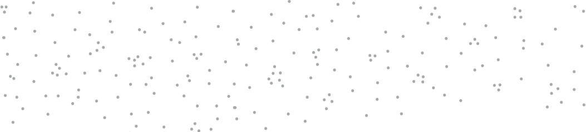
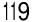
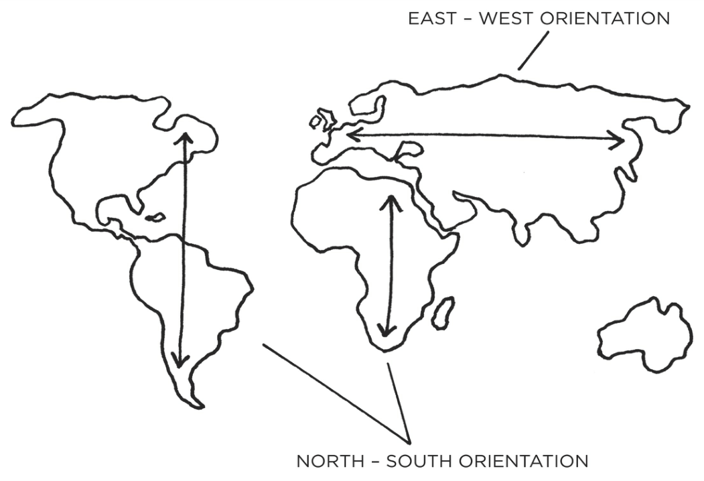
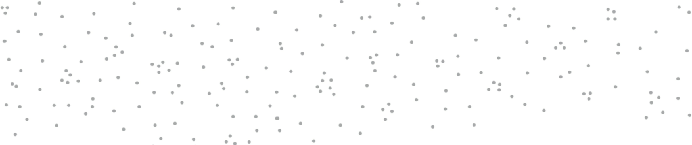
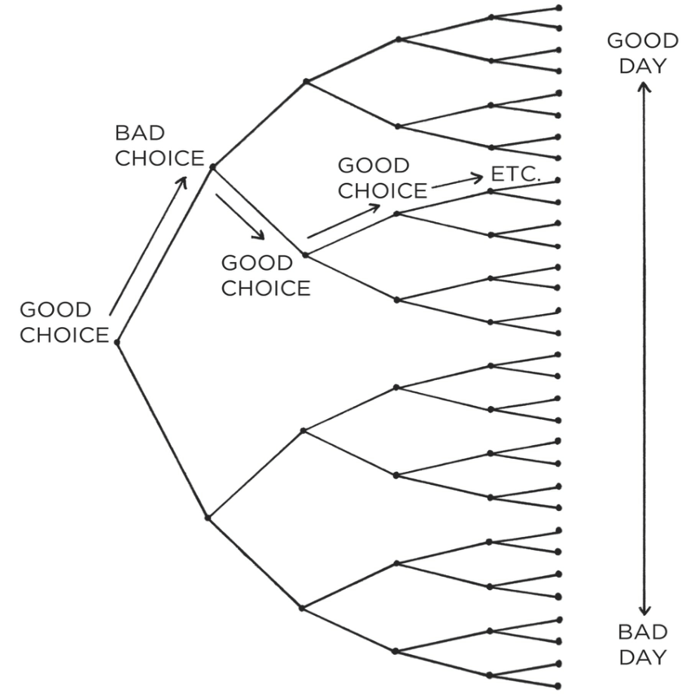
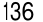

**The 4th Law: Make It Satisfying** 

###### **HOW TO BREAK A BAD HABIT** 

111 

|**Inversion of the 1st Law: Make It Invisible**|
|---|
|**1.5:**Reduce exposure. Remove the cues of your bad habits from your environment.|
|**Inversion of the 2nd Law: Make It Unattractive**|
|**2.4:**Reframe your mind-set. Highlight the benefits of avoiding your bad habits.|
|**Inversion of the 3rd Law: Make It Difficult**|
|**Inversion of the 4th Law: Make It Unsatisfying**|

_You can download a printable version of this habits cheat sheet at:_ _atomichabits.com/cheatsheet_ 

112 

#### **THE 3RD LAW** 

Make It Easy 

113 

11 

###### Walk Slowly, but Never Backward 

**O** N THE FIRST day of class, Jerry Uelsmann, a professor at the University of Florida, divided his film photography students into two groups. 

Everyone on the left side of the classroom, he explained, would be in the “quantity” group. They would be graded solely on the amount of work they produced. On the final day of class, he would tally the number of photos submitted by each student. One hundred photos would rate an A, ninety photos a B, eighty photos a C, and so on. 

Meanwhile, everyone on the right side of the room would be in the “quality” group. They would be graded only on the excellence of their work. They would only need to produce one photo during the semester, but to get an A, it had to be a nearly perfect image. 

At the end of the term, he was surprised to find that all the best photos were produced by the _quantity_ group. During the semester, these students were busy taking photos, experimenting with composition and lighting, testing out various methods in the darkroom, and learning from their mistakes. In the process of creating hundreds of photos, they honed their skills. Meanwhile, the _quality_ group sat around speculating about perfection. In the end, they had little to show for their efforts other than unverified theories and one mediocre photo.* 

It is easy to get bogged down trying to find the optimal plan for change: the fastest way to lose weight, the best program to build muscle, the perfect idea for a side hustle. We are so focused on 

114 

figuring out the best approach that we never get around to taking action. As Voltaire once wrote, “The best is the enemy of the good.” I refer to this as the difference between being in motion and taking action. The two ideas sound similar, but they’re not the same. When you’re in motion, you’re planning and strategizing and learning. Those are all good things, but they don’t produce a result. 

Action, on the other hand, is the type of behavior that will deliver an outcome. If I outline twenty ideas for articles I want to write, that’s motion. If I actually sit down and write an article, that’s action. If I search for a better diet plan and read a few books on the topic, that’s motion. If I actually eat a healthy meal, that’s action. 

Sometimes motion is useful, but it will never produce an outcome by itself. It doesn’t matter how many times you go talk to the personal trainer, that motion will never get you in shape. Only the action of working out will get the result you’re looking to achieve. 

If motion doesn’t lead to results, why do we do it? Sometimes we do it because we actually need to plan or learn more. But more often than not, we do it because motion allows us to feel like we’re making progress without running the risk of failure. Most of us are experts at avoiding criticism. It doesn’t feel good to fail or to be judged publicly, so we tend to avoid situations where that might happen. And that’s the biggest reason why you slip into motion rather than taking action: you want to delay failure. 

It’s easy to be in motion and convince yourself that you’re still making progress. You think, _“I’ve got conversations going with four potential clients right now. This is good. We’re moving in the right direction.”_ Or, _“I brainstormed some ideas for that book I want to write. This is coming together.”_ 

Motion makes you feel like you’re getting things done. But really, you’re just preparing to get something done. When preparation becomes a form of procrastination, you need to change something. You don’t want to merely be planning. You want to be practicing. 

If you want to master a habit, the key is to start with repetition, not perfection. You don’t need to map out every feature of a new habit. You just need to practice it. This is the first takeaway of the 3rd Law: you just need to get your reps in. 

###### **HOW LONG DOES IT ACTUALLY TAKE TO FORM A NEW HABIT?** 

115 

Habit formation is the process by which a behavior becomes progressively more automatic through repetition. The more you repeat an activity, the more the structure of your brain changes to become efficient at that activity. Neuroscientists call this _long-term potentiation_ , which refers to the strengthening of connections between neurons in the brain based on recent patterns of activity. With each repetition, cell-to-cell signaling improves and the neural connections tighten. First described by neuropsychologist Donald Hebb in 1949, this phenomenon is commonly known as Hebb’s Law: “Neurons that fire together wire together.” 

Repeating a habit leads to clear physical changes in the brain. In musicians, the cerebellum—critical for physical movements like plucking a guitar string or pulling a violin bow—is larger than it is in nonmusicians. Mathematicians, meanwhile, have increased gray matter in the inferior parietal lobule, which plays a key role in computation and calculation. Its size is directly correlated with the amount of time spent in the field; the older and more experienced the mathematician, the greater the increase in gray matter. 

When scientists analyzed the brains of taxi drivers in London, they found that the hippocampus—a region of the brain involved in spatial memory—was significantly larger in their subjects than in non–taxi drivers. Even more fascinating, the hippocampus decreased in size when a driver retired. Like the muscles of the body responding to regular weight training, particular regions of the brain adapt as they are used and atrophy as they are abandoned. 

Of course, the importance of repetition in establishing habits was recognized long before neuroscientists began poking around. In 1860, the English philosopher George H. Lewes noted, “In learning to speak a new language, to play on a musical instrument, or to perform unaccustomed movements, great difficulty is felt, because the channels through which each sensation has to pass have not become established; but no sooner has frequent repetition cut a pathway, than this difficulty vanishes; the actions become so automatic that they can be performed while the mind is otherwise engaged.” Both common sense and scientific evidence agree: repetition is a form of change. 

Each time you repeat an action, you are activating a particular neural circuit associated with that habit. This means that simply putting in your reps is one of the most critical steps you can take to encoding a new habit. It is why the students who took tons of photos 

116 

improved their skills while those who merely theorized about perfect photos did not. One group engaged in active practice, the other in passive learning. One in action, the other in motion. All habits follow a similar trajectory from effortful practice to automatic behavior, a process known as _automaticity_ . Automaticity is the ability to perform a behavior without thinking about each step, which occurs when the nonconscious mind takes over. It looks something like this: 

###### **THE HABIT LINE** 

&#123;/*  Start of picture text  */&#125;
Cc ee ee ee SCABIT > LINE = 0 B & > fo) a Dx A REPETITIONS &#123;/*  End of picture text  */&#125;

FIGURE 11: In the beginning (point A), a habit requires a good deal of effort and concentration to perform. After a few repetitions (point B), it gets easier, but still requires some conscious attention. With enough practice (point C), the habit becomes more automatic than conscious. Beyond this threshold— _the habit line_ —the behavior can be done more or less without thinking. A new habit has been formed. 

On the following page, you’ll see what it looks like when researchers track the level of automaticity for an actual habit like 

117 

walking for ten minutes each day. The shape of these charts, which scientists call _learning curves_ , reveals an important truth about behavior change: habits form based on frequency, not time. 

###### **WALKING 10 MINUTES PER DAY** 

&#123;/*  Start of picture text  */&#125;
x % x ¥% aRx xPRMx mee Ky xe"¥ AUTOMATICITY ye a ¥ x 10 20 30 40 10 60 70 80 90 100 DAY &#123;/*  End of picture text  */&#125;

FIGURE 12: This graph shows someone who built the habit of walking for ten minutes after breakfast each day. Notice that as the repetitions increase, so does automaticity, until the behavior is as easy and automatic as it can be. 

One of the most common questions I hear is, “How _long_ does it take to build a new habit?” But what people really should be asking is, “How _many_ does it take to form a new habit?” That is, how many repetitions are required to make a habit automatic? 

There is nothing magical about time passing with regard to habit formation. It doesn’t matter if it’s been twenty-one days or thirty days or three hundred days. What matters is the rate at which you perform the behavior. You could do something twice in thirty days, or two hundred times. It’s the frequency that makes the difference. Your current habits have been internalized over the course of hundreds, if not thousands, of repetitions. New habits require the same level of frequency. You need to string together enough 

118 

successful attempts until the behavior is firmly embedded in your mind and you cross the Habit Line. 

In practice, it doesn’t really matter how long it takes for a habit to become automatic. What matters is that you take the actions you need to take to make progress. Whether an action is fully automatic is of less importance. 

To build a habit, you need to practice it. And the most effective way to make practice happen is to adhere to the 3rd Law of Behavior Change: _make it easy_ . The chapters that follow will show you how to do exactly that. 

###### Chapter Summary 

- The 3rd Law of Behavior Change is _make it easy_ . The most effective form of learning is practice, not planning. 

- Focus on taking action, not being in motion. 

- Habit formation is the process by which a behavior becomes progressively more automatic through repetition. 

- The amount of time you have been performing a habit is not as important as the number of times you have performed it. 

&#123;/*  Start of picture text  */&#125;
119 &#123;/*  End of picture text  */&#125;

12 

###### The Law of Least Effort 

**I** N HIS AWARD-WINNING BOOK, _Guns, Germs, and Steel_ , anthropologist and biologist Jared Diamond points out a simple fact: different continents have different shapes. At first glance, this statement seems rather obvious and unimportant, but it turns out to have a profound impact on human behavior. 

The primary axis of the Americas runs from north to south. That is, the landmass of North and South America tends to be tall and thin rather than wide and fat. The same is generally true for Africa. Meanwhile, the landmass that makes up Europe, Asia, and the Middle East is the opposite. This massive stretch of land tends to be more east-west in shape. According to Diamond, this difference in shape played a significant role in the spread of agriculture over the centuries. 

When agriculture began to spread around the globe, farmers had an easier time expanding along east-west routes than along northsouth ones. This is because locations along the same latitude generally share similar climates, amounts of sunlight and rainfall, and changes in season. These factors allowed farmers in Europe and Asia to domesticate a few crops and grow them along the entire stretch of land from France to China. 

###### **THE SHAPE OF HUMAN BEHAVIOR** 

120 

&#123;/*  Start of picture text  */&#125;
EAST - WEST ORIENTATION | NORTH - SOUTH ORIENTATION &#123;/*  End of picture text  */&#125;

FIGURE 13: The primary axis of Europe and Asia is eastwest. The primary axis of the Americas and Africa is northsouth. This leads to a wider range of climates up-and-down the Americas than across Europe and Asia. As a result, agriculture spread nearly twice as fast across Europe and Asia than it did elsewhere. The behavior of farmers—even across hundreds or thousands of years—was constrained by the amount of friction in the environment. 

By comparison, the climate varies greatly when traveling from north to south. Just imagine how different the weather is in Florida compared to Canada. You can be the most talented farmer in the world, but it won’t help you grow Florida oranges in the Canadian winter. Snow is a poor substitute for soil. In order to spread crops along north-south routes, farmers would need to find and domesticate new plants whenever the climate changed. 

As a result, agriculture spread two to three times faster across Asia and Europe than it did up and down the Americas. Over the span of centuries, this small difference had a very big impact. Increased food production allowed for more rapid population growth. With more people, these cultures were able to build 

121 

stronger armies and were better equipped to develop new technologies. The changes started out small—a crop that spread slightly farther, a population that grew slightly faster—but compounded into substantial differences over time. 

The spread of agriculture provides an example of the 3rd Law of Behavior Change on a global scale. Conventional wisdom holds that motivation is the key to habit change. Maybe if you _really_ wanted it, you’d actually do it. But the truth is, our real motivation is to be lazy and to do what is convenient. And despite what the latest productivity best seller will tell you, this is a smart strategy, not a dumb one. 

Energy is precious, and the brain is wired to conserve it whenever possible. It is human nature to follow the Law of Least Effort, which states that when deciding between two similar options, people will naturally gravitate toward the option that requires the least amount of work.* For example, expanding your farm to the east where you can grow the same crops rather than heading north where the climate is different. Out of all the possible actions we could take, the one that is realized is the one that delivers the most value for the least effort. We are motivated to do what is easy. 

Every action requires a certain amount of energy. The more energy required, the less likely it is to occur. If your goal is to do a hundred push-ups per day, that’s a lot of energy! In the beginning, when you’re motivated and excited, you can muster the strength to get started. But after a few days, such a massive effort feels exhausting. Meanwhile, sticking to the habit of doing one push-up per day requires almost no energy to get started. And the less energy a habit requires, the more likely it is to occur. 

Look at any behavior that fills up much of your life and you’ll see that it can be performed with very low levels of motivation. Habits like scrolling on our phones, checking email, and watching television steal so much of our time because they can be performed almost without effort. They are remarkably convenient. 

In a sense, every habit is just an obstacle to getting what you really want. Dieting is an obstacle to getting fit. Meditation is an obstacle to feeling calm. Journaling is an obstacle to thinking clearly. You don’t actually want the habit itself. What you really want is the outcome the habit delivers. The greater the obstacle— that is, the more difficult the habit—the more friction there is 

122 

between you and your desired end state. This is why it is crucial to make your habits so easy that you’ll do them even when you don’t feel like it. If you can make your good habits more convenient, you’ll be more likely to follow through on them. 

But what about all the moments when we seem to do the opposite? If we’re all so lazy, then how do you explain people accomplishing hard things like raising a child or starting a business or climbing Mount Everest? 

Certainly, you are capable of doing very hard things. The problem is that some days you feel like doing the hard work and some days you feel like giving in. On the tough days, it’s crucial to have as many things working in your favor as possible so that you can overcome the challenges life naturally throws your way. The less friction you face, the easier it is for your stronger self to emerge. The idea behind _make it easy_ is not to _only_ do easy things. The idea is to make it as easy as possible in the moment to do things that payoff in the long run. 

###### **HOW TO ACHIEVE MORE WITH LESS EFFORT** 

Imagine you are holding a garden hose that is bent in the middle. Some water can flow through, but not very much. If you want to increase the rate at which water passes through the hose, you have two options. The first option is to crank up the valve and force more water out. The second option is to simply remove the bend in the hose and let water flow through naturally. 

Trying to pump up your motivation to stick with a hard habit is like trying to force water through a bent hose. You can do it, but it requires a lot of effort and increases the tension in your life. Meanwhile, making your habits simple and easy is like removing the bend in the hose. Rather than trying to overcome the friction in your life, you reduce it. 

One of the most effective ways to reduce the friction associated with your habits is to practice environment design. In Chapter 6, we discussed environment design as a method for making cues more obvious, but you can also optimize your environment to make actions easier. For example, when deciding where to practice a new habit, it is best to choose a place that is already along the path of your daily routine. Habits are easier to build when they fit into the 

123 

flow of your life. You are more likely to go to the gym if it is on your way to work because stopping doesn’t add much friction to your lifestyle. By comparison, if the gym is off the path of your normal commute—even by just a few blocks—now you’re going “out of your way” to get there. 

Perhaps even more effective is reducing the friction within your home or office. Too often, we try to start habits in high-friction environments. We try to follow a strict diet while we are out to dinner with friends. We try to write a book in a chaotic household. We try to concentrate while using a smartphone filled with distractions. It doesn’t have to be this way. We can remove the points of friction that hold us back. This is precisely what electronics manufacturers in Japan began to do in the 1970s. 

In an article published in the _New Yorker_ titled “Better All the Time,” James Suroweicki writes: 

“Japanese firms emphasized what came to be known as ‘lean production,’ relentlessly looking to remove waste of all kinds from the production process, down to redesigning workspaces, so workers didn’t have to waste time twisting and turning to reach their tools. The result was that Japanese factories were more efficient and Japanese products were more reliable than American ones. In 1974, service calls for American-made color televisions were five times as common as for Japanese televisions. By 1979, it took American workers three times as long to assemble their sets.” 

I like to refer to this strategy as _addition by subtraction_ .* The Japanese companies looked for every point of friction in the manufacturing process and eliminated it. As they subtracted wasted effort, they added customers and revenue. Similarly, when we remove the points of friction that sap our time and energy, we can achieve more with less effort. (This is one reason tidying up can feel so good: we are simultaneously moving forward and lightening the cognitive load our environment places on us.) 

If you look at the most habit-forming products, you’ll notice that one of the things these goods and services do best is remove little bits of friction from your life. Meal delivery services reduce the friction of shopping for groceries. Dating apps reduce the friction of making social introductions. Ride-sharing services reduce the friction of getting across town. Text messaging reduces the friction of sending a letter in the mail. 

124 

Like a Japanese television manufacturer redesigning their workspace to reduce wasted motion, successful companies design their products to automate, eliminate, or simplify as many steps as possible. They reduce the number of fields on each form. They pare down the number of clicks required to create an account. They deliver their products with easy-to-understand directions or ask their customers to make fewer choices. 

When the first voice-activated speakers were released—products like Google Home, Amazon Echo, and Apple HomePod—I asked a friend what he liked about the product he had purchased. He said it was just easier to say “Play some country music” than to pull out his phone, open the music app, and pick a playlist. Of course, just a few years earlier, having unlimited access to music in your pocket was a remarkably frictionless behavior compared to driving to the store and buying a CD. Business is a never-ending quest to deliver the same result in an easier fashion. 

Similar strategies have been used effectively by governments. When the British government wanted to increase tax collection rates, they switched from sending citizens to a web page where the tax form could be downloaded to linking directly to the form. Reducing that one step in the process increased the response rate from 19.2 percent to 23.4 percent. For a country like the United Kingdom, those percentage points represent millions in tax revenue. 

The central idea is to create an environment where doing the right thing is as easy as possible. Much of the battle of building better habits comes down to finding ways to reduce the friction associated with our good habits and increase the friction associated with our bad ones. 

###### **PRIME THE ENVIRONMENT FOR FUTURE USE** 

Oswald Nuckols is an IT developer from Natchez, Mississippi. He is also someone who understands the power of priming his environment. 

Nuckols dialed in his cleaning habits by following a strategy he refers to as “resetting the room.” For instance, when he finishes watching television, he places the remote back on the TV stand, arranges the pillows on the couch, and folds the blanket. When he leaves his car, he throws any trash away. Whenever he takes a 

125 

shower, he wipes down the toilet while the shower is warming up. (As he notes, the “perfect time to clean the toilet is right before you wash yourself in the shower anyway.”) The purpose of resetting each room is not simply to clean up after the last action, but to prepare for the next action. 

“When I walk into a room everything is in its right place,” Nuckols wrote. “Because I do this every day in every room, stuff always stays in good shape. . . . People think I work hard but I’m actually really lazy. I’m just proactively lazy. It gives you so much time back.” 

Whenever you organize a space for its intended purpose, you are priming it to make the next action easy. For instance, my wife keeps a box of greeting cards that are presorted by occasion—birthday, sympathy, wedding, graduation, and more. Whenever necessary, she grabs an appropriate card and sends it off. She is incredibly good at remembering to send cards because she has reduced the friction of doing so. For years, I was the opposite. Someone would have a baby and I would think, “I should send a card.” But then weeks would pass and by the time I remembered to pick one up at the store, it was too late. The habit wasn’t easy. 

There are many ways to prime your environment so it’s ready for immediate use. If you want to cook a healthy breakfast, place the skillet on the stove, set the cooking spray on the counter, and lay out any plates and utensils you’ll need the night before. When you wake up, making breakfast will be easy. 

- Want to draw more? Put your pencils, pens, notebooks, and drawing tools on top of your desk, within easy reach. 

- Want to exercise? Set out your workout clothes, shoes, gym bag, and water bottle ahead of time. 

- Want to improve your diet? Chop up a ton of fruits and vegetables on weekends and pack them in containers, so you have easy access to healthy, ready-to-eat options during the week. 

These are simple ways to make the good habit the path of least resistance. 

You can also invert this principle and prime the environment to make bad behaviors difficult. If you find yourself watching too much 

126 television, for example, then unplug it after each use. Only plug it back in if you can say out loud the name of the show you want to watch. This setup creates just enough friction to prevent mindless viewing. 

If that doesn’t do it, you can take it a step further. Unplug the television and take the batteries out of the remote after each use, so it takes an extra ten seconds to turn it back on. And if you’re really hard-core, move the television out of the living room and into a closet after each use. You can be sure you’ll only take it out when you _really_ want to watch something. The greater the friction, the less likely the habit. 

Whenever possible, I leave my phone in a different room until lunch. When it’s right next to me, I’ll check it all morning for no reason at all. But when it is in another room, I rarely think about it. And the friction is high enough that I won’t go get it without a reason. As a result, I get three to four hours each morning when I can work without interruption. 

If sticking your phone in another room doesn’t seem like enough, tell a friend or family member to hide it from you for a few hours. Ask a coworker to keep it at their desk in the morning and give it back to you at lunch. 

It is remarkable how little friction is required to prevent unwanted behavior. When I hide beer in the back of the fridge where I can’t see it, I drink less. When I delete social media apps from my phone, it can be weeks before I download them again and log in. These tricks are unlikely to curb a true addiction, but for many of us, a little bit of friction can be the difference between sticking with a good habit or sliding into a bad one. Imagine the cumulative impact of making dozens of these changes and living in an environment designed to make the good behaviors easier and the bad behaviors harder. 

Whether we are approaching behavior change as an individual, a parent, a coach, or a leader, we should ask ourselves the same question: “How can we design a world where it’s easy to do what’s right?” Redesign your life so the actions that matter most are also the actions that are easiest to do. 

Chapter Summary 

127 

- Human behavior follows the Law of Least Effort. We will naturally gravitate toward the option that requires the least amount of work. 

- Create an environment where doing the right thing is as easy as possible. 

- Reduce the friction associated with good behaviors. When friction is low, habits are easy. 

- Increase the friction associated with bad behaviors. When friction is high, habits are difficult. 

- Prime your environment to make future actions easier. 

128 

13 

###### How to Stop Procrastinating by Using the Two-Minute Rule 

**T** WYLA THARP IS widely regarded as one of the greatest dancers and choreographers of the modern era. In 1992, she was awarded a MacArthur Fellowship, often referred to as the Genius Grant, and she has spent the bulk of her career touring the globe to perform her original works. She also credits much of her success to simple daily habits. 

“I begin each day of my life with a ritual,” she writes. “I wake up at 5:30 A.M., put on my workout clothes, my leg warmers, my sweat shirt, and my hat. I walk outside my Manhattan home, hail a taxi, and tell the driver to take me to the Pumping Iron gym at 91st Street and First Avenue, where I work out for two hours. 

“The ritual is not the stretching and weight training I put my body through each morning at the gym; the ritual is the cab. The moment I tell the driver where to go I have completed the ritual. 

“It’s a simple act, but doing it the same way each morning habitualizes it—makes it repeatable, easy to do. It reduces the chance that I would skip it or do it differently. It is one more item in my arsenal of routines, and one less thing to think about.” 

Hailing a cab each morning may be a tiny action, but it is a splendid example of the 3rd Law of Behavior Change. 

Researchers estimate that 40 to 50 percent of our actions on any given day are done out of habit. This is already a substantial percentage, but the true influence of your habits is even greater than these numbers suggest. Habits are automatic choices that influence the conscious decisions that follow. Yes, a habit can be completed in 

129 

just a few seconds, but it can also shape the actions that you take for minutes or hours afterward. 

Habits are like the entrance ramp to a highway. They lead you down a path and, before you know it, you’re speeding toward the next behavior. It seems to be easier to continue what you are already doing than to start doing something different. You sit through a bad movie for two hours. You keep snacking even when you’re already full. You check your phone for “just a second” and soon you have spent twenty minutes staring at the screen. In this way, the habits you follow without thinking often determine the choices you make when you are thinking. 

Each evening, there is a tiny moment—usually around 5:15 p.m. —that shapes the rest of my night. My wife walks in the door from work and either we change into our workout clothes and head to the gym or we crash onto the couch, order Indian food, and watch _The Office_ .* Similar to Twyla Tharp hailing the cab, the ritual is changing into my workout clothes. If I change clothes, I know the workout will happen. Everything that follows—driving to the gym, deciding which exercises to do, stepping under the bar—is easy once I’ve taken the first step. 

Every day, there are a handful of moments that deliver an outsized impact. I refer to these little choices as _decisive moments_ . The moment you decide between ordering takeout or cooking dinner. The moment you choose between driving your car or riding your bike. The moment you decide between starting your homework or grabbing the video game controller. These choices are a fork in the road. 

###### **DECISIVE MOMENTS** 

130 

&#123;/*  Start of picture text  */&#125;
GOOD DAY BAD CHOICE GOOD ETC. GOOD CHOICE GOOD CHOICE BAD DAY &#123;/*  End of picture text  */&#125;

FIGURE 14: The difference between a good day and a bad day is often a few productive and healthy choices made at decisive moments. Each one is like a fork in the road, and these choices stack up throughout the day and can ultimately lead to very different outcomes. 

Decisive moments set the options available to your future self. For instance, walking into a restaurant is a decisive moment because it determines what you’ll be eating for lunch. Technically, you are in control of what you order, but in a larger sense, you can only order an item if it is on the menu. If you walk into a steakhouse, you can get a sirloin or a rib eye, but not sushi. Your options are constrained by what’s available. They are shaped by the first choice. 

We are limited by where our habits lead us. This is why mastering the decisive moments throughout your day is so important. Each day is made up of many moments, but it is really a 

131 

few habitual choices that determine the path you take. These little choices stack up, each one setting the trajectory for how you spend the next chunk of time. 

Habits are the entry point, not the end point. They are the cab, not the gym. 

###### **THE TWO-MINUTE RULE** 

Even when you know you should start small, it’s easy to start too big. When you dream about making a change, excitement inevitably takes over and you end up trying to do too much too soon. The most effective way I know to counteract this tendency is to use the _TwoMinute Rule_ , which states, “When you start a new habit, it should take less than two minutes to do.” 

You’ll find that nearly any habit can be scaled down into a twominute version: 

- “Read before bed each night” becomes “Read one page.” “Do thirty minutes of yoga” becomes “Take out my yoga mat.” “Study for class” becomes “Open my notes.” “Fold the laundry” becomes “Fold one pair of socks.” “Run three miles” becomes “Tie my running shoes.” 

The idea is to make your habits as easy as possible to start. Anyone can meditate for one minute, read one page, or put one item of clothing away. And, as we have just discussed, this is a powerful strategy because once you’ve started doing the right thing, it is much easier to continue doing it. A new habit should not feel like a challenge. The actions that _follow_ can be challenging, but the first two minutes should be easy. What you want is a “gateway habit” that naturally leads you down a more productive path. 

You can usually figure out the gateway habits that will lead to your desired outcome by mapping out your goals on a scale from “very easy” to “very hard.” For instance, running a marathon is very hard. Running a 5K is hard. Walking ten thousand steps is moderately difficult. Walking ten minutes is easy. And putting on your running shoes is very easy. Your goal might be to run a marathon, but your gateway habit is to put on your running shoes. That’s how you follow the Two-Minute Rule. 

132 

|**Very easy**|**Easy**|**Moderate**|**Hard**|**Very hard**|
|---|---|---|---|---|
|Put on your running shoes|Walk ten minutes|Walk ten thousand steps|Run a 5K|Run a marathon|
|Write one sentence|Write one paragraph|Write one thousand words|Write a five- thousand-word article|Write a book|
|Open your notes|Study for ten minutes|Study for three hours|Get straight A’s|Earn a PhD|

People often think it’s weird to get hyped about reading one page or meditating for one minute or making one sales call. But the point is not to do one thing. The point is to master the habit of showing up. The truth is, a habit must be established before it can be improved. If you can’t learn the basic skill of showing up, then you have little hope of mastering the finer details. Instead of trying to engineer a perfect habit from the start, do the easy thing on a more consistent basis. You have to standardize before you can optimize. 

As you master the art of showing up, the first two minutes simply become a ritual at the beginning of a larger routine. This is not merely a hack to make habits easier but actually the ideal way to master a difficult skill. The more you ritualize the beginning of a process, the more likely it becomes that you can slip into the state of deep focus that is required to do great things. By doing the same warm-up before every workout, you make it easier to get into a state of peak performance. By following the same creative ritual, you make it easier to get into the hard work of creating. By developing a consistent power-down habit, you make it easier to get to bed at a reasonable time each night. You may not be able to automate the whole process, but you can make the first action mindless. Make it easy to start and the rest will follow. 

The Two-Minute Rule can seem like a trick to some people. You know that the _real_ goal is to do more than just two minutes, so it may feel like you’re trying to fool yourself. Nobody is actually aspiring to read one page or do one push-up or open their notes. And if you know it’s a mental trick, why would you fall for it? 

If the Two-Minute Rule feels forced, try this: do it for two minutes and then stop. Go for a run, but you _must_ stop after two 

133 

minutes. Start meditating, but you _must_ stop after two minutes. Study Arabic, but you _must_ stop after two minutes. It’s not a strategy for starting, it’s the whole thing. Your habit can _only_ last one hundred and twenty seconds. 

One of my readers used this strategy to lose over one hundred pounds. In the beginning, he went to the gym each day, but he told himself he wasn’t allowed to stay for more than five minutes. He would go to the gym, exercise for five minutes, and leave as soon as his time was up. After a few weeks, he looked around and thought, “Well, I’m always coming here anyway. I might as well start staying a little longer.” A few years later, the weight was gone. 

Journaling provides another example. Nearly everyone can benefit from getting their thoughts out of their head and onto paper, but most people give up after a few days or avoid it entirely because journaling feels like a chore.* The secret is to always stay below the point where it feels like work. Greg McKeown, a leadership consultant from the United Kingdom, built a daily journaling habit by specifically writing _less_ than he felt like. He always stopped journaling before it seemed like a hassle. Ernest Hemingway believed in similar advice for any kind of writing. “The best way is to always stop when you are going good,” he said. 

Strategies like this work for another reason, too: they reinforce the identity you want to build. If you show up at the gym five days in a row—even if it’s just for two minutes—you are casting votes for your new identity. You’re not worried about getting in shape. You’re focused on becoming the type of person who doesn’t miss workouts. You’re taking the smallest action that confirms the type of person you want to be. 

We rarely think about change this way because everyone is consumed by the end goal. But one push-up is better than not exercising. One minute of guitar practice is better than none at all. One minute of reading is better than never picking up a book. It’s better to do less than you hoped than to do nothing at all. 

At some point, once you’ve established the habit and you’re showing up each day, you can combine the Two-Minute Rule with a technique we call _habit shaping_ to scale your habit back up toward your ultimate goal. Start by mastering the first two minutes of the smallest version of the behavior. Then, advance to an intermediate step and repeat the process—focusing on just the first two minutes and mastering that stage before moving on to the next level. 

134 

Eventually, you’ll end up with the habit you had originally hoped to build while still keeping your focus where it should be: on the first two minutes of the behavior. 

###### **EXAMPLES OF HABIT SHAPING** 

###### **Becoming an Early Riser** 

_Phase 1:_ Be home by 10 p.m. every night. 

_Phase 2:_ Have all devices (TV, phone, etc.) turned off by 10 p.m. every night. _Phase 3:_ Be in bed by 10 p.m. every night (reading a book, talking with your partner). 

_Phase 4:_ Lights off by 10 p.m. every night. 

_Phase 5:_ Wake up at 6 a.m. every day. 

###### **Becoming Vegan** 

_Phase 1:_ Start eating vegetables at each meal. _Phase 2:_ Stop eating animals with four legs (cow, pig, lamb, etc.). _Phase 3:_ Stop eating animals with two legs (chicken, turkey, etc.). _Phase 4:_ Stop eating animals with no legs (fish, clams, scallops, etc.). _Phase 5:_ Stop eating all animal products (eggs, milk, cheese). 

###### **Starting to Exercise** 

_Phase 1:_ Change into workout clothes. _Phase 2:_ Step out the door (try taking a walk). _Phase 3:_ Drive to the gym, exercise for five minutes, and leave. _Phase 4:_ Exercise for fifteen minutes at least once per week. _Phase 5:_ Exercise three times per week. 

Nearly any larger life goal can be transformed into a two-minute behavior. I want to live a healthy and long life > I need to stay in shape > I need to exercise > I need to change into my workout clothes. I want to have a happy marriage > I need to be a good partner > I should do something each day to make my partner’s life easier > I should meal plan for next week. 

Whenever you are struggling to stick with a habit, you can employ the Two-Minute Rule. It’s a simple way to make your habits easy. 

135 

###### Chapter Summary 

- Habits can be completed in a few seconds but continue to impact your behavior for minutes or hours afterward. 

- Many habits occur at decisive moments—choices that are like a fork in the road—and either send you in the direction of a productive day or an unproductive one. 

- The Two-Minute Rule states, “When you start a new habit, it should take less than two minutes to do.” 

- The more you ritualize the beginning of a process, the more likely it becomes that you can slip into the state of deep focus that is required to do great things. Standardize before you optimize. You can’t improve a habit that doesn’t exist. 

&#123;/*  Start of picture text  */&#125;
136 &#123;/*  End of picture text  */&#125;

&#123;/*  Start of picture text  */&#125;
14 &#123;/*  End of picture text  */&#125;

###### How to Make Good Habits Inevitable and Bad Habits Impossible 

**I** N THE SUMMER OF 1830, Victor Hugo was facing an impossible deadline. Twelve months earlier, the French author had promised his publisher a new book. But instead of writing, he spent that year pursuing other projects, entertaining guests, and delaying his work. Frustrated, Hugo’s publisher responded by setting a deadline less than six months away. The book had to be finished by February 1831. 

Hugo concocted a strange plan to beat his procrastination. He collected all of his clothes and asked an assistant to lock them away in a large chest. He was left with nothing to wear except a large shawl. Lacking any suitable clothing to go outdoors, he remained in his study and wrote furiously during the fall and winter of 1830. _The Hunchback of Notre Dame_ was published two weeks early on January 14, 1831.* 

Sometimes success is less about making good habits easy and more about making bad habits hard. This is an inversion of the 3rd Law of Behavior Change: _make it difficult_ . If you find yourself continually struggling to follow through on your plans, then you can take a page from Victor Hugo and make your bad habits more difficult by creating what psychologists call a _commitment device_ . 

A commitment device is a choice you make in the present that controls your actions in the future. It is a way to lock in future behavior, bind you to good habits, and restrict you from bad ones. When Victor Hugo shut his clothes away so he could focus on writing, he was creating a commitment device.* 

137 

There are many ways to create a commitment device. You can reduce overeating by purchasing food in individual packages rather than in bulk size. You can voluntarily ask to be added to the banned list at casinos and online poker sites to prevent future gambling sprees. I’ve even heard of athletes who have to “make weight” for a competition choosing to leave their wallets at home during the week before weigh-in so they won’t be tempted to buy fast food. 

As another example, my friend and fellow habits expert Nir Eyal purchased an outlet timer, which is an adapter that he plugged in between his internet router and the power outlet. At 10 p.m. each night, the outlet timer cuts off the power to the router. When the internet goes off, everyone knows it is time to go to bed. 

Commitment devices are useful because they enable you to take advantage of good intentions before you can fall victim to temptation. Whenever I’m looking to cut calories, for example, I will ask the waiter to split my meal and box half of it to go _before_ the meal is served. If I waited until the meal came out and told myself “I’ll just eat half,” it would never work. 

The key is to change the task such that it requires more work to get _out_ of the good habit than to get started on it. If you’re feeling motivated to get in shape, schedule a yoga session and pay ahead of time. If you’re excited about the business you want to start, email an entrepreneur you respect and set up a consulting call. When the time comes to act, the only way to bail is to cancel the meeting, which requires effort and may cost money. 

Commitment devices increase the odds that you’ll do the right thing in the future by making bad habits difficult in the present. However, we can do even better. We can make good habits inevitable and bad habits impossible. 

###### **HOW TO AUTOMATE A HABIT AND NEVER THINK ABOUT IT AGAIN** 

John Henry Patterson was born in Dayton, Ohio, in 1844. He spent his childhood doing chores on the family farm and working shifts at his father’s sawmill. After attending college at Dartmouth, Patterson returned to Ohio and opened a small supply store for coal miners. 

It seemed like a good opportunity. The store faced little competition and enjoyed a steady stream of customers, but still 

138 

struggled to make money. That was when Patterson discovered his employees were stealing from him. 

In the mid-1800s, employee theft was a common problem. Receipts were kept in an open drawer and could easily be altered or discarded. There were no video cameras to review behavior and no software to track transactions. Unless you were willing to hover over your employees every minute of the day, or to manage all transactions yourself, it was difficult to prevent theft. 

As Patterson mulled over his predicament, he came across an advertisement for a new invention called Ritty’s Incorruptible Cashier. Designed by fellow Dayton resident James Ritty, it was the first cash register. The machine automatically locked the cash and receipts inside after each transaction. Patterson bought two for fifty dollars each. 

Employee theft at his store vanished overnight. In the next six months, Patterson’s business went from losing money to making $5,000 in profit—the equivalent of more than $100,000 today. 

Patterson was so impressed with the machine that he changed businesses. He bought the rights to Ritty’s invention and opened the National Cash Register Company. Ten years later, National Cash Register had over one thousand employees and was on its way to becoming one of the most successful businesses of its time. 

The best way to break a bad habit is to make it impractical to do. Increase the friction until you don’t even have the option to act. The brilliance of the cash register was that it automated ethical behavior by making stealing practically impossible. Rather than trying to change the employees, it made the preferred behavior automatic. 

Some actions—like installing a cash register—pay off again and again. These onetime choices require a little bit of effort up front but create increasing value over time. I’m fascinated by the idea that a single choice can deliver returns again and again, and I surveyed my readers on their favorite onetime actions that lead to better longterm habits. The table on the following page shares some of the most popular answers. 

I’d wager that if the average person were to simply do half of the onetime actions on this list—even if they didn’t give another thought to their habits—most would find themselves living a better life a year from now. These onetime actions are a straightforward way to employ the 3rd Law of Behavior Change. They make it easier to 

139 

sleep well, eat healthy, be productive, save money, and generally live better. 

###### **ONETIME ACTIONS THAT LOCK IN GOOD HABITS** 

###### **Nutrition** 

Buy a water filter to clean your drinking water. Use smaller plates to reduce caloric intake. 

###### **Sleep** 

Buy a good mattress. Get blackout curtains. Remove your television from your bedroom. 

###### **Productivity** 

Unsubscribe from emails. Turn off notifications and mute group chats. Set your phone to silent. Use email filters to clear up your inbox. Delete games and social media apps on your phone. 

###### **Happiness** 

Get a dog. Move to a friendly, social neighborhood. 

**General Health** Get vaccinated. Buy good shoes to avoid back pain. Buy a supportive chair or standing desk. 

**Finance** 

Enroll in an automatic savings plan. Set up automatic bill pay. Cut cable service. Ask service providers to lower your bills. 

Of course, there are many ways to automate good habits and eliminate bad ones. Typically, they involve putting technology to work for you. Technology can transform actions that were once hard, annoying, and complicated into behaviors that are easy, 

140 painless, and simple. It is the most reliable and effective way to guarantee the right behavior. 

This is particularly useful for behaviors that happen too infrequently to become habitual. Things you have to do monthly or yearly—like rebalancing your investment portfolio—are never repeated frequently enough to become a habit, so they benefit in particular from technology “remembering” to do them for you. Other examples include: 

- Medicine: Prescriptions can be automatically refilled. Personal finance: Employees can save for retirement with an automatic wage deduction. 

- Cooking: Meal-delivery services can do your grocery shopping. Productivity: Social media browsing can be cut off with a website blocker. 

When you automate as much of your life as possible, you can spend your effort on the tasks machines cannot do yet. Each habit that we hand over to the authority of technology frees up time and energy to pour into the next stage of growth. As mathematician and philosopher Alfred North Whitehead wrote, “Civilization advances by extending the number of operations we can perform without thinking about them.” 

Of course, the power of technology can work against us as well. Binge-watching becomes a habit because you have to put more effort in to _stop_ looking at the screen than to continue doing so. Instead of pressing a button to advance to the next episode, Netflix or YouTube will autoplay it for you. All you have to do is keep your eyes open. 

Technology creates a level of convenience that enables you to act on your smallest whims and desires. At the mere suggestion of hunger, you can have food delivered to your door. At the slightest hint of boredom, you can get lost in the vast expanse of social media. When the effort required to act on your desires becomes effectively zero, you can find yourself slipping into whatever impulse arises at the moment. The downside of automation is that we can find ourselves jumping from easy task to easy task without making time for more difficult, but ultimately more rewarding, work. 

141 

I often find myself gravitating toward social media during any downtime. If I feel bored for just a fraction of a second, I reach for my phone. It’s easy to write off these minor distractions as “just taking a break,” but over time they can accumulate into a serious issue. The constant tug of “just one more minute” can prevent me from doing anything of consequence. (I’m not the only one. The average person spends over two hours per day on social media. What could you do with an extra six hundred hours per year?) 

During the year I was writing this book, I experimented with a new time management strategy. Every Monday, my assistant would reset the passwords on all my social media accounts, which logged me out on each device. All week I worked without distraction. On Friday, she would send me the new passwords. I had the entire weekend to enjoy what social media had to offer until Monday morning when she would do it again. (If you don’t have an assistant, team up with a friend or family member and reset each other’s passwords each week.) 

One of the biggest surprises was how quickly I adapted. Within the first week of locking myself out of social media, I realized that I didn’t need to check it nearly as often as I had been, and I certainly didn’t need it each day. It had simply been so easy that it had become the default. Once my bad habit became impossible, I discovered that I _did_ actually have the motivation to work on more meaningful tasks. After I removed the mental candy from my environment, it became much easier to eat the healthy stuff. 

When working in your favor, automation can make your good habits inevitable and your bad habits impossible. It is the ultimate way to lock in future behavior rather than relying on willpower in the moment. By utilizing commitment devices, strategic onetime decisions, and technology, you can create an environment of inevitability—a space where good habits are not just an outcome you hope for but an outcome that is virtually guaranteed. 

###### Chapter Summary 

- The inversion of the 3rd Law of Behavior Change is _make it difficult_ . 

- A commitment device is a choice you make in the present that locks in better behavior in the future. 

- 142 

- The ultimate way to lock in future behavior is to automate your habits. 

- Onetime choices—like buying a better mattress or enrolling in an automatic savings plan—are single actions that automate your future habits and deliver increasing returns over time. Using technology to automate your habits is the most reliable and effective way to guarantee the right behavior. 

###### **HOW TO CREATE A GOOD HABIT**