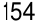
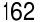

###### **The 4th Law: Make It Satisfying** 

###### **HOW TO BREAK A BAD HABIT** 

143 

|**Inversion of the 1st Law: Make It Invisible**|
|---|
|**1.5:**Reduce exposure. Remove the cues of your bad habits from your environment.|
|**Inversion of the 2nd Law: Make It Unattractive**|
|**2.4:**Reframe your mind-set. Highlight the benefits of avoiding your bad habits.|
|**Inversion of the 3rd Law: Make It Difficult**|
|**3.6:**Increase friction. Increase the number of steps between you and your bad habits.|
|**3.7:**Use a commitment device. Restrict your future choices to the ones that benefit you.|
|**Inversion of the 4th Law: Make It Unsatisfying**|

_You can download a printable version of this habits cheat sheet at:_ _atomichabits.com/cheatsheet_ 

144 

**THE 4TH LAW** 

Make It Satisfying 

&#123;/*  Start of picture text  */&#125;
145 &#123;/*  End of picture text  */&#125;

&#123;/*  Start of picture text  */&#125;
15 &#123;/*  End of picture text  */&#125;

###### The Cardinal Rule of Behavior Change 

**I** N THE LATE 1990S, a public health worker named Stephen Luby left his hometown of Omaha, Nebraska, and bought a one-way ticket to Karachi, Pakistan. 

Karachi was one of the most populous cities in the world. By 1998, over nine million people called it home. It was the economic center of Pakistan and a transportation hub, with some of the most active airports and seaports in the region. In the commercial parts of town, you could find all of the standard urban amenities and bustling downtown streets. But Karachi was also one of the _least_ livable cities in the world. 

Over 60 percent of Karachi’s residents lived in squatter settlements and slums. These densely packed neighborhoods were filled with makeshift houses cobbled together from old boards, cinder blocks, and other discarded materials. There was no waste removal system, no electricity grid, no clean water supply. When dry, the streets were a combination of dust and trash. When wet, they became a muddy pit of sewage. Mosquito colonies thrived in pools of stagnant water, and children played among the garbage. 

The unsanitary conditions lead to widespread illness and disease. Contaminated water sources caused epidemics of diarrhea, vomiting, and abdominal pain. Nearly one third of the children living there were malnourished. With so many people crammed into such a small space, viruses and bacterial infections spread rapidly. It was this public health crisis that had brought Stephen Luby to Pakistan. 

146 

Luby and his team realized that in an environment with poor sanitation, the simple habit of washing your hands could make a real difference in the health of the residents. But they soon discovered that many people were already aware that handwashing was important. 

And yet, despite this knowledge, many residents were washing their hands in a haphazard fashion. Some people would just run their hands under the water quickly. Others would only wash one hand. Many would simply forget to wash their hands before preparing food. Everyone _said_ handwashing was important, but few people made a habit out of it. The problem wasn’t knowledge. The problem was consistency. 

That was when Luby and his team partnered with Procter & Gamble to supply the neighborhood with Safeguard soap. Compared to your standard bar of soap, using Safeguard was a more enjoyable experience. 

“In Pakistan, Safeguard was a premium soap,” Luby told me. “The study participants commonly mentioned how much they liked it.” The soap foamed easily, and people were able to lather their hands with suds. It smelled great. Instantly, handwashing became slightly more pleasurable. 

“I see the goal of handwashing promotion not as behavior change but as habit adoption,” Luby said. “It is a lot easier for people to adopt a product that provides a strong positive sensory signal, for example the mint taste of toothpaste, than it is to adopt a habit that does not provide pleasurable sensory feedback, like flossing one’s teeth. The marketing team at Procter & Gamble talked about trying to create a positive handwashing experience.” 

Within months, the researchers saw a rapid shift in the health of children in the neighborhood. The rate of diarrhea fell by 52 percent; pneumonia by 48 percent; and impetigo, a bacterial skin infection, by 35 percent. 

The long-term effects were even better. “We went back to some of the households in Karachi six years after,” Luby told me. “Over 95 percent of households who had been given the soap for free and encouraged to wash their hands had a handwashing station with soap and water available when our study team visited. . . . We had not given any soap to the intervention group for over five years, but during the trial they had become so habituated to wash their hands, 

147 

that they had maintained the practice.” It was a powerful example of the fourth and final Law of Behavior Change: _make it satisfying._ 

We are more likely to repeat a behavior when the experience is satisfying. This is entirely logical. Feelings of pleasure—even minor ones like washing your hands with soap that smells nice and lathers well—are signals that tell the brain: “This feels good. Do this again, next time.” Pleasure teaches your brain that a behavior is worth remembering and repeating. 

Take the story of chewing gum. Chewing gum had been sold commercially throughout the 1800s, but it wasn’t until Wrigley launched in 1891 that it became a worldwide habit. Early versions were made from relatively bland resins—chewy, but not tasty. Wrigley revolutionized the industry by adding flavors like Spearmint and Juicy Fruit, which made the product flavorful and fun to use. Then they went a step further and began pushing chewing gum as a pathway to a clean mouth. Advertisements told readers to “Refresh Your Taste.” 

Tasty flavors and the feeling of a fresh mouth provided little bits of immediate reinforcement and made the product satisfying to use. Consumption skyrocketed, and Wrigley became the largest chewing gum company in the world. 

Toothpaste had a similar trajectory. Manufacturers enjoyed great success when they added flavors like spearmint, peppermint, and cinnamon to their products. These flavors don’t improve the effectiveness of toothpaste. They simply create a “clean mouth” feel and make the experience of brushing your teeth more pleasurable. My wife actually stopped using Sensodyne because she didn’t like the aftertaste. She switched to a brand with a stronger mint flavor, which proved to be more satisfying. 

Conversely, if an experience is not satisfying, we have little reason to repeat it. In my research, I came across the story of a woman who had a narcissistic relative who drove her nuts. In an attempt to spend less time with this egomaniac, she acted as dull and as boring as possible whenever he was around. Within a few encounters, _he_ started avoiding _her_ because he found her so uninteresting. 

Stories like these are evidence of the Cardinal Rule of Behavior Change: _What is rewarded is repeated. What is punished is avoided._ You learn what to do in the future based on what you were 

148 rewarded for doing (or punished for doing) in the past. Positive emotions cultivate habits. Negative emotions destroy them. 

The first three laws of behavior change— _make it obvious, make it attractive,_ and _make it easy_ —increase the odds that a behavior will be performed _this_ time. The fourth law of behavior change— _make it satisfying_ —increases the odds that a behavior will be repeated _next_ time. It completes the habit loop. 

But there is a trick. We are not looking for just any type of satisfaction. We are looking for immediate satisfaction. 

###### **THE MISMATCH BETWEEN IMMEDIATE AND DELAYED REWARDS** 

Imagine you’re an animal roaming the plains of Africa—a giraffe or an elephant or a lion. On any given day, most of your decisions have an immediate impact. You are always thinking about what to eat or where to sleep or how to avoid a predator. You are constantly focused on the present or the very near future. You live in what scientists call an _immediate-return environment_ because your actions instantly deliver clear and immediate outcomes. 

Now switch back to your human self. In modern society, many of the choices you make today will _not_ benefit you immediately. If you do a good job at work, you’ll get a paycheck in a few weeks. If you exercise today, perhaps you won’t be overweight next year. If you save money now, maybe you’ll have enough for retirement decades from now. You live in what scientists call a _delayed-return environment_ because you can work for years before your actions deliver the intended payoff. 

The human brain did not evolve for life in a delayed-return environment. The earliest remains of modern humans, known as _Homo sapiens sapiens_ , are approximately two hundred thousand years old. These were the first humans to have a brain relatively similar to ours. In particular, the neocortex—the newest part of the brain and the region responsible for higher functions like language —was roughly the same size two hundred thousand years ago as today. You are walking around with the same hardware as your Paleolithic ancestors. 

It is only recently—during the last five hundred years or so—that society has shifted to a predominantly delayed-return 

149 

environment.* Compared to the age of the brain, modern society is brand-new. In the last one hundred years, we have seen the rise of the car, the airplane, the television, the personal computer, the internet, the smartphone, and Beyoncé. The world has changed much in recent years, but human nature has changed little. 

Similar to other animals on the African savannah, our ancestors spent their days responding to grave threats, securing the next meal, and taking shelter from a storm. It made sense to place a high value on instant gratification. The distant future was less of a concern. And after thousands of generations in an immediate-return environment, our brains evolved to prefer quick payoffs to longterm ones. 

Behavioral economists refer to this tendency as _time inconsistency_ . That is, the way your brain evaluates rewards is inconsistent across time.* You value the present more than the future. Usually, this tendency serves us well. A reward that is _certain_ right now is typically worth more than one that is merely _possible_ in the future. But occasionally, our bias toward instant gratification causes problems. 

Why would someone smoke if they know it increases the risk of lung cancer? Why would someone overeat when they know it increases their risk of obesity? Why would someone have unsafe sex if they know it can result in sexually transmitted disease? Once you understand how the brain prioritizes rewards, the answers become clear: the consequences of bad habits are delayed while the rewards are immediate. Smoking might kill you in ten years, but it reduces stress and eases your nicotine cravings _now_ . Overeating is harmful in the long run but appetizing in the moment. Sex—safe or not— provides pleasure right away. Disease and infection won’t show up for days or weeks, even years. 

Every habit produces multiple outcomes across time. Unfortunately, these outcomes are often misaligned. With our bad habits, the immediate outcome usually feels good, but the ultimate outcome feels bad. With good habits, it is the reverse: the immediate outcome is unenjoyable, but the ultimate outcome feels good. The French economist Frédéric Bastiat explained the problem clearly when he wrote, “It almost always happens that when the immediate consequence is favorable, the later consequences are disastrous, and vice versa. . . . Often, the sweeter the first fruit of a habit, the more bitter are its later fruits.” 

150 

Put another way, the costs of your good habits are in the present. The costs of your bad habits are in the future. 

The brain’s tendency to prioritize the present moment means you can’t rely on good intentions. When you make a plan—to lose weight, write a book, or learn a language—you are actually making plans for your future self. And when you envision what you want your life to be like, it is easy to see the value in taking actions with long-term benefits. We all want better lives for our future selves. However, when the moment of decision arrives, instant gratification usually wins. You are no longer making a choice for Future You, who dreams of being fitter or wealthier or happier. You are choosing for Present You, who wants to be full, pampered, and entertained. As a general rule, the more immediate pleasure you get from an action, the more strongly you should question whether it aligns with your long-term goals.* 

With a fuller understanding of what causes our brain to repeat some behaviors and avoid others, let’s update the Cardinal Rule of Behavior Change: What is _immediately_ rewarded is repeated. What is _immediately_ punished is avoided. 

Our preference for instant gratification reveals an important truth about success: because of how we are wired, most people will spend all day chasing quick hits of satisfaction. The road less traveled is the road of delayed gratification. If you’re willing to wait for the rewards, you’ll face less competition and often get a bigger payoff. As the saying goes, the last mile is always the least crowded. 

This is precisely what research has shown. People who are better at delaying gratification have higher SAT scores, lower levels of substance abuse, lower likelihood of obesity, better responses to stress, and superior social skills. We’ve all seen this play out in our own lives. If you delay watching television and get your homework done, you’ll generally learn more and get better grades. If you don’t buy desserts and chips at the store, you’ll often eat healthier food when you get home. At some point, success in nearly every field requires you to ignore an immediate reward in favor of a delayed reward. 

Here’s the problem: most people _know_ that delaying gratification is the wise approach. They want the benefits of good habits: to be healthy, productive, at peace. But these outcomes are seldom topof-mind at the decisive moment. Thankfully, it’s possible to train yourself to delay gratification—but you need to work with the grain 

151 

of human nature, not against it. The best way to do this is to add a little bit of immediate pleasure to the habits that pay off in the longrun and a little bit of immediate pain to ones that don’t. 

###### **HOW TO TURN INSTANT GRATIFICATION TO YOUR ADVANTAGE** 

The vital thing in getting a habit to stick is to feel successful—even if it’s in a small way. The feeling of success is a signal that your habit paid off and that the work was worth the effort. 

In a perfect world, the reward for a good habit is the habit itself. In the real world, good habits tend to feel worthwhile only after they have provided you with something. Early on, it’s all sacrifice. You’ve gone to the gym a few times, but you’re not stronger or fitter or faster—at least, not in any noticeable sense. It’s only months later, once you shed a few pounds or your arms gain some definition, that it becomes easier to exercise for its own sake. In the beginning, you need a reason to stay on track. This is why immediate rewards are essential. They keep you excited while the delayed rewards accumulate in the background. 

What we’re really talking about here—when we’re discussing immediate rewards—is the ending of a behavior. The ending of any experience is vital because we tend to remember it more than other phases. You want the ending of your habit to be satisfying. The best approach is to use _reinforcement_ , which refers to the process of using an immediate reward to increase the rate of a behavior. Habit stacking, which we covered in Chapter 5, ties your habit to an immediate cue, which makes it obvious when to start. Reinforcement ties your habit to an immediate reward, which makes it satisfying when you finish. 

Immediate reinforcement can be especially helpful when dealing with _habits of avoidance_ , which are behaviors you want to stop doing. It can be challenging to stick with habits like “no frivolous purchases” or “no alcohol this month” because nothing happens when you skip happy hour drinks or don’t buy that pair of shoes. It can be hard to feel satisfied when there is no action in the first place. All you’re doing is resisting temptation, and there isn’t much satisfying about that. 

152 

One solution is to turn the situation on its head. You want to make avoidance visible. Open a savings account and label it for something you want—maybe “Leather Jacket.” Whenever you pass on a purchase, put the same amount of money in the account. Skip your morning latte? Transfer $5. Pass on another month of Netflix? Move $10 over. It’s like creating a loyalty program for yourself. The immediate reward of seeing yourself save money toward the leather jacket feels a lot better than being deprived. You are making it satisfying to do nothing. 

One of my readers and his wife used a similar setup. They wanted to stop eating out so much and start cooking together more. They labeled their savings account “Trip to Europe.” Whenever they skipped going out to eat, they transferred $50 into the account. At the end of the year, they put the money toward the vacation. 

It is worth noting that it is important to select short-term rewards that reinforce your identity rather than ones that conflict with it. Buying a new jacket is fine if you’re trying to lose weight or read more books, but it doesn’t work if you’re trying to budget and save money. Instead, taking a bubble bath or going on a leisurely walk are good examples of rewarding yourself with free time, which aligns with your ultimate goal of more freedom and financial independence. Similarly, if your reward for exercising is eating a bowl of ice cream, then you’re casting votes for conflicting identities, and it ends up being a wash. Instead, maybe your reward is a massage, which is both a luxury and a vote toward taking care of your body. Now the short-term reward is aligned with your longterm vision of being a healthy person. 

Eventually, as intrinsic rewards like a better mood, more energy, and reduced stress kick in, you’ll become less concerned with chasing the secondary reward. The identity itself becomes the reinforcer. You do it because it’s who you are and it feels good to be you. The more a habit becomes part of your life, the less you need outside encouragement to follow through. Incentives can start a habit. Identity sustains a habit. 

That said, it takes time for the evidence to accumulate and a new identity to emerge. Immediate reinforcement helps maintain motivation in the short term while you’re waiting for the long-term rewards to arrive. 

In summary, a habit needs to be enjoyable for it to last. Simple bits of reinforcement—like soap that smells great or toothpaste that 

153 

has a refreshing mint flavor or seeing $50 hit your savings account —can offer the immediate pleasure you need to enjoy a habit. And change is easy when it is enjoyable. 

###### Chapter Summary 

- The 4th Law of Behavior Change is _make it satisfying_ . We are more likely to repeat a behavior when the experience is satisfying. 

- The human brain evolved to prioritize immediate rewards over delayed rewards. 

- The Cardinal Rule of Behavior Change: _What is immediately rewarded is repeated. What is immediately punished is avoided._ 

- To get a habit to stick you need to feel immediately successful— even if it’s in a small way. 

- The first three laws of behavior change— _make it obvious, make it attractive,_ and _make it easy_ —increase the odds that a behavior will be performed this time. The fourth law of behavior change— _make it satisfying_ —increases the odds that a behavior will be repeated next time. 

&#123;/*  Start of picture text  */&#125;
154 &#123;/*  End of picture text  */&#125;

16 

###### How to Stick with Good Habits Every Day 

**I** N 1993, a bank in Abbotsford, Canada, hired a twenty-three-yearold stockbroker named Trent Dyrsmid. Abbotsford was a relatively small suburb, tucked away in the shadow of nearby Vancouver, where most of the big business deals were being made. Given the location, and the fact that Dyrsmid was a rookie, nobody expected too much of him. But he made brisk progress thanks to a simple daily habit. 

Dyrsmid began each morning with two jars on his desk. One was filled with 120 paper clips. The other was empty. As soon as he settled in each day, he would make a sales call. Immediately after, he would move one paper clip from the full jar to the empty jar and the process would begin again. “Every morning I would start with 120 paper clips in one jar and I would keep dialing the phone until I had moved them all to the second jar,” he told me. 

Within eighteen months, Dyrsmid was bringing in $5 million to the firm. By age twenty-four, he was making $75,000 per year—the equivalent of $125,000 today. Not long after, he landed a six-figure job with another company. 

I like to refer to this technique as the Paper Clip Strategy and, over the years, I’ve heard from readers who have employed it in a variety of ways. One woman shifted a hairpin from one container to another whenever she wrote a page of her book. Another man moved a marble from one bin to the next after each set of push-ups. 

Making progress is satisfying, and visual measures—like moving paper clips or hairpins or marbles—provide clear evidence of your 

155 

progress. As a result, they reinforce your behavior and add a little bit of immediate satisfaction to any activity. Visual measurement comes in many forms: food journals, workout logs, loyalty punch cards, the progress bar on a software download, even the page numbers in a book. But perhaps the best way to measure your progress is with a _habit tracker_ . 

###### **HOW TO KEEP YOUR HABITS ON TRACK** 

A habit tracker is a simple way to measure whether you did a habit. The most basic format is to get a calendar and cross off each day you stick with your routine. For example, if you meditate on Monday, Wednesday, and Friday, each of those dates gets an _X_ . As time rolls by, the calendar becomes a record of your habit streak. 

Countless people have tracked their habits, but perhaps the most famous was Benjamin Franklin. Beginning at age twenty, Franklin carried a small booklet everywhere he went and used it to track thirteen personal virtues. This list included goals like “Lose no time. Be always employed in something useful” and “Avoid trifling conversation.” At the end of each day, Franklin would open his booklet and record his progress. 

Jerry Seinfeld reportedly uses a habit tracker to stick with his streak of writing jokes. In the documentary _Comedian_ , he explains that his goal is simply to “never break the chain” of writing jokes every day. In other words, he is not focused on how good or bad a particular joke is or how inspired he feels. He is simply focused on showing up and adding to his streak. 

“Don’t break the chain” is a powerful mantra. Don’t break the chain of sales calls and you’ll build a successful book of business. Don’t break the chain of workouts and you’ll get fit faster than you’d expect. Don’t break the chain of creating every day and you will end up with an impressive portfolio. Habit tracking is powerful because it leverages multiple Laws of Behavior Change. It simultaneously makes a behavior obvious, attractive, and satisfying. 

Let’s break down each one. 

Benefit #1: Habit trackin is obvious. 

g 

156 

Recording your last action creates a trigger that can initiate your next one. Habit tracking naturally builds a series of visual cues like the streak of _X_ ’s on your calendar or the list of meals in your food log. When you look at the calendar and see your streak, you’ll be reminded to act again. Research has shown that people who track their progress on goals like losing weight, quitting smoking, and lowering blood pressure are all more likely to improve than those who don’t. One study of more than sixteen hundred people found that those who kept a daily food log lost twice as much weight as those who did not. The mere act of tracking a behavior can spark the urge to change it. 

Habit tracking also keeps you honest. Most of us have a distorted view of our own behavior. We think we act better than we do. Measurement offers one way to overcome our blindness to our own behavior and notice what’s really going on each day. One glance at the paper clips in the container and you immediately know how much work you have (or haven’t) been putting in. When the evidence is right in front of you, you’re less likely to lie to yourself. 

###### Benefit #2: Habit tracking is attractive. 

The most effective form of motivation is progress. When we get a signal that we are moving forward, we become more motivated to continue down that path. In this way, habit tracking can have an addictive effect on motivation. Each small win feeds your desire. 

This can be particularly powerful on a bad day. When you’re feeling down, it’s easy to forget about all the progress you have already made. Habit tracking provides visual proof of your hard work—a subtle reminder of how far you’ve come. Plus, the empty square you see each morning can motivate you to get started because you don’t want to lose your progress by breaking the streak. 

###### Benefit #3: Habit tracking is satisfying. 

This is the most crucial benefit of all. Tracking can become its own form of reward. It is satisfying to cross an item off your to-do list, to complete an entry in your workout log, or to mark an _X_ on the calendar. It feels good to watch your results grow—the size of your 

157 

investment portfolio, the length of your book manuscript—and if it feels good, then you’re more likely to endure. 

Habit tracking also helps keep your eye on the ball: you’re focused on the process rather than the result. You’re not fixated on getting six-pack abs, you’re just trying to keep the streak alive and become the type of person who doesn’t miss workouts. 

In summary, habit tracking (1) creates a visual cue that can remind you to act, (2) is inherently motivating because you see the progress you are making and don’t want to lose it, and (3) feels satisfying whenever you record another successful instance of your habit. Furthermore, habit tracking provides visual proof that you are casting votes for the type of person you wish to become, which is a delightful form of immediate and intrinsic gratification.* 

You may be wondering, if habit tracking is so useful, why have I waited so long to talk about it? 

Despite all the benefits, I’ve left this discussion until now for a simple reason: many people resist the idea of tracking and measuring. It can feel like a burden because it forces you into _two_ habits: the habit you’re trying to build and the habit of tracking it. Counting calories sounds like a hassle when you’re already struggling to follow a diet. Writing down every sales call seems tedious when you’ve got work to do. It feels easier to say, “I’ll just eat less.” Or, “I’ll try harder.” Or, “I’ll remember to do it.” People inevitably tell me things like, “I have a decision journal, but I wish I used it more.” Or, “I recorded my workouts for a week, but then quit.” I’ve been there myself. I once made a food log to track my calories. I managed to do it for _one meal_ and then gave up. 

Tracking isn’t for everyone, and there is no need to measure your entire life. But nearly anyone can benefit from it in some form— even if it’s only temporary. 

What can we do to make tracking easier? 

First, whenever possible, measurement should be automated. You’ll probably be surprised by how much you’re already tracking without knowing it. Your credit card statement tracks how often you go out to eat. Your Fitbit registers how many steps you take and how long you sleep. Your calendar records how many new places you travel to each year. Once you know where to get the data, add a note to your calendar to review it each week or each month, which is more practical than tracking it every day. 

158 

Second, manual tracking should be limited to your most important habits. It is better to consistently track one habit than to sporadically track ten. 

Finally, record each measurement immediately after the habit occurs. The completion of the behavior is the cue to write it down. This approach allows you to combine the habit-stacking method mentioned in Chapter 5 with habit tracking. 

The habit stacking + habit tracking formula is: After [CURRENT HABIT], I will [TRACK MY HABIT]. 

After I hang up the phone from a sales call, I will move one paper clip over. 

After I finish each set at the gym, I will record it in my workout journal. 

After I put my plate in the dishwasher, I will write down what I ate. 

These tactics can make tracking your habits easier. Even if you aren’t the type of person who enjoys recording your behavior, I think you’ll find a few weeks of measurements to be insightful. It’s always interesting to see how you’ve _actually_ been spending your time. 

That said, every habit streak ends at some point. And, more important than any single measurement, is having a good plan for when your habits slide off track. 

###### **HOW TO RECOVER QUICKLY WHEN YOUR HABITS BREAK DOWN** 

No matter how consistent you are with your habits, it is inevitable that life will interrupt you at some point. Perfection is not possible. Before long, an emergency will pop up—you get sick or you have to travel for work or your family needs a little more of your time. 

Whenever this happens to me, I try to remind myself of a simple rule: never miss twice. 

If I miss one day, I try to get back into it as quickly as possible. Missing one workout happens, but I’m not going to miss two in a 

159 

row. Maybe I’ll eat an entire pizza, but I’ll follow it up with a healthy meal. I can’t be perfect, but I can avoid a second lapse. As soon as one streak ends, I get started on the next one. 

The first mistake is never the one that ruins you. It is the spiral of repeated mistakes that follows. Missing once is an accident. Missing twice is the start of a new habit. 

This is a distinguishing feature between winners and losers. Anyone can have a bad performance, a bad workout, or a bad day at work. But when successful people fail, they rebound quickly. The breaking of a habit doesn’t matter if the reclaiming of it is fast. 

I think this principle is so important that I’ll stick to it even if I can’t do a habit as well or as completely as I would like. Too often, we fall into an all-or-nothing cycle with our habits. The problem is not slipping up; the problem is thinking that if you can’t do something perfectly, then you shouldn’t do it at all. 

You don’t realize how valuable it is to just show up on your bad (or busy) days. Lost days hurt you more than successful days help you. If you start with $100, then a 50 percent gain will take you to $150. But you only need a 33 percent loss to take you back to $100. In other words, avoiding a 33 percent loss is just as valuable as achieving a 50 percent gain. As Charlie Munger says, “The first rule of compounding: Never interrupt it unnecessarily.” 

This is why the “bad” workouts are often the most important ones. Sluggish days and bad workouts maintain the compound gains you accrued from previous good days. Simply doing something—ten squats, five sprints, a push-up, anything really—is huge. Don’t put up a zero. Don’t let losses eat into your compounding. 

Furthermore, it’s not always about what happens during the workout. It’s about being the type of person who doesn’t miss workouts. It’s easy to train when you feel good, but it’s crucial to show up when you don’t feel like it—even if you do less than you hope. Going to the gym for five minutes may not improve your performance, but it reaffirms your identity. 

The all-or-nothing cycle of behavior change is just one pitfall that can derail your habits. Another potential danger—especially if you are using a habit tracker—is measuring the wrong thing. 

###### **KNOWING WHEN (AND WHEN NOT) TO TRACK A HABIT** 

160 

Say you’re running a restaurant and you want to know if your chef is doing a good job. One way to measure success is to track how many customers pay for a meal each day. If more customers come in, the food must be good. If fewer customers come in, something must be wrong. 

However, this one measurement—daily revenue—only gives a limited picture of what’s really going on. Just because someone pays for a meal doesn’t mean they _enjoy_ the meal. Even dissatisfied customers are unlikely to dine and dash. In fact, if you’re only measuring revenue, the food might be getting worse but you’re making up for it with marketing or discounts or some other method. Instead, it may be more effective to track how many customers _finish_ their meal or perhaps the percentage of customers who leave a generous tip. 

The dark side of tracking a particular behavior is that we become driven by the number rather than the purpose behind it. If your success is measured by quarterly earnings, you will optimize sales, revenue, and accounting for quarterly earnings. If your success is measured by a lower number on the scale, you will optimize for a lower number on the scale, even if that means embracing crash diets, juice cleanses, and fat-loss pills. The human mind wants to “win” whatever game is being played. 

This pitfall is evident in many areas of life. We focus on working long hours instead of getting meaningful work done. We care more about getting ten thousand steps than we do about being healthy. We teach for standardized tests instead of emphasizing learning, curiosity, and critical thinking. In short, we optimize for what we measure. When we choose the wrong measurement, we get the wrong behavior. 

This is sometimes referred to as Goodhart’s Law. Named after the economist Charles Goodhart, the principle states, “When a measure becomes a target, it ceases to be a good measure.” Measurement is only useful when it guides you and adds context to a larger picture, not when it consumes you. Each number is simply one piece of feedback in the overall system. 

In our data-driven world, we tend to overvalue numbers and undervalue anything ephemeral, soft, and difficult to quantify. We mistakenly think the factors we can measure are the only factors that exist. But just because you can measure something doesn’t 

161 

mean it’s the most important thing. And just because you _can’t_ measure something doesn’t mean it’s not important at all. 

All of this to say, it’s crucial to keep habit tracking in its proper place. It can feel satisfying to record a habit and track your progress, but the measurement is not the only thing that matters. Furthermore, there are many ways to measure progress, and sometimes it helps to shift your focus to something entirely different. 

This is why _nonscale victories_ can be effective for weight loss. The number on the scale may be stubborn, so if you focus solely on that number, your motivation will sag. But you may notice that your skin looks better or you wake up earlier or your sex drive got a boost. All of these are valid ways to track your improvement. If you’re not feeling motivated by the number on the scale, perhaps it’s time to focus on a different measurement—one that gives you more signals of progress. 

No matter how you measure your improvement, habit tracking offers a simple way to make your habits more satisfying. Each measurement provides a little bit of evidence that you’re moving in the right direction and a brief moment of immediate pleasure for a job well done. 

###### Chapter Summary 

- One of the most satisfying feelings is the feeling of making progress. 

- A habit tracker is a simple way to measure whether you did a habit—like marking an X on a calendar. 

- Habit trackers and other visual forms of measurement can make your habits satisfying by providing clear evidence of your progress. 

- Don’t break the chain. Try to keep your habit streak alive. Never miss twice. If you miss one day, try to get back on track as quickly as possible. 

- Just because you can measure something doesn’t mean it’s the most important thing. 

&#123;/*  Start of picture text  */&#125;
162 &#123;/*  End of picture text  */&#125;

17 

###### How an Accountability Partner Can Change Everything 

**A** FTER SERVING AS a pilot in World War II, Roger Fisher attended Harvard Law School and spent thirty-four years specializing in negotiation and conflict management. He founded the Harvard Negotiation Project and worked with numerous countries and world leaders on peace resolutions, hostage crises, and diplomatic compromises. But it was in the 1970s and 1980s, as the threat of nuclear war escalated, that Fisher developed perhaps his most interesting idea. 

At the time, Fisher was focused on designing strategies that could prevent nuclear war, and he had noticed a troubling fact. Any sitting president would have access to launch codes that could kill millions of people but would never actually see anyone die because he would always be thousands of miles away. 

“My suggestion was quite simple,” he wrote in 1981. “Put that [nuclear] code number in a little capsule, and then implant that capsule right next to the heart of a volunteer. The volunteer would carry with him a big, heavy butcher knife as he accompanied the President. If ever the President wanted to fire nuclear weapons, the only way he could do so would be for him first, with his own hands, to kill one human being. The President says, ‘George, I’m sorry but tens of millions must die.’ He has to look at someone and realize what death is—what an innocent death is. Blood on the White House carpet. It’s reality brought home. 

“When I suggested this to friends in the Pentagon they said, ‘My God, that’s terrible. Having to kill someone would distort the 

163 

President’s judgment. He might never push the button.’” Throughout our discussion of the 4th Law of Behavior Change we have covered the importance of making good habits immediately satisfying. Fisher’s proposal is an inversion of the 4th Law: _Make it immediately unsatisfying._ 

Just as we are more likely to repeat an experience when the ending is satisfying, we are also more likely to avoid an experience when the ending is painful. Pain is an effective teacher. If a failure is painful, it gets fixed. If a failure is relatively painless, it gets ignored. The more immediate and more costly a mistake is, the faster you will learn from it. The threat of a bad review forces a plumber to be good at his job. The possibility of a customer never returning makes restaurants create good food. The cost of cutting the wrong blood vessel makes a surgeon master human anatomy and cut carefully. When the consequences are severe, people learn quickly. 

The more immediate the pain, the less likely the behavior. If you want to prevent bad habits and eliminate unhealthy behaviors, then adding an instant cost to the action is a great way to reduce their odds. 

We repeat bad habits because they serve us in some way, and that makes them hard to abandon. The best way I know to overcome this predicament is to increase the speed of the punishment associated with the behavior. There can’t be a gap between the action and the consequences. 

As soon as actions incur an immediate consequence, behavior begins to change. Customers pay their bills on time when they are charged a late fee. Students show up to class when their grade is linked to attendance. We’ll jump through a lot of hoops to avoid a little bit of immediate pain. 

There is, of course, a limit to this. If you’re going to rely on punishment to change behavior, then the strength of the punishment must match the relative strength of the behavior it is trying to correct. To be productive, the cost of procrastination must be greater than the cost of action. To be healthy, the cost of laziness must be greater than the cost of exercise. Getting fined for smoking in a restaurant or failing to recycle adds consequence to an action. Behavior only shifts if the punishment is painful enough and reliably enforced. 

In general, the more local, tangible, concrete, and immediate the consequence, the more likely it is to influence individual behavior. 

164 

The more global, intangible, vague, and delayed the consequence, the less likely it is to influence individual behavior. 

Thankfully, there is a straightforward way to add an immediate cost to any bad habit: create a _habit contract_ . 

###### **THE HABIT CONTRACT** 

The first seat belt law was passed in New York on December 1, 1984. At the time, just 14 percent of people in the United States regularly wore a seat belt—but that was all about to change. 

Within five years, over half of the nation had seat belt laws. Today, wearing a seat belt is enforceable by law in forty-nine of the fifty states. And it’s not just the legislation, the number of people wearing seat belts has changed dramatically as well. In 2016, over 88 percent of Americans buckled up each time they got in a car. In just over thirty years, there was a complete reversal in the habits of millions of people. 

Laws and regulations are an example of how government can change our habits by creating a social contract. As a society, we collectively agree to abide by certain rules and then enforce them as a group. Whenever a new piece of legislation impacts behavior—seat belt laws, banning smoking inside restaurants, mandatory recycling —it is an example of a social contract shaping our habits. The group agrees to act in a certain way, and if you don’t follow along, you’ll be punished. 

Just as governments use laws to hold citizens accountable, you can create a habit contract to hold yourself accountable. A habit contract is a verbal or written agreement in which you state your commitment to a particular habit and the punishment that will occur if you don’t follow through. Then you find one or two people to act as your accountability partners and sign off on the contract with you. 

Bryan Harris, an entrepreneur from Nashville, Tennessee, was the first person I saw put this strategy into action. Shortly after the birth of his son, Harris realized he wanted to shed a few pounds. He wrote up a habit contract between himself, his wife, and his personal trainer. The first version read, “Bryan’s #1 objective for Q1 of 2017 is to start eating correctly again so he feels better, looks 

165 

better, and is able to hit his long-term goal of 200 pounds at 10% body fat.” 

Below that statement, Harris laid out a road map for achieving his ideal outcome: 

- Phase #1: Get back to a strict “slow-carb” diet in Q1. Phase #2: Start a strict macronutrient tracking program in Q2. Phase #3: Refine and maintain the details of his diet and workout program in Q3. 

Finally, he wrote out each of the daily habits that would get him to his goal. For example, “Write down all food that he consumes each day and weigh himself each day.” 

And then he listed the punishment if he failed: “If Bryan doesn’t do these two items then the following consequence will be enforced: He will have to dress up each workday and each Sunday morning for the rest of the quarter. Dress up is defined as not wearing jeans, t- shirts, hoodies, or shorts. He will also give Joey (his trainer) $200 to use as he sees fit if he misses one day of logging food.” 

At the bottom of the page, Harris, his wife, and his trainer all signed the contract. 

My initial reaction was that a contract like this seemed overly formal and unnecessary, especially the signatures. But Harris convinced me that signing the contract was an indication of seriousness. “Anytime I skip this part,” he said, “I start slacking almost immediately.” 

Three months later, after hitting his targets for Q1, Harris upgraded his goals. The consequences escalated, too. If he missed his carbohydrate and protein targets, he had to pay his trainer $100. And if he failed to weigh himself, he had to give his wife $500 to use as she saw fit. Perhaps most painfully, if he forgot to run sprints, he had to dress up for work every day and wear an Alabama hat the rest of the quarter—the bitter rival of his beloved Auburn team. 

The strategy worked. With his wife and trainer acting as accountability partners and with the habit contract clarifying exactly what to do each day, Harris lost the weight.* 

To make bad habits unsatisfying, your best option is to make them painful in the moment. Creating a habit contract is a straightforward way to do exactly that. 

166 

Even if you don’t want to create a full-blown habit contract, simply having an accountability partner is useful. The comedian Margaret Cho writes a joke or song every day. She does the “song a day” challenge with a friend, which helps them both stay accountable. Knowing that someone is watching can be a powerful motivator. You are less likely to procrastinate or give up because there is an immediate cost. If you don’t follow through, perhaps they’ll see you as untrustworthy or lazy. Suddenly, you are not only failing to uphold your promises to yourself, but also failing to uphold your promises to others. 

You can even automate this process. Thomas Frank, an entrepreneur in Boulder, Colorado, wakes up at 5:55 each morning. And if he doesn’t, he has a tweet automatically scheduled that says, “It’s 6:10 and I’m not up because I’m lazy! Reply to this for $5 via PayPal (limit 5), assuming my alarm didn’t malfunction.” 

We are always trying to present our best selves to the world. We comb our hair and brush our teeth and dress ourselves carefully because we know these habits are likely to get a positive reaction. We want to get good grades and graduate from top schools to impress potential employers and mates and our friends and family. We care about the opinions of those around us because it helps if others like us. This is precisely why getting an accountability partner or signing a habit contract can work so well. 

###### Chapter Summary 

- The inversion of the 4th Law of Behavior Change is _make it unsatisfying_ . 

- We are less likely to repeat a bad habit if it is painful or unsatisfying. 

- An accountability partner can create an immediate cost to inaction. We care deeply about what others think of us, and we do not want others to have a lesser opinion of us. 

- A habit contract can be used to add a social cost to any behavior. It makes the costs of violating your promises public and painful. 

- Knowing that someone else is watching you can be a powerful motivator. 

167 

**HOW TO CREATE A GOOD HABIT**