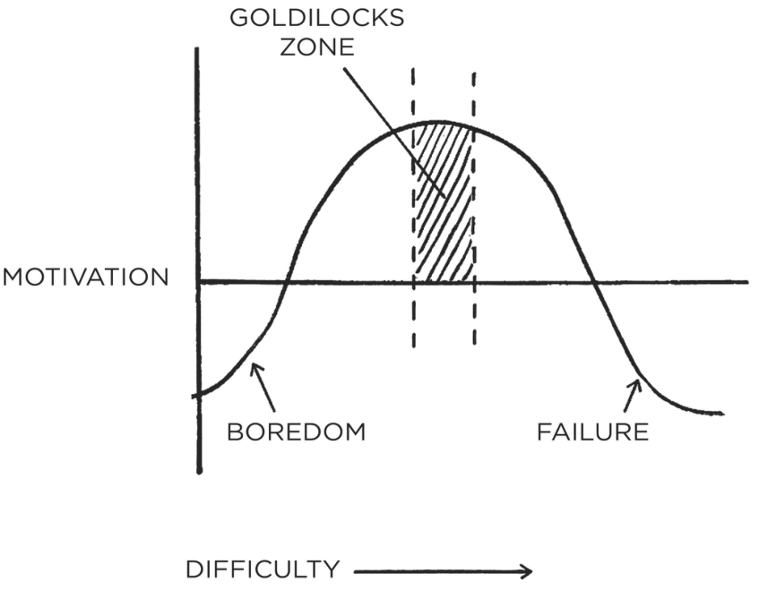
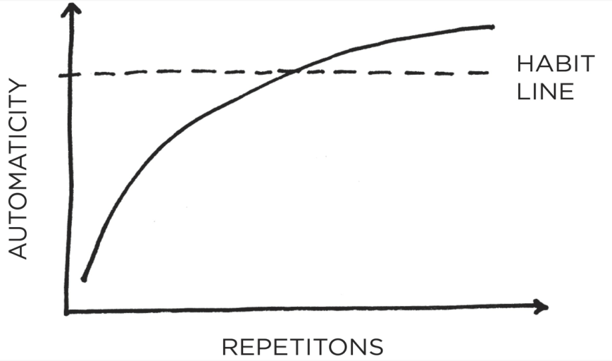
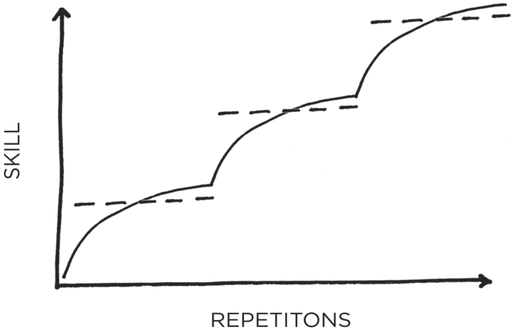

###### **The 4th Law: Make It Satisfying** 

- **4.1:** Use reinforcement. Give yourself an immediate reward when you complete your habit. 

- **4.2:** Make “doing nothing” enjoyable. When avoiding a bad habit, design a way to see the benefits. 

- **4.3:** Use a habit tracker. Keep track of your habit streak and “don’t break the chain.” 

- **4.4:** Never miss twice. When you forget to do a habit, make sure you get back on track immediately. 

###### **HOW TO BREAK A BAD HABIT** 

168 

|**Inversion of the 1st Law: Make It Invisible**|
|---|
|**1.5:**Reduce exposure. Remove the cues of your bad habits from your environment.|
|**Inversion of the 2nd Law: Make It Unattractive**|
|**2.4:**Reframe your mind-set. Highlight the benefits of avoiding your bad habits.|
|**Inversion of the 3rd Law: Make It Difficult**|
|**3.6:**Increase friction. Increase the number of steps between you and your bad habits. **3.7:**Use a commitment device. Restrict your future choices to the ones that benefit you.|
|**Inversion of the 4th Law: Make It Unsatisfying**|
|**4.5:**Get an accountability partner. Ask someone to watch your behavior. **4.6:**Create a habit contract. Make the costs of your bad habits public and painful.|

_You can download a printable version of this habits cheat sheet at:_ _atomichabits.com/cheatsheet_ 

169 

#### **ADVANCED TACTICS** 

How to Go from Being Merely Good to Being Truly Great 

&#123;/*  Start of picture text  */&#125;
170 &#123;/*  End of picture text  */&#125;

&#123;/*  Start of picture text  */&#125;
18 &#123;/*  End of picture text  */&#125;

###### The Truth About Talent (When Genes Matter and When They Don’t) 

**M** ANY PEOPLE ARE familiar with Michael Phelps, who is widely considered to be one of the greatest athletes in history. Phelps has won more Olympic medals not only than any swimmer but also more than any Olympian in _any_ sport. 

Fewer people know the name Hicham El Guerrouj, but he was a fantastic athlete in his own right. El Guerrouj is a Moroccan runner who holds two Olympic gold medals and is one of the greatest middle-distance runners of all time. For many years, he held the world record in the mile, 1,500-meter, and 2,000-meter races. At the Olympic Games in Athens, Greece, in 2004, he won gold in the 1,500-meter and 5,000-meter races. 

These two athletes are wildly different in many ways. (For starters, one competed on land and the other in water.) But most notably, they differ significantly in height. El Guerrouj is five feet, nine inches tall. Phelps is six feet, four inches tall. Despite this seven-inch difference in height, the two men are identical in one respect: Michael Phelps and Hicham El Guerrouj wear the same length inseam on their pants. 

How is this possible? Phelps has relatively short legs for his height and a very long torso, the perfect build for swimming. El Guerrouj has incredibly long legs and a short upper body, an ideal frame for distance running. 

Now, imagine if these world-class athletes were to switch sports. Given his remarkable athleticism, could Michael Phelps become an Olympic-caliber distance runner with enough training? It’s unlikely. 

171 

At peak fitness, Phelps weighed 194 pounds, which is 40 percent heavier than El Guerrouj, who competed at an ultralight 138 pounds. Taller runners are heavier runners, and every extra pound is a curse when it comes to distance running. Against elite competition, Phelps would be doomed from the start. 

Similarly, El Guerrouj might be one of the best runners in history, but it’s doubtful he would ever qualify for the Olympics as a swimmer. Since 1976, the average height of Olympic gold medalists in the men’s 1,500-meter run is five feet, ten inches. In comparison, the average height of Olympic gold medalists in the men’s 100meter freestyle swim is six feet, four inches. Swimmers tend to be tall and have long backs and arms, which are ideal for pulling through the water. El Guerrouj would be at a severe disadvantage before he ever touched the pool. 

The secret to maximizing your odds of success is to choose the right field of competition. This is just as true with habit change as it is with sports and business. Habits are easier to perform, and more satisfying to stick with, when they align with your natural inclinations and abilities. Like Michael Phelps in the pool or Hicham El Guerrouj on the track, you want to play a game where the odds are in your favor. 

Embracing this strategy requires the acceptance of the simple truth that people are born with different abilities. Some people don’t like to discuss this fact. On the surface, your genes seem to be fixed, and it’s no fun to talk about things you cannot control. Plus, phrases like _biological determinism_ makes it sound like certain individuals are destined for success and others doomed to failure. But this is a shortsighted view of the influence of genes on behavior. 

The strength of genetics is also their weakness. Genes cannot be easily changed, which means they provide a powerful advantage in favorable circumstances and a serious disadvantage in unfavorable circumstances. If you want to dunk a basketball, being seven feet tall is very useful. If you want to perform a gymnastics routine, being seven feet tall is a great hindrance. Our environment determines the suitability of our genes and the utility of our natural talents. When our environment changes, so do the qualities that determine success. 

This is true not just for physical characteristics but for mental ones as well. I’m smart if you ask me about habits and human 

172 

behavior; not so much when it comes to knitting, rocket propulsion, or guitar chords. Competence is highly dependent on context. 

The people at the top of any competitive field are not only well trained, they are also well suited to the task. And this is why, if you want to be truly great, selecting the right place to focus is crucial. 

In short: genes do not determine your destiny. They determine your areas of opportunity. As physician Gabor Mate notes, “Genes can predispose, but they don’t predetermine.” The areas where you are genetically predisposed to success are the areas where habits are more likely to be satisfying. The key is to direct your effort toward areas that both excite you and match your natural skills, to align your ambition with your ability. 

The obvious question is, “How do I figure out where the odds are in my favor? How do I identify the opportunities and habits that are right for me?” The first place we will look for an answer is by understanding your personality. 

###### **HOW YOUR PERSONALITY INFLUENCES YOUR HABITS** 

Your genes are operating beneath the surface of every habit. Indeed, beneath the surface of every _behavior_ . Genes have been shown to influence everything from the number of hours you spend watching television to your likelihood to marry or divorce to your tendency to get addicted to drugs, alcohol, or nicotine. There’s a strong genetic component to how obedient or rebellious you are when facing authority, how vulnerable or resistant you are to stressful events, how proactive or reactive you tend to be, and even how captivated or bored you feel during sensory experiences like attending a concert. As Robert Plomin, a behavioral geneticist at King’s College in London, told me, “It is now at the point where we have stopped testing to see if traits have a genetic component because we literally can’t find a single one that isn’t influenced by our genes.” 

Bundled together, your unique cluster of genetic traits predispose you to a particular personality. Your personality is the set of characteristics that is consistent from situation to situation. The most proven scientific analysis of personality traits is known as the “Big Five,” which breaks them down into five spectrums of behavior. 

173 

1. Openness to experience: from curious and inventive on one end to cautious and consistent on the other. 

2. Conscientiousness: organized and efficient to easygoing and spontaneous. 

3. Extroversion: outgoing and energetic to solitary and reserved (you likely know them as extroverts vs. introverts). 

4. Agreeableness: friendly and compassionate to challenging and detached. 

5. Neuroticism: anxious and sensitive to confident, calm, and stable. 

All five characteristics have biological underpinnings. Extroversion, for instance, can be tracked from birth. If scientists play a loud noise in the nursing ward, some babies turn toward it while others turn away. When the researchers tracked these children through life, they found that the babies who turned toward the noise were more likely to grow up to be extroverts. Those who turned away were more likely to become introverts. 

People who are high in agreeableness are kind, considerate, and warm. They also tend to have higher natural oxytocin levels, a hormone that plays an important role in social bonding, increases feelings of trust, and can act as a natural antidepressant. You can easily imagine how someone with more oxytocin might be inclined to build habits like writing thank-you notes or organizing social events. 

As a third example, consider neuroticism, which is a personality trait all people possess to various degrees. People who are high in neuroticism tend to be anxious and worry more than others. This trait has been linked to hypersensitivity of the amygdala, the portion of the brain responsible for noticing threats. In other words, people who are more sensitive to negative cues in their environment are more likely to score high in neuroticism. 

Our habits are not solely determined by our personalities, but there is no doubt that our genes nudge us in a certain direction. Our deeply rooted preferences make certain behaviors easier for some people than for others. You don’t have to apologize for these differences or feel guilty about them, but you do have to work with them. A person who scores lower on conscientiousness, for example, will be less likely to be orderly by nature and may need to rely more heavily on environment design to stick with good habits. (As a 

174 

reminder for the less conscientious readers among us, environment design is a strategy we discussed in Chapters 6 and 12.) 

The takeaway is that you should build habits that work for your personality.* People can get ripped working out like a bodybuilder, but if you prefer rock climbing or cycling or rowing, then shape your exercise habit around your interests. If your friend follows a lowcarb diet but you find that low-fat works for you, then more power to you. If you want to read more, don’t be embarrassed if you prefer steamy romance novels over nonfiction. Read whatever fascinates you.* You don’t have to build the habits everyone tells you to build. Choose the habit that best suits you, not the one that is most popular. 

There is a version of every habit that can bring you joy and satisfaction. Find it. Habits need to be enjoyable if they are going to stick. This is the core idea behind the 4th Law. 

Tailoring your habits to your personality is a good start, but this is not the end of the story. Let’s turn our attention to finding and designing situations where you’re at a natural advantage. **HOW TO FIND A GAME WHERE THE ODDS ARE IN YOUR FAVOR** 

Learning to play a game where the odds are in your favor is critical for maintaining motivation and feeling successful. In theory, you can enjoy almost anything. In practice, you are more likely to enjoy the things that come easily to you. People who are talented in a particular area tend to be more competent at that task and are then praised for doing a good job. They stay energized because they are making progress where others have failed, and because they get rewarded with better pay and bigger opportunities, which not only makes them happier but also propels them to produce even higherquality work. It’s a virtuous cycle. 

Pick the right habit and progress is easy. Pick the wrong habit and life is a struggle. 

How do you pick the right habit? The first step is something we covered in the 3rd Law: _make it easy_ . In many cases, when people pick the wrong habit, it simply means they picked a habit that was too difficult. When a habit is easy, you are more likely to be successful. When you are successful, you are more likely to feel 

175 

satisfied. However, there is another level to consider. In the longrun, if you continue to advance and improve, any area can become challenging. At some point, you need to make sure you’re playing the right game for your skillset. How do you figure that out? 

The most common approach is trial and error. Of course, there’s a problem with this strategy: life is short. You don’t have time to try every career, date every eligible bachelor, or play every musical instrument. Thankfully, there is an effective way to manage this conundrum, and it is known as the _explore/exploit trade-off_ . 

In the beginning of a new activity, there should be a period of exploration. In relationships, it’s called dating. In college, it’s called the liberal arts. In business, it’s called split testing. The goal is to try out many possibilities, research a broad range of ideas, and cast a wide net. 

After this initial period of exploration, shift your focus to the best solution you’ve found—but keep experimenting occasionally. The proper balance depends on whether you’re winning or losing. If you are currently winning, you exploit, exploit, exploit. If you are currently losing, you continue to explore, explore, explore. 

In the long-run it is probably most effective to work on the strategy that seems to deliver the best results about 80 to 90 percent of the time and keep exploring with the remaining 10 to 20 percent. Google famously asks employees to spend 80 percent of the workweek on their official job and 20 percent on projects of their choice, which has led to the creation of blockbuster products like AdWords and Gmail. 

The optimal approach also depends on how much time you have. If you have a lot of time—like someone at the beginning of their career—it makes more sense to explore because once you find the right thing, you still have a good amount of time to exploit it. If you’re pressed for time—say, as you come up on the deadline for a project—you should implement the best solution you’ve found so far and get some results. 

As you explore different options, there are a series of questions you can ask yourself to continually narrow in on the habits and areas that will be most satisfying to you: 

**What feels like fun to me, but work to others?** The mark of whether you are made for a task is not whether you love it but whether you can handle the pain of the task easier than 

176 

most people. When are you enjoying yourself while other people are complaining? The work that hurts you less than it hurts others is the work you were made to do. 

**What makes me lose track of time?** Flow is the mental state you enter when you are so focused on the task at hand that the rest of the world fades away. This blend of happiness and peak performance is what athletes and performers experience when they are “in the zone.” It is nearly impossible to experience a flow state and not find the task satisfying at least to some degree. 

**Where do I get greater returns than the average person?** We are continually comparing ourselves to those around us, and a behavior is more likely to be satisfying when the comparison is in our favor. When I started writing at jamesclear.com, my email list grew very quickly. I wasn’t quite sure what I was doing well, but I knew that results seemed to be coming faster for me than for some of my colleagues, which motivated me to keep writing. 

**What comes naturally to me?** For just a moment, ignore what you have been taught. Ignore what society has told you. Ignore what others expect of you. Look inside yourself and ask, “What feels natural to me? When have I felt alive? When have I felt like the real me?” No internal judgments or peoplepleasing. No second-guessing or self-criticism. Just feelings of engagement and enjoyment. Whenever you feel authentic and genuine, you are headed in the right direction. 

To be honest, some of this process is just luck. Michael Phelps and Hicham El Guerrouj were lucky to be born with a rare set of abilities that are highly valued by society and to be placed in the ideal environment for those abilities. We all have limited time on this planet, and the truly great among us are the ones who not only work hard but also have the good fortune to be exposed to opportunities that favor us. 

But what if you don’t want to leave it up to luck? 

177 

If you can’t find a game where the odds are stacked in your favor, create one. Scott Adams, the cartoonist behind _Dilbert_ , says, “Everyone has at least a few areas in which they could be in the top 25% with some effort. In my case, I can draw better than most people, but I’m hardly an artist. And I’m not any funnier than the average standup comedian who never makes it big, but I’m funnier than most people. The magic is that few people can draw well and write jokes. It’s the combination of the two that makes what I do so rare. And when you add in my business background, suddenly I had a topic that few cartoonists could hope to understand without living it.” 

When you can’t win by being better, you can win by being different. By combining your skills, you reduce the level of competition, which makes it easier to stand out. You can shortcut the need for a genetic advantage (or for years of practice) by rewriting the rules. A good player works hard to win the game everyone else is playing. A great player creates a new game that favors their strengths and avoids their weaknesses. 

In college, I designed my own major, biomechanics, which was a combination of physics, chemistry, biology, and anatomy. I wasn’t smart enough to stand out among the top physics or biology majors, so I created my own game. And because it suited me—I was only taking the courses I was interested in—studying felt like less of a chore. It was also easier to avoid the trap of comparing myself to everyone else. After all, nobody else was taking the same combination of classes, so who could say if they were better or worse? 

Specialization is a powerful way to overcome the “accident” of bad genetics. The more you master a specific skill, the harder it becomes for others to compete with you. Many bodybuilders are stronger than the average arm wrestler, but even a massive bodybuilder may lose at arm wrestling because the arm wrestling champ has very specific strength. Even if you’re not the most naturally gifted, you can often win by being the best in a very narrow category. 

Boiling water will soften a potato but harden an egg. You can’t control whether you’re a potato or an egg, but you can decide to play a game where it’s better to be hard or soft. If you can find a more favorable environment, you can transform the situation from one where the odds are against you to one where they are in your favor. 

178 

###### **HOW TO GET THE MOST OUT OF YOUR GENES** 

Our genes do not eliminate the need for hard work. They clarify it. They tell us _what_ to work hard on. Once we realize our strengths, we know where to spend our time and energy. We know which types of opportunities to look for and which types of challenges to avoid. The better we understand our nature, the better our strategy can be. Biological differences matter. Even so, it’s more productive to focus on whether you are fulfilling your own potential than comparing yourself to someone else. The fact that you have a natural limit to any specific ability has nothing to do with whether you are reaching the ceiling of your capabilities. People get so caught up in the fact that they _have_ limits that they rarely exert the effort required to get close to them. 

Furthermore, genes can’t make you successful if you’re not doing the work. Yes, it’s possible that the ripped trainer at the gym has better genes, but if you haven’t put in the same reps, it’s impossible to say if you have been dealt a better or worse genetic hand. Until you work as hard as those you admire, don’t explain away their success as luck. 

In summary, one of the best ways to ensure your habits remain satisfying over the long-run is to pick behaviors that align with your personality and skills. Work hard on the things that come easy. 

###### Chapter Summary 

- The secret to maximizing your odds of success is to choose the right field of competition. 

- Pick the right habit and progress is easy. Pick the wrong habit and life is a struggle. 

- Genes cannot be easily changed, which means they provide a powerful advantage in favorable circumstances and a serious disadvantage in unfavorable circumstances. 

- Habits are easier when they align with your natural abilities. Choose the habits that best suit you. 

- Play a game that favors your strengths. If you can’t find a game that favors you, create one. 

- Genes do not eliminate the need for hard work. They clarify it. They tell us _what_ to work hard on. 

&#123;/*  Start of picture text  */&#125;
179 &#123;/*  End of picture text  */&#125;

19 

###### The Goldilocks Rule: How to Stay Motivated in Life and Work 

**I** N 1955, Disneyland had just opened in Anaheim, California, when a ten-year-old boy walked in and asked for a job. Labor laws were loose back then and the boy managed to land a position selling guidebooks for $0.50 apiece. 

Within a year, he had transitioned to Disney’s magic shop, where he learned tricks from the older employees. He experimented with jokes and tried out simple routines on visitors. Soon he discovered that what he loved was not performing magic but performing in general. He set his sights on becoming a comedian. 

Beginning in his teenage years, he started performing in little clubs around Los Angeles. The crowds were small and his act was short. He was rarely on stage for more than five minutes. Most of the people in the crowd were too busy drinking or talking with friends to pay attention. One night, he literally delivered his standup routine to an empty club. 

It wasn’t glamorous work, but there was no doubt he was getting better. His first routines would only last one or two minutes. By high school, his material had expanded to include a five-minute act and, a few years later, a ten-minute show. At nineteen, he was performing weekly for twenty minutes at a time. He had to read three poems during the show just to make the routine long enough, but his skills continued to progress. 

He spent another decade experimenting, adjusting, and practicing. He took a job as a television writer and, gradually, he was able to land his own appearances on talk shows. By the mid- 

180 

1970s, he had worked his way into being a regular guest on _The Tonight Show_ and _Saturday Night Live_ . 

Finally, after nearly fifteen years of work, the young man rose to fame. He toured sixty cities in sixty-three days. Then seventy-two cities in eighty days. Then eighty-five cities in ninety days. He had 18,695 people attend one show in Ohio. Another 45,000 tickets were sold for his three-day show in New York. He catapulted to the top of his genre and became one of the most successful comedians of his time. 

His name is Steve Martin. 

Martin’s story offers a fascinating perspective on what it takes to stick with habits for the long run. Comedy is not for the timid. It is hard to imagine a situation that would strike fear into the hearts of more people than performing alone on stage and failing to get a single laugh. And yet Steve Martin faced this fear every week for eighteen years. In his words, “10 years spent learning, 4 years spent refining, and 4 years as a wild success.” 

Why is it that some people, like Martin, stick with their habits— whether practicing jokes or drawing cartoons or playing guitar— while most of us struggle to stay motivated? How do we design habits that pull us in rather than ones that fade away? Scientists have been studying this question for many years. While there is still much to learn, one of the most consistent findings is that the way to maintain motivation and achieve peak levels of desire is to work on tasks of “just manageable difficulty.” 

The human brain loves a challenge, but only if it is within an optimal zone of difficulty. If you love tennis and try to play a serious match against a four-year-old, you will quickly become bored. It’s too easy. You’ll win every point. In contrast, if you play a professional tennis player like Roger Federer or Serena Williams, you will quickly lose motivation because the match is too difficult. 

Now consider playing tennis against someone who is your equal. As the game progresses, you win a few points and you lose a few. You have a good chance of winning, but only if you really try. Your focus narrows, distractions fade away, and you find yourself fully invested in the task at hand. This is a challenge of just manageable difficulty and it is a prime example of the _Goldilocks Rule_ . 

The Goldilocks Rule states that humans experience peak motivation when working on tasks that are right on the edge of their current abilities. Not too hard. Not too easy. Just right. 

181 

###### **THE GOLDILOCKS RULE** 

&#123;/*  Start of picture text  */&#125;
GOLDILOCKS ZONE it '! MOTIVATION /¥y | 1 i&#125; i BOREDOM FAILURE DIFFICULTY ——————> &#123;/*  End of picture text  */&#125;

FIGURE 15: Maximum motivation occurs when facing a challenge of just manageable difficulty. In psychology research this is known as the Yerkes–Dodson law, which describes the optimal level of arousal as the midpoint between boredom and anxiety. 

Martin’s comedy career is an excellent example of the Goldilocks Rule in practice. Each year, he expanded his comedy routine—but only by a minute or two. He was always adding new material, but he also kept a few jokes that were guaranteed to get laughs. There were just enough victories to keep him motivated and just enough mistakes to keep him working hard. 

When you’re starting a new habit, it’s important to keep the behavior as easy as possible so you can stick with it even when conditions aren’t perfect. This is an idea we covered in detail while discussing the 3rd Law of Behavior Change. 

Once a habit has been established, however, it’s important to continue to advance in small ways. These little improvements and new challenges keep you engaged. And if you hit the Goldilocks Zone just right, you can achieve a _flow state_ .* 

182 

A flow state is the experience of being “in the zone” and fully immersed in an activity. Scientists have tried to quantify this feeling. They found that to achieve a state of flow, a task must be roughly 4 percent beyond your current ability. In real life it’s typically not feasible to quantify the difficulty of an action in this way, but the core idea of the Goldilocks Rule remains: working on challenges of just manageable difficulty—something on the perimeter of your ability—seems crucial for maintaining motivation. 

Improvement requires a delicate balance. You need to regularly search for challenges that push you to your edge while continuing to make enough progress to stay motivated. Behaviors need to remain novel in order for them to stay attractive and satisfying. Without variety, we get bored. And boredom is perhaps the greatest villain on the quest for self-improvement. 

###### **HOW TO STAY FOCUSED WHEN YOU GET BORED WORKING ON YOUR GOALS** 

After my baseball career ended, I was looking for a new sport. I joined a weightlifting team and one day an elite coach visited our gym. He had worked with thousands of athletes during his long career, including a few Olympians. I introduced myself and we began talking about the process of improvement. 

“What’s the difference between the best athletes and everyone else?” I asked. “What do the really successful people do that most don’t?” 

He mentioned the factors you might expect: genetics, luck, talent. But then he said something I wasn’t expecting: “At some point it comes down to who can handle the boredom of training every day, doing the same lifts over and over and over.” 

His answer surprised me because it’s a different way of thinking about work ethic. People talk about getting “amped up” to work on their goals. Whether it’s business or sports or art, you hear people say things like, “It all comes down to passion.” Or, “You have to really want it.” As a result, many of us get depressed when we lose focus or motivation because we think that successful people have some bottomless reserve of passion. But this coach was saying that really successful people _feel_ the same lack of motivation as everyone 

183 

else. The difference is that they still find a way to show up despite the feelings of boredom. 

Mastery requires practice. But the more you practice something, the more boring and routine it becomes. Once the beginner gains have been made and we learn what to expect, our interest starts to fade. Sometimes it happens even faster than that. All you have to do is hit the gym a few days in a row or publish a couple of blog posts on time and letting one day slip doesn’t feel like much. Things are going well. It’s easy to rationalize taking a day off because you’re in a good place. 

The greatest threat to success is not failure but boredom. We get bored with habits because they stop delighting us. The outcome becomes expected. And as our habits become ordinary, we start derailing our progress to seek novelty. Perhaps this is why we get caught up in a never-ending cycle, jumping from one workout to the next, one diet to the next, one business idea to the next. As soon as we experience the slightest dip in motivation, we begin seeking a new strategy—even if the old one was still working. As Machiavelli noted, “Men desire novelty to such an extent that those who are doing well wish for a change as much as those who are doing badly.” Perhaps this is why many of the most habit-forming products are those that provide continuous forms of novelty. Video games provide visual novelty. Porn provides sexual novelty. Junk foods provide culinary novelty. Each of these experiences offer continual elements of surprise. 

In psychology, this is known as a _variable reward_ .* Slot machines are the most common real-world example. A gambler hits the jackpot every now and then but not at any predictable interval. The pace of rewards varies. This variance leads to the greatest spike of dopamine, enhances memory recall, and accelerates habit formation. 

Variable rewards won’t _create_ a craving—that is, you can’t take a reward people are uninterested in, give it to them at a variable interval, and hope it will change their mind—but they are a powerful way to amplify the cravings we already experience because they reduce boredom. 

The sweet spot of desire occurs at a 50/50 split between success and failure. Half of the time you get what you want. Half of the time you don’t. You need just enough “winning” to experience satisfaction and just enough “wanting” to experience desire. This is 

184 one of the benefits of following the Goldilocks Rule. If you’re already interested in a habit, working on challenges of just manageable difficulty is a good way to keep things interesting. 

Of course, not all habits have a variable reward component, and you wouldn’t want them to. If Google only delivered a useful search result some of the time, I would switch to a competitor pretty quickly. If Uber only picked up half of my trips, I doubt I’d be using that service much longer. And if I flossed my teeth each night and only sometimes ended up with a clean mouth, I think I’d skip it. 

Variable rewards or not, no habit will stay interesting forever. At some point, everyone faces the same challenge on the journey of self-improvement: you have to fall in love with boredom. 

We all have goals that we would like to achieve and dreams that we would like to fulfill, but it doesn’t matter what you are trying to become better at, if you only do the work when it’s convenient or exciting, then you’ll never be consistent enough to achieve remarkable results. 

I can guarantee that if you manage to start a habit and keep sticking to it, there will be days when you feel like quitting. When you start a business, there will be days when you don’t feel like showing up. When you’re at the gym, there will be sets that you don’t feel like finishing. When it’s time to write, there will be days that you don’t feel like typing. But stepping up when it’s annoying or painful or draining to do so, that’s what makes the difference between a professional and an amateur. 

Professionals stick to the schedule; amateurs let life get in the way. Professionals know what is important to them and work toward it with purpose; amateurs get pulled off course by the urgencies of life. 

David Cain, an author and meditation teacher, encourages his students to avoid being “fair-weather meditators.” Similarly, you don’t want to be a fair-weather athlete or a fair-weather writer or a fair-weather anything. When a habit is truly important to you, you have to be willing to stick to it in any mood. Professionals take action even when the mood isn’t right. They might not enjoy it, but they find a way to put the reps in. 

There have been a lot of sets that I haven’t felt like finishing, but I’ve never regretted doing the workout. There have been a lot of articles I haven’t felt like writing, but I’ve never regretted publishing on schedule. There have been a lot of days I’ve felt like relaxing, but 

185 

I’ve never regretted showing up and working on something that was important to me. 

The only way to become excellent is to be endlessly fascinated by doing the same thing over and over. You have to fall in love with boredom. 

###### Chapter Summary 

- The Goldilocks Rule states that humans experience peak motivation when working on tasks that are right on the edge of their current abilities. 

- The greatest threat to success is not failure but boredom. As habits become routine, they become less interesting and less satisfying. We get bored. 

- Anyone can work hard when they feel motivated. It’s the ability to keep going when work isn’t exciting that makes the difference. 

- Professionals stick to the schedule; amateurs let life get in the way. 

186 

20 

###### The Downside of Creating Good Habits 

**H** ABITS CREATE THE FOUNDATION FOR MASTERY. In chess, it is only after the basic movements of the pieces have become automatic that a player can focus on the next level of the game. Each chunk of information that is memorized opens up the mental space for more effortful thinking. This is true for any endeavor. When you know the simple movements so well that you can perform them without thinking, you are free to pay attention to more advanced details. In this way, habits are the backbone of any pursuit of excellence. 

However, the benefits of habits come at a cost. At first, each repetition develops fluency, speed, and skill. But then, as a habit becomes automatic, you become less sensitive to feedback. You fall into mindless repetition. It becomes easier to let mistakes slide. When you can do it “good enough” on autopilot, you stop thinking about how to do it better. 

The upside of habits is that we can do things without thinking. The downside of habits is that you get used to doing things a certain way and stop paying attention to little errors. You assume you’re getting better because you’re gaining experience. In reality, you are merely reinforcing your current habits—not improving them. In fact, some research has shown that once a skill has been mastered there is usually a slight _decline_ in performance over time. 

Usually, this minor dip in performance is no cause for worry. You don’t need a system to continuously improve how well you brush your teeth or tie your shoes or make your morning cup of tea. With habits like these, good enough is usually good enough. The less 

187 

energy you spend on trivial choices, the more you can spend it on what really matters. 

However, when you want to maximize your potential and achieve elite levels of performance, you need a more nuanced approach. You can’t repeat the same things blindly and expect to become exceptional. Habits are necessary, but not sufficient for mastery. What you need is a combination of automatic habits and deliberate practice. 

###### Habits + Deliberate Practice = Mastery 

To become great, certain skills _do_ need to become automatic. Basketball players need to be able to dribble without thinking before they can move on to mastering layups with their nondominant hand. Surgeons need to repeat the first incision so many times that they could do it with their eyes closed, so that they can focus on the hundreds of variables that arise during surgery. But after one habit has been mastered, you have to return to the effortful part of the work and begin building the next habit. 

Mastery is the process of narrowing your focus to a tiny element of success, repeating it until you have internalized the skill, and then using this new habit as the foundation to advance to the next frontier of your development. Old tasks become easier the second time around, but it doesn’t get easier overall because now you’re pouring your energy into the next challenge. Each habit unlocks the next level of performance. It’s an endless cycle. 

###### **MASTERING ONE HABIT** 

188 

&#123;/*  Start of picture text  */&#125;
eee Le COCHABIT a LINE O <x >= fe)— <D REPETITONS &#123;/*  End of picture text  */&#125;

###### **MASTERING A FIELD** 

&#123;/*  Start of picture text  */&#125;
=x (ep) a] Pan REPETITONS &#123;/*  End of picture text  */&#125;

FIGURE 16: The process of mastery requires that you progressively layer improvements on top of one another, each habit building upon the last until a new level of performance has been reached and a higher range of skills has been internalized. 

Although habits are powerful, what you need is a way to remain conscious of your performance over time, so you can continue to 

189 

refine and improve. It is precisely at the moment when you begin to feel like you have mastered a skill—right when things are starting to feel automatic and you are becoming comfortable—that you must avoid slipping into the trap of complacency. The solution? Establish a system for reflection and review. 

###### **HOW TO REVIEW YOUR HABITS AND MAKE ADJUSTMENTS** 

In 1986, the Los Angeles Lakers had one of the most talented basketball teams ever assembled, but they are rarely remembered that way. The team started the 1985–1986 NBA season with an astounding 29–5 record. “The pundits were saying that we might be the best team in the history of basketball,” head coach Pat Riley said after the season. Surprisingly, the Lakers stumbled in the 1986 playoffs and suffered a season-ending defeat in the Western Conference Finals. The “best team in the history of basketball” didn’t even play for the NBA championship. 

After that blow, Riley was tired of hearing about how much talent his players had and about how much promise his team held. He didn’t want to see flashes of brilliance followed by a gradual fade in performance. He wanted the Lakers to play up to their potential, night after night. In the summer of 1986, he created a plan to do exactly that, a system that he called the Career Best Effort program or CBE. 

“When players first join the Lakers,” Riley explained, “we track their basketball statistics all the way back to high school. I call this Taking Their Number. We look for an accurate gauge of what a player can do, then build him into our plan for the team, based on the notion that he will maintain and then improve upon his averages.” 

After determining a player’s baseline level of performance, Riley added a key step. He asked each player to “improve their output by at least 1 percent over the course of the season. If they succeeded, it would be a CBE, or Career Best Effort.” Similar to the British Cycling team that we discussed in Chapter 1, the Lakers sought peak performance by getting slightly better each day. 

Riley was careful to point out that CBE was not merely about points or statistics but about giving your “best effort spiritually and mentally and physically.” Players got credit for “allowing an 

190 

opponent to run into you when you know that a foul will be called against him, diving for loose balls, going after rebounds whether you are likely to get them or not, helping a teammate when the player he’s guarding has surged past him, and other ‘unsung hero’ deeds.” 

As an example, let’s say that Magic Johnson—the Lakers star player at the time—had 11 points, 8 rebounds, 12 assists, 2 steals, and 5 turnovers in a game. Magic also got credit for an “unsung hero” deed by diving after a loose ball (+1). Finally, he played a total of 33 minutes in this imaginary game. 

The positive numbers (11 + 8 + 12 + 2 + 1) add up to 34. Then, we subtract the 5 turnovers (34–5) to get 29. Finally, we divide 29 by 33 minutes played. 

###### 29/33 = 0.879 

Magic’s CBE number here would be 879. This number was calculated for all of a player’s games, and it was the average CBE that a player was asked to improve by 1 percent over the season. Riley compared each player’s current CBE to not only their past performances but also those of other players in the league. As Riley put it, “We rank team members alongside league opponents who play the same position and have similar role definitions.” 

Sportswriter Jackie MacMullan noted, “Riley trumpeted the top performers in the league in bold lettering on the blackboard each week and measured them against the corresponding players on his own roster. Solid, reliable players generally rated a score in the 600s, while elite players scored at least 800. Magic Johnson, who submitted 138 triple-doubles in his career, often scored over 1,000.” 

The Lakers also emphasized year-over-year progress by making historical comparisons of CBE data. Riley said, “We stacked the month of November 1986, next to November 1985, and showed the players whether they were doing better or worse than at the same point last season. Then we showed them how their performance figures for December 1986, stacked up against November’s.” 

The Lakers rolled out CBE in October 1986. Eight months later, they were NBA champions. The following year, Pat Riley led his team to another title as the Lakers became the first team in twenty years to win back-to-back NBA championships. Afterward, he said, 

191 

“Sustaining an effort is the most important thing for any enterprise. The way to be successful is to learn how to do things right, then do them the same way every time.” 

The CBE program is a prime example of the power of reflection and review. The Lakers were already talented. CBE helped them get the most out of what they had, and made sure their habits improved rather than declined. 

Reflection and review enables the long-term improvement of all habits because it makes you aware of your mistakes and helps you consider possible paths for improvement. Without reflection, we can make excuses, create rationalizations, and lie to ourselves. We have no process for determining whether we are performing better or worse compared to yesterday. 

Top performers in all fields engage in various types of reflection and review, and the process doesn’t have to be complex. Kenyan runner Eliud Kipchoge is one of the greatest marathoners of all time and an Olympic gold medalist. He still takes notes after every practice in which he reviews his training for the day and searches for areas that can be improved. Similarly, gold medal swimmer Katie Ledecky records her wellness on a scale of 1 to 10 and includes notes on her nutrition and how well she slept. She also records the times posted by other swimmers. At the end of each week, her coach goes over her notes and adds his thoughts. 

It’s not just athletes, either. When comedian Chris Rock is preparing fresh material, he will first appear at small nightclubs dozens of times and test hundreds of jokes. He brings a notepad on stage and records which bits go over well and where he needs to make adjustments. The few killer lines that survive will form the backbone of his new show. 

I know of executives and investors who keep a “decision journal” in which they record the major decisions they make each week, why they made them, and what they expect the outcome to be. They review their choices at the end of each month or year to see where they were correct and where they went wrong.* 

Improvement is not just about learning habits, it’s also about fine-tuning them. Reflection and review ensures that you spend your time on the right things and make course corrections whenever necessary—like Pat Riley adjusting the effort of his players on a nightly basis. You don’t want to keep practicing a habit if it becomes ineffective. 

192 

Personally, I employ two primary modes of reflection and review. Each December, I perform an _Annual Review_ , in which I reflect on the previous year. I tally my habits for the year by counting up how many articles I published, how many workouts I put in, how many new places I visited, and more.* Then, I reflect on my progress (or lack thereof) by answering three questions: 

1. What went well this year? 

2. What didn’t go so well this year? 

3. What did I learn? 

Six months later, when summer rolls around, I conduct an _Integrity Report_ . Like everyone, I make a lot of mistakes. My Integrity Report helps me realize where I went wrong and motivates me to get back on course. I use it as a time to revisit my core values and consider whether I have been living in accordance with them. This is when I reflect on my identity and how I can work toward being the type of person I wish to become.* 

My yearly Integrity Report answers three questions: 

1. What are the core values that drive my life and work? 

2. How am I living and working with integrity right now? 

3. How can I set a higher standard in the future? 

These two reports don’t take very long—just a few hours per year —but they are crucial periods of refinement. They prevent the gradual slide that happens when I don’t pay close attention. They provide an annual reminder to revisit my desired identity and consider how my habits are helping me become the type of person I wish to be. They indicate when I should upgrade my habits and take on new challenges and when I should dial my efforts back and focus on the fundamentals. 

Reflection can also bring a sense of perspective. Daily habits are powerful because of how they compound, but worrying too much about every daily choice is like looking at yourself in the mirror from an inch away. You can see every imperfection and lose sight of the bigger picture. There is too much feedback. Conversely, never reviewing your habits is like never looking in the mirror. You aren’t aware of easily fixable flaws—a spot on your shirt, a bit of food in 

193 

your teeth. There is too little feedback. Periodic reflection and review is like viewing yourself in the mirror from a conversational distance. You can see the important changes you should make without losing sight of the bigger picture. You want to view the entire mountain range, not obsess over each peak and valley. Finally, reflection and review offers an ideal time to revisit one of the most important aspects of behavior change: identity. 

###### **HOW TO BREAK THE BELIEFS THAT HOLD YOU BACK** 

In the beginning, repeating a habit is essential to build up evidence of your desired identity. As you latch on to that new identity, however, those same beliefs can hold you back from the next level of growth. When working against you, your identity creates a kind of “pride” that encourages you to deny your weak spots and prevents you from truly growing. This is one of the greatest downsides of building habits. 

The more sacred an idea is to us—that is, the more deeply it is tied to our identity—the more strongly we will defend it against criticism. You see this in every industry. The schoolteacher who ignores innovative teaching methods and sticks with her tried-andtrue lesson plans. The veteran manager who is committed to doing things “his way.” The surgeon who dismisses the ideas of her younger colleagues. The band who produces a mind-blowing first album and then gets stuck in a rut. The tighter we cling to an identity, the harder it becomes to grow beyond it. 

One solution is to avoid making any single aspect of your identity an overwhelming portion of who you are. In the words of investor Paul Graham, “keep your identity small.” The more you let a single belief define you, the less capable you are of adapting when life challenges you. If you tie everything up in being the point guard or the partner at the firm or whatever else, then the loss of that facet of your life will wreck you. If you’re a vegan and then develop a health condition that forces you to change your diet, you’ll have an identity crisis on your hands. When you cling too tightly to one identity, you become brittle. Lose that one thing and you lose yourself. 

For most of my young life, being an athlete was a major part of my identity. After my baseball career ended, I struggled to find 

194 

myself. When you spend your whole life defining yourself in one way and that disappears, who are you now? 

Military veterans and former entrepreneurs report similar feelings. If your identity is wrapped up in a belief like “I’m a great soldier,” what happens when your period of service ends? For many business owners, their identity is something along the lines of “I’m the CEO” or “I’m the founder.” If you have spent every waking moment working on your business, how will you feel after you sell the company? 

The key to mitigating these losses of identity is to redefine yourself such that you get to keep important aspects of your identity even if your particular role changes. 

- “I’m an athlete” becomes “I’m the type of person who is mentally tough and loves a physical challenge.” 

- “I’m a great soldier” transforms into “I’m the type of person who is disciplined, reliable, and great on a team.” “I’m the CEO” translates to “I’m the type of person who builds and creates things.” 

When chosen effectively, an identity can be flexible rather than brittle. Like water flowing around an obstacle, your identity works with the changing circumstances rather than against them. 

The following quote from the _Tao Te Ching_ encapsulates the ideas perfectly: 

_Men are born soft and supple; dead, they are stiff and hard. Plants are born tender and pliant; dead, they are brittle and dry. Thus whoever is stiff and inflexible is a disciple of death. Whoever is soft and yielding is a disciple of life. The hard and stiff will be broken. The soft and supple will prevail._ 

—LAO TZU 

195 

Habits deliver numerous benefits, but the downside is that they can lock us into our previous patterns of thinking and acting—even when the world is shifting around us. Everything is impermanent. Life is constantly changing, so you need to periodically check in to see if your old habits and beliefs are still serving you. A lack of self-awareness is poison. Reflection and review is the antidote. 

###### Chapter Summary 

- The upside of habits is that we can do things without thinking. The downside is that we stop paying attention to little errors. Habits + Deliberate Practice = Mastery 

- Reflection and review is a process that allows you to remain conscious of your performance over time. The tighter we cling to an identity, the harder it becomes to grow beyond it. 

196