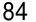
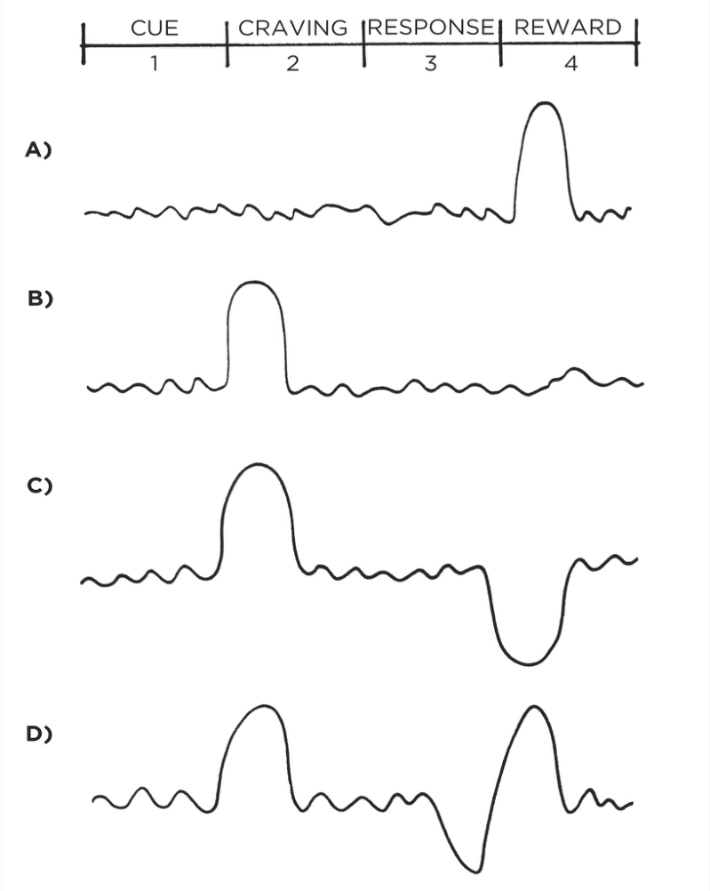

&#123;/*  Start of picture text  */&#125;
84&#123;/*  End of picture text  */&#125;

8 

# How to Make a Habit Irresistible 

**I** N THE 1940S, a Dutch scientist named Niko Tinbergen performed a series of experiments that transformed our understanding of what motivates us. Tinbergen—who eventually won a Nobel Prize for his work—was investigating herring gulls, the gray and white birds often seen flying along the seashores of North America. 

Adult herring gulls have a small red dot on their beak, and Tinbergen noticed that newly hatched chicks would peck this spot whenever they wanted food. To begin one experiment, he created a collection of fake cardboard beaks, just a head without a body. When the parents had flown away, he went over to the nest and offered these dummy beaks to the chicks. The beaks were obvious fakes, and he assumed the baby birds would reject them altogether. 

However, when the tiny gulls saw the red spot on the cardboard beak, they pecked away just as if it were attached to their own mother. They had a clear preference for those red spots—as if they had been genetically programmed at birth. Soon Tinbergen discovered that the bigger the red spot, the faster the chicks pecked. Eventually, he created a beak with three large red dots on it. When he placed it over the nest, the baby birds went crazy with delight. They pecked at the little red patches as if it was the greatest beak they had ever seen. 

Tinbergen and his colleagues discovered similar behavior in other animals. For example, the greylag goose is a ground-nesting bird. Occasionally, as the mother moves around on the nest, one of the eggs will roll out and settle on the grass nearby. Whenever this 

85 

happens, the goose will waddle over to the egg and use its beak and neck to pull it back into the nest. 

Tinbergen discovered that the goose will pull _any_ nearby round object, such as a billiard ball or a lightbulb, back into the nest. The bigger the object, the greater their response. One goose even made a tremendous effort to roll a volleyball back and sit on top. Like the baby gulls automatically pecking at red dots, the greylag goose was following an instinctive rule: _When I see a round object nearby, I must roll it back into the nest. The bigger the round object, the harder I should try to get it._ 

It’s like the brain of each animal is preloaded with certain rules for behavior, and when it comes across an exaggerated version of that rule, it lights up like a Christmas tree. Scientists refer to these exaggerated cues as _supernormal stimuli_ . A supernormal stimulus is a heightened version of reality—like a beak with three red dots or an egg the size of a volleyball—and it elicits a stronger response than usual. 

Humans are also prone to fall for exaggerated versions of reality. Junk food, for example, drives our reward systems into a frenzy. After spending hundreds of thousands of years hunting and foraging for food in the wild, the human brain has evolved to place a high value on salt, sugar, and fat. Such foods are often calorie-dense and they were quite rare when our ancient ancestors were roaming the savannah. When you don’t know where your next meal is coming from, eating as much as possible is an excellent strategy for survival. 

Today, however, we live in a calorie-rich environment. Food is abundant, but your brain continues to crave it like it is scarce. Placing a high value on salt, sugar, and fat is no longer advantageous to our health, but the craving persists because the brain’s reward centers have not changed for approximately fifty thousand years. The modern food industry relies on stretching our Paleolithic instincts beyond their evolutionary purpose. 

A primary goal of food science is to create products that are more attractive to consumers. Nearly every food in a bag, box, or jar has been enhanced in some way, if only with additional flavoring. Companies spend millions of dollars to discover the most satisfying level of crunch in a potato chip or the perfect amount of fizz in a soda. Entire departments are dedicated to optimizing how a product feels in your mouth—a quality known as _orosensation_ . French fries, 

86 for example, are a potent combination—golden brown and crunchy on the outside, light and smooth on the inside. 

Other processed foods enhance _dynamic contrast_ , which refers to items with a combination of sensations, like crunchy and creamy. Imagine the gooeyness of melted cheese on top of a crispy pizza crust, or the crunch of an Oreo cookie combined with its smooth center. With natural, unprocessed foods, you tend to experience the same sensations over and over— _how’s that seventeenth bite of kale taste?_ After a few minutes, your brain loses interest and you begin to feel full. But foods that are high in dynamic contrast keep the experience novel and interesting, encouraging you to eat more. 

Ultimately, such strategies enable food scientists to find the “bliss point” for each product—the precise combination of salt, sugar, and fat that excites your brain and keeps you coming back for more. The result, of course, is that you overeat because hyperpalatable foods are more attractive to the human brain. As Stephan Guyenet, a neuroscientist who specializes in eating behavior and obesity, says, “We’ve gotten too good at pushing our own buttons.” 

The modern food industry, and the overeating habits it has spawned, is just one example of the 2nd Law of Behavior Change: _Make it attractive._ The more attractive an opportunity is, the more likely it is to become habit-forming. 

Look around. Society is filled with highly engineered versions of reality that are more attractive than the world our ancestors evolved in. Stores feature mannequins with exaggerated hips and breasts to sell clothes. Social media delivers more “likes” and praise in a few minutes than we could ever get in the office or at home. Online porn splices together stimulating scenes at a rate that would be impossible to replicate in real life. Advertisements are created with a combination of ideal lighting, professional makeup, and Photoshopped edits—even the model doesn’t look like the person in the final image. These are the supernormal stimuli of our modern world. They exaggerate features that are naturally attractive to us, and our instincts go wild as a result, driving us into excessive shopping habits, social media habits, porn habits, eating habits, and many others. 

If history serves as a guide, the opportunities of the future will be more attractive than those of today. The trend is for rewards to become more concentrated and stimuli to become more enticing. Junk food is a more concentrated form of calories than natural 

87 

foods. Hard liquor is a more concentrated form of alcohol than beer. Video games are a more concentrated form of play than board games. Compared to nature, these pleasure-packed experiences are hard to resist. We have the brains of our ancestors but temptations they never had to face. 

If you want to increase the odds that a behavior will occur, then you need to make it attractive. Throughout our discussion of the 2nd Law, our goal is to learn how to make our habits irresistible. While it is not possible to transform every habit into a supernormal stimulus, we can make any habit more enticing. To do this, we must start by understanding what a craving is and how it works. 

We begin by examining a biological signature that all habits share—the dopamine spike. 

## **THE DOPAMINE-DRIVEN FEEDBACK LOOP** 

Scientists can track the precise moment a craving occurs by measuring a neurotransmitter called dopamine.* The importance of dopamine became apparent in 1954 when the neuroscientists James Olds and Peter Milner ran an experiment that revealed the neurological processes behind craving and desire. By implanting electrodes in the brains of rats, the researchers blocked the release of dopamine. To the surprise of the scientists, the rats lost all will to live. They wouldn’t eat. They wouldn’t have sex. They didn’t crave anything. Within a few days, the animals died of thirst. 

In follow-up studies, other scientists also inhibited the dopamine-releasing parts of the brain, but this time, they squirted little droplets of sugar into the mouths of the dopamine-depleted rats. Their little rat faces lit up with pleasurable grins from the tasty substance. Even though dopamine was blocked, they _liked_ the sugar just as much as before; they just didn’t _want_ it anymore. The ability to experience pleasure remained, but without dopamine, desire died. And without desire, action stopped. 

When other researchers reversed this process and flooded the reward system of the brain with dopamine, animals performed habits at breakneck speed. In one study, mice received a powerful hit of dopamine each time they poked their nose in a box. Within minutes, the mice developed a craving so strong they began poking their nose into the box eight hundred times per hour. (Humans are 

88 

not so different: the average slot machine player will spin the wheel six hundred times per hour.) 

Habits are a dopamine-driven feedback loop. Every behavior that is highly habit-forming—taking drugs, eating junk food, playing video games, browsing social media—is associated with higher levels of dopamine. The same can be said for our most basic habitual behaviors like eating food, drinking water, having sex, and interacting socially. 

For years, scientists assumed dopamine was all about pleasure, but now we know it plays a central role in many neurological processes, including motivation, learning and memory, punishment and aversion, and voluntary movement. 

When it comes to habits, the key takeaway is this: dopamine is released not only when you _experience_ pleasure, but also when you _anticipate_ it. Gambling addicts have a dopamine spike right _before_ they place a bet, not after they win. Cocaine addicts get a surge of dopamine when they _see_ the powder, not after they take it. Whenever you predict that an opportunity will be rewarding, your levels of dopamine spike in anticipation. And whenever dopamine rises, so does your motivation to act. 

It is the anticipation of a reward—not the fulfillment of it—that gets us to take action. 

Interestingly, the reward system that is activated in the brain when you _receive_ a reward is the same system that is activated when you _anticipate_ a reward. This is one reason the anticipation of an experience can often feel better than the attainment of it. As a child, thinking about Christmas morning can be better than opening the gifts. As an adult, daydreaming about an upcoming vacation can be more enjoyable than actually being on vacation. Scientists refer to this as the difference between “wanting” and “liking.” 

## **THE DOPAMINE SPIKE** 

89 

&#123;/*  Start of picture text  */&#125;
CUE1 | CRAVING2 IRESPONSE|3 REWARD4 |° Ae: un ee: wl ey po° wl lm /&#123;/*  End of picture text  */&#125;

FIGURE 9: Before a habit is learned (A), dopamine is released when the reward is experienced for the first time. The next time around (B), dopamine rises _before_ taking action, immediately after a cue is recognized. This spike leads to a feeling of desire and a craving to take action whenever the cue is spotted. Once a habit is learned, dopamine will not rise when a reward is experienced because you already expect the reward. However, if you see a cue and expect a reward, but do not get one, then dopamine will drop in disappointment (C). The sensitivity of the dopamine response can clearly be seen when a reward is provided late (D). First, the cue is identified and dopamine rises as a craving builds. Next, a response is taken but the reward does not come as 

90 

quickly as expected and dopamine begins to drop. Finally, when the reward comes a little later than you had hoped, dopamine spikes again. It is as if the brain is saying, “See! I knew I was right. Don’t forget to repeat this action next time.” 

Your brain has far more neural circuitry allocated for _wanting_ rewards than for _liking_ them. The wanting centers in the brain are large: the brain stem, the nucleus accumbens, the ventral tegmental area, the dorsal striatum, the amygdala, and portions of the prefrontal cortex. By comparison, the liking centers of the brain are much smaller. They are often referred to as “hedonic hot spots” and are distributed like tiny islands throughout the brain. For instance, researchers have found that 100 percent of the nucleus accumbens is activated during wanting. Meanwhile, only 10 percent of the structure is activated during liking. 

The fact that the brain allocates so much precious space to the regions responsible for craving and desire provides further evidence of the crucial role these processes play. Desire is the engine that drives behavior. Every action is taken because of the anticipation that precedes it. It is the craving that leads to the response. 

These insights reveal the importance of the 2nd Law of Behavior Change. We need to make our habits attractive because it is the expectation of a rewarding experience that motivates us to act in the first place. This is where a strategy known as temptation bundling comes into play. 

## **HOW TO USE TEMPTATION BUNDLING TO MAKE YOUR HABITS MORE ATTRACTIVE** 

Ronan Byrne, an electrical engineering student in Dublin, Ireland, enjoyed watching Netflix, but he also knew that he should exercise more often than he did. Putting his engineering skills to use, Byrne hacked his stationary bike and connected it to his laptop and television. Then he wrote a computer program that would allow Netflix to run _only_ if he was cycling at a certain speed. If he slowed down for too long, whatever show he was watching would pause until he started pedaling again. He was, in the words of one fan, “eliminating obesity one Netflix binge at a time.” 

91 

He was also employing temptation bundling to make his exercise habit more attractive. Temptation bundling works by linking an action you want to do with an action you need to do. In Byrne’s case, he bundled watching Netflix (the thing he wanted to do) with riding his stationary bike (the thing he needed to do). 

Businesses are masters at temptation bundling. For instance, when the American Broadcasting Company, more commonly known as ABC, launched its Thursday-night television lineup for the 2014– 2015 season, they promoted temptation bundling on a massive scale. 

Every Thursday, the company would air three shows created by screenwriter Shonda Rhimes— _Grey’s Anatomy_ , _Scandal_ , and _How to Get Away with Murder_ . They branded it as “TGIT on ABC” (TGIT stands for Thank God It’s Thursday). In addition to promoting the shows, ABC encouraged viewers to make popcorn, drink red wine, and enjoy the evening. 

Andrew Kubitz, head of scheduling for ABC, described the idea behind the campaign: “We see Thursday night as a viewership opportunity, with either couples or women by themselves who want to sit down and escape and have fun and drink their red wine and have some popcorn.” The brilliance of this strategy is that ABC was associating the thing they _needed_ viewers to do (watch their shows) with activities their viewers already _wanted_ to do (relax, drink wine, and eat popcorn). 

Over time, people began to connect watching ABC with feeling relaxed and entertained. If you drink red wine and eat popcorn at 8 p.m. every Thursday, then eventually “8 p.m. on Thursday” _means_ relaxation and entertainment. The reward gets associated with the cue, and the habit of turning on the television becomes more attractive. 

You’re more likely to find a behavior attractive if you get to do one of your favorite things at the same time. Perhaps you want to hear about the latest celebrity gossip, but you need to get in shape. Using temptation bundling, you could only read the tabloids and watch reality shows at the gym. Maybe you want to get a pedicure, but you need to clean out your email inbox. Solution: only get a pedicure while processing overdue work emails. 

Temptation bundling is one way to apply a psychology theory known as Premack’s Principle. Named after the work of professor David Premack, the principle states that “more probable behaviors 

92 

will reinforce less probable behaviors.” In other words, even if you don’t really want to process overdue work emails, you’ll become conditioned to do it if it means you get to do something you really want to do along the way. 

You can even combine temptation bundling with the habit stacking strategy we discussed in Chapter 5 to create a set of rules to guide your behavior. 

The habit stacking + temptation bundling formula is: 

1. After [CURRENT HABIT], I will [HABIT I NEED]. 

2. After [HABIT I NEED], I will [HABIT I WANT]. 

If you want to read the news, but you need to express more gratitude: 

1. After I get my morning coffee, I will say one thing I’m grateful for that happened yesterday (need). 

2. After I say one thing I’m grateful for, I will read the news (want). 

If you want to watch sports, but you need to make sales calls: 

1. After I get back from my lunch break, I will call three potential clients (need). 

2. After I call three potential clients, I will check ESPN (want). 

If you want to check Facebook, but you need to exercise more: 

1. After I pull out my phone, I will do ten burpees (need). 2. After I do ten burpees, I will check Facebook (want). 

The hope is that eventually you’ll look forward to calling three clients or doing ten burpees because it means you get to read the latest sports news or check Facebook. Doing the thing you need to do means you get to do the thing you want to do. 

93 

We began this chapter by discussing supernormal stimuli, which are heightened versions of reality that increase our desire to take action. Temptation bundling is one way to create a heightened version of any habit by connecting it with something you already want. Engineering a truly irresistible habit is a hard task, but this simple strategy can be employed to make nearly any habit more attractive than it would be otherwise. 

## Chapter Summary 

- The 2nd Law of Behavior Change is _make it attractive._ The more attractive an opportunity is, the more likely it is to become habit-forming. 

- Habits are a dopamine-driven feedback loop. When dopamine rises, so does our motivation to act. 

- It is the anticipation of a reward—not the fulfillment of it—that gets us to take action. The greater the anticipation, the greater the dopamine spike. 

- Temptation bundling is one way to make your habits more attractive. The strategy is to pair an action you _want_ to do with an action you _need_ to do. 

