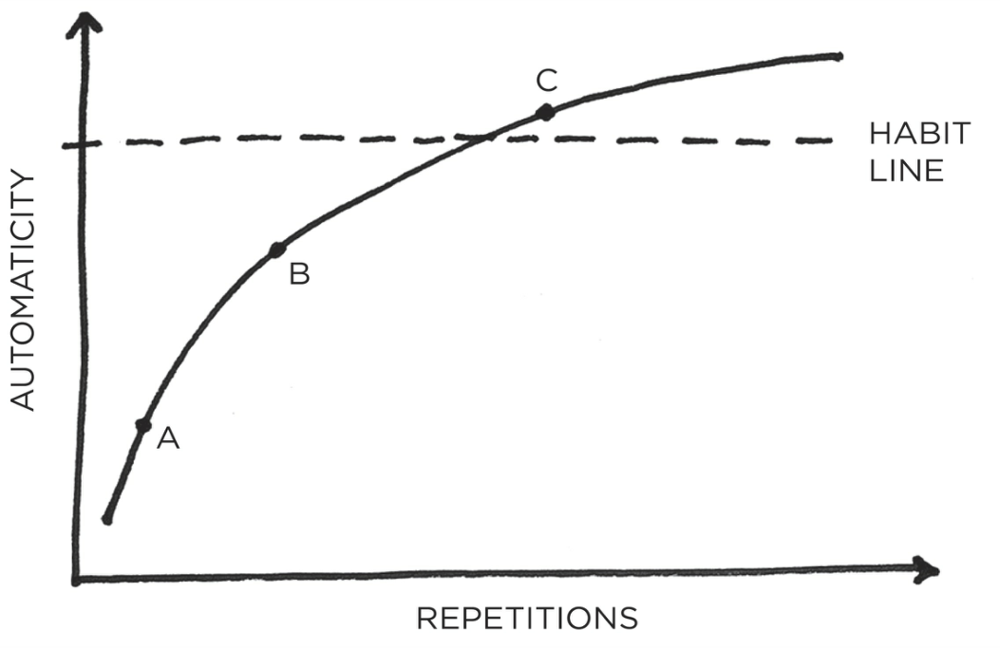
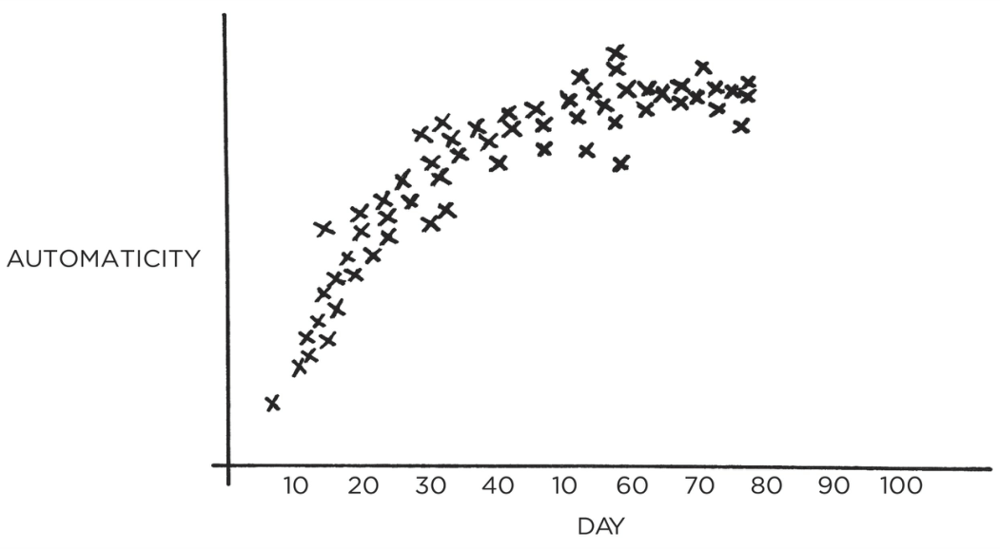

113 

11 

# Walk Slowly, but Never Backward 

**O** N THE FIRST day of class, Jerry Uelsmann, a professor at the University of Florida, divided his film photography students into two groups. 

Everyone on the left side of the classroom, he explained, would be in the “quantity” group. They would be graded solely on the amount of work they produced. On the final day of class, he would tally the number of photos submitted by each student. One hundred photos would rate an A, ninety photos a B, eighty photos a C, and so on. 

Meanwhile, everyone on the right side of the room would be in the “quality” group. They would be graded only on the excellence of their work. They would only need to produce one photo during the semester, but to get an A, it had to be a nearly perfect image. 

At the end of the term, he was surprised to find that all the best photos were produced by the _quantity_ group. During the semester, these students were busy taking photos, experimenting with composition and lighting, testing out various methods in the darkroom, and learning from their mistakes. In the process of creating hundreds of photos, they honed their skills. Meanwhile, the _quality_ group sat around speculating about perfection. In the end, they had little to show for their efforts other than unverified theories and one mediocre photo.* 

It is easy to get bogged down trying to find the optimal plan for change: the fastest way to lose weight, the best program to build muscle, the perfect idea for a side hustle. We are so focused on 

114 

figuring out the best approach that we never get around to taking action. As Voltaire once wrote, “The best is the enemy of the good.” I refer to this as the difference between being in motion and taking action. The two ideas sound similar, but they’re not the same. When you’re in motion, you’re planning and strategizing and learning. Those are all good things, but they don’t produce a result. 

Action, on the other hand, is the type of behavior that will deliver an outcome. If I outline twenty ideas for articles I want to write, that’s motion. If I actually sit down and write an article, that’s action. If I search for a better diet plan and read a few books on the topic, that’s motion. If I actually eat a healthy meal, that’s action. 

Sometimes motion is useful, but it will never produce an outcome by itself. It doesn’t matter how many times you go talk to the personal trainer, that motion will never get you in shape. Only the action of working out will get the result you’re looking to achieve. 

If motion doesn’t lead to results, why do we do it? Sometimes we do it because we actually need to plan or learn more. But more often than not, we do it because motion allows us to feel like we’re making progress without running the risk of failure. Most of us are experts at avoiding criticism. It doesn’t feel good to fail or to be judged publicly, so we tend to avoid situations where that might happen. And that’s the biggest reason why you slip into motion rather than taking action: you want to delay failure. 

It’s easy to be in motion and convince yourself that you’re still making progress. You think, _“I’ve got conversations going with four potential clients right now. This is good. We’re moving in the right direction.”_ Or, _“I brainstormed some ideas for that book I want to write. This is coming together.”_ 

Motion makes you feel like you’re getting things done. But really, you’re just preparing to get something done. When preparation becomes a form of procrastination, you need to change something. You don’t want to merely be planning. You want to be practicing. 

If you want to master a habit, the key is to start with repetition, not perfection. You don’t need to map out every feature of a new habit. You just need to practice it. This is the first takeaway of the 3rd Law: you just need to get your reps in. 

### **HOW LONG DOES IT ACTUALLY TAKE TO FORM A NEW HABIT?** 

115 

Habit formation is the process by which a behavior becomes progressively more automatic through repetition. The more you repeat an activity, the more the structure of your brain changes to become efficient at that activity. Neuroscientists call this _long-term potentiation_ , which refers to the strengthening of connections between neurons in the brain based on recent patterns of activity. With each repetition, cell-to-cell signaling improves and the neural connections tighten. First described by neuropsychologist Donald Hebb in 1949, this phenomenon is commonly known as Hebb’s Law: “Neurons that fire together wire together.” 

Repeating a habit leads to clear physical changes in the brain. In musicians, the cerebellum—critical for physical movements like plucking a guitar string or pulling a violin bow—is larger than it is in nonmusicians. Mathematicians, meanwhile, have increased gray matter in the inferior parietal lobule, which plays a key role in computation and calculation. Its size is directly correlated with the amount of time spent in the field; the older and more experienced the mathematician, the greater the increase in gray matter. 

When scientists analyzed the brains of taxi drivers in London, they found that the hippocampus—a region of the brain involved in spatial memory—was significantly larger in their subjects than in non–taxi drivers. Even more fascinating, the hippocampus decreased in size when a driver retired. Like the muscles of the body responding to regular weight training, particular regions of the brain adapt as they are used and atrophy as they are abandoned. 

Of course, the importance of repetition in establishing habits was recognized long before neuroscientists began poking around. In 1860, the English philosopher George H. Lewes noted, “In learning to speak a new language, to play on a musical instrument, or to perform unaccustomed movements, great difficulty is felt, because the channels through which each sensation has to pass have not become established; but no sooner has frequent repetition cut a pathway, than this difficulty vanishes; the actions become so automatic that they can be performed while the mind is otherwise engaged.” Both common sense and scientific evidence agree: repetition is a form of change. 

Each time you repeat an action, you are activating a particular neural circuit associated with that habit. This means that simply putting in your reps is one of the most critical steps you can take to encoding a new habit. It is why the students who took tons of photos 

116 

improved their skills while those who merely theorized about perfect photos did not. One group engaged in active practice, the other in passive learning. One in action, the other in motion. All habits follow a similar trajectory from effortful practice to automatic behavior, a process known as _automaticity_ . Automaticity is the ability to perform a behavior without thinking about each step, which occurs when the nonconscious mind takes over. It looks something like this: 

### **THE HABIT LINE** 

&#123;/*  Start of picture text  */&#125;
Ccee ee ee SCABIT> LINE=0B&>fo)aDxAREPETITIONS&#123;/*  End of picture text  */&#125;

FIGURE 11: In the beginning (point A), a habit requires a good deal of effort and concentration to perform. After a few repetitions (point B), it gets easier, but still requires some conscious attention. With enough practice (point C), the habit becomes more automatic than conscious. Beyond this threshold— _the habit line_ —the behavior can be done more or less without thinking. A new habit has been formed. 

On the following page, you’ll see what it looks like when researchers track the level of automaticity for an actual habit like 

117 

walking for ten minutes each day. The shape of these charts, which scientists call _learning curves_ , reveals an important truth about behavior change: habits form based on frequency, not time. 

## **WALKING 10 MINUTES PER DAY** 

&#123;/*  Start of picture text  */&#125;
x % x¥% aRx xPRMxmee Kyxe"¥AUTOMATICITY yea¥x10 20 30 40 10 60 70 80 90 100DAY&#123;/*  End of picture text  */&#125;

FIGURE 12: This graph shows someone who built the habit of walking for ten minutes after breakfast each day. Notice that as the repetitions increase, so does automaticity, until the behavior is as easy and automatic as it can be. 

One of the most common questions I hear is, “How _long_ does it take to build a new habit?” But what people really should be asking is, “How _many_ does it take to form a new habit?” That is, how many repetitions are required to make a habit automatic? 

There is nothing magical about time passing with regard to habit formation. It doesn’t matter if it’s been twenty-one days or thirty days or three hundred days. What matters is the rate at which you perform the behavior. You could do something twice in thirty days, or two hundred times. It’s the frequency that makes the difference. Your current habits have been internalized over the course of hundreds, if not thousands, of repetitions. New habits require the same level of frequency. You need to string together enough 

118 

successful attempts until the behavior is firmly embedded in your mind and you cross the Habit Line. 

In practice, it doesn’t really matter how long it takes for a habit to become automatic. What matters is that you take the actions you need to take to make progress. Whether an action is fully automatic is of less importance. 

To build a habit, you need to practice it. And the most effective way to make practice happen is to adhere to the 3rd Law of Behavior Change: _make it easy_ . The chapters that follow will show you how to do exactly that. 

## Chapter Summary 

- The 3rd Law of Behavior Change is _make it easy_ . The most effective form of learning is practice, not planning. 

- Focus on taking action, not being in motion. 

- Habit formation is the process by which a behavior becomes progressively more automatic through repetition. 

- The amount of time you have been performing a habit is not as important as the number of times you have performed it. 

